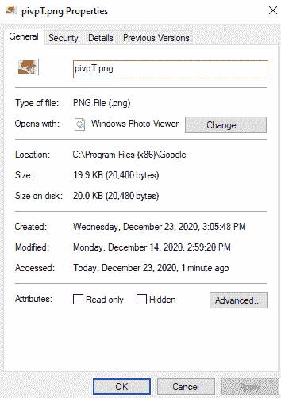

# 如何在 Python 中获取文件的创建和修改日期或时间？

> 原文:[https://www . geesforgeks . org/如何获取文件-创建-修改-日期或时间-python/](https://www.geeksforgeeks.org/how-to-get-file-creation-and-modification-date-or-time-in-python/)

时间戳是一系列字符，表示事件的发生。时间戳是计算机科学中广泛需要的。这存在不同的精度和准确度，即一些时间戳对于偶数的出现具有高达毫秒的精度，而其他时间戳则没有。这允许存在不同形式(和标准)的时间戳。在本文中，我们将研究查找文件的创建和修改时间戳的方法。我们将使用具有以下属性的文件进行演示。



我们将使用在 os 库中路径模块内部找到的 *getctime()* 和 *getmtime()* 函数来获取文件的创建和修改时间。以上两个函数都返回自*EPOCH*(1970 年 1 月 1 日世界协调时 00:00:00)以来的时间(时间为浮点数据类型)。因为这个数字不像一个可以理解的时间戳，我们必须转换时间，即它变得可以识别。为此，我们将使用时间库中的 *ctime()* 函数。

> ctime(秒)
> 
> 将自纪元以来的时间(秒)转换为本地时间字符串。
> 
> 这相当于 as time(local time(秒))。当时间元组是
> 
> 不存在，使用 localtime()返回的当前时间。
> 
> **参数:**
> 
> 秒=整数/浮点值
> 
> **返回:**
> 
> 表示时间戳的字符串

**下面是实现:**

## 蟒蛇 3

```py
import os
import time

# Path to the file/directory
path = r"C:\Program Files (x86)\Google\pivpT.png"

# Both the variables would contain time 
# elapsed since EPOCH in float
ti_c = os.path.getctime(path)
ti_m = os.path.getmtime(path)

# Converting the time in seconds to a timestamp
c_ti = time.ctime(ti_c)
m_ti = time.ctime(ti_m)

print(
    f"The file located at the path {path}
    was created at {c_ti} and was last modified at {m_ti}")
```

**输出:**

> 位于路径 C:\ Program Files(x86)\ Google \ pippt . png 的文件创建于 20 20 年 12 月 23 日星期三 15:05:48
> 最后一次修改是在 2020 年 12 月 14 日星期一 14:59:20

上述代码的时间戳具有以下格式限定符–

```py
[Day](3) [Month](3) [day](2) [Hours:Minutes:Seconds](8) [Year](4)
```

其中括号内的单词是显示内容的提示，括号内其后的数字显示它将占据的长度。

**注意:**可以更改上述代码中使用的时间戳格式。默认情况下， *ctime()* 函数将返回上述语法的时间戳。为了改变它，我们必须把它传递给[*【strptime()*](https://docs.python.org/3/library/time.html#time.strptime)函数(也可以在时间库中找到)来创建一个时间结构(对象)。然后我们可以将格式说明符传递给[*str time()*](https://docs.python.org/3/library/time.html#time.strftime)，从时间结构中创建一个自定义时间戳。在下面的代码中，我们将以 [ISO 8601](https://en.wikipedia.org/wiki/ISO_8601) 时间戳格式获取同一文件的修改时间。

## 蟒蛇 3

```py
import os
import time

path = r"C:\Program Files (x86)\Google\pivpT.png"

ti_m = os.path.getmtime(path)

m_ti = time.ctime(ti_m)

# Using the timestamp string to create a 
# time object/structure
t_obj = time.strptime(m_ti)

# Transforming the time object to a timestamp 
# of ISO 8601 format
T_stamp = time.strftime("%Y-%m-%d %H:%M:%S", t_obj)

print(f"The file located at the path {path} was last modified at {T_stamp}")
```

**输出:**

> 位于路径 C:\ Program Files(x86)\ Google \ pippt . png 的文件最后一次修改是在 2020-12-14 14:59:20