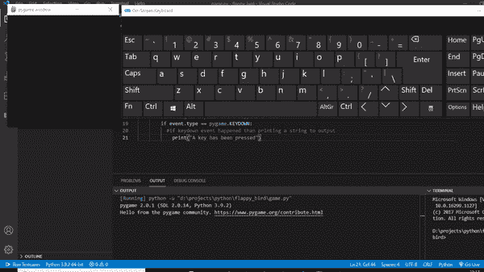

# 如何在 PyGame 中获取键盘输入？

> 原文:[https://www . geesforgeks . org/如何在 pygame 中获得键盘输入/](https://www.geeksforgeeks.org/how-to-get-keyboard-input-in-pygame/)

在使用 Python 的 pygame 模块时，我们有时需要使用键盘输入进行各种操作，例如将角色向某个方向移动。为了实现这一点，我们必须看到所有事件的发生。Pygame 跟踪发生的事件，我们可以通过 events.get()函数看到这些事件。在本文中，我们将讨论如何在 pygame 中获取和使用各种键盘输入。

### 检测按键是否被按下:

每当按下或释放一个键时，pygame.event()队列方法 pygame。KEYDOWN 和 pygame。分别是 KEYUP 事件。

例如，如果我们想检测一个键是否被按下，我们将跟踪 pygame 的任何事件。键按下是否发生，因此，我们将了解是否有任何键被按下。用于检测是否按下任何键的代码可以写成:

## 计算机编程语言

```py
# importing pygame module
import pygame

# importing sys module
import sys

# initialising pygame
pygame.init()

# creating display
display = pygame.display.set_mode((300, 300))

# creating a running loop
while True:

    # creating a loop to check events that
    # are occuring
    for event in pygame.event.get():
        if event.type == pygame.QUIT:
            pygame.quit()
            sys.exit()

        # checking if keydown event happened or not
        if event.type == pygame.KEYDOWN:

            # if keydown event happened
            # than printing a string to output
            print("A key has been pressed")
```

**输出:**



运行该代码后，可以看到每当一个键按下时，终端上都会打印一个字符串“一个键已被按下”

### 检测按下了哪个键:

为了知道哪个键被按下，我们必须检查事件。key 变量对应于哪个 pygame 键。例如，字母“A”的 pygame 键是“K_a”，那么我们将比较事件。带 K 和 A 的键，如果相同，则表示按下了“A”键。

各种键盘键和相应的 pygame 键有:

<figure class="table">

| 游戏密钥 | **描述** |
| --- | --- |
| k _ 退格 | 退格键 |
| K_TAB | 标签 |
| K_CLEAR | 清楚的 |
| K_RETURN | 返回 |
| k _ 暂停 | 中止 |
| K_ESCAPE | 逃跑 |
| K_SPACE | 空间 |
| k _ CLUDE | 惊叫 |
| K_HASH | 混杂 |
| K_QUOTEDBL | 报价 b |
| k _ 美元 | 美元 |
| K _ 符号 | &的记号名称 |
| K_QUOTE | 引用 |
| k _ 一家 | 左括号 |
| k _ right 配对 | 右括号 |
| K _ ASTERISK | 星号 |
| K_PLUS | 加号 |
| k _ 逗号 | 逗号 |
| k _ 减 | 减号 |
| K_PERIOD | 时期 |
| K_SLASH | 斜杠 |
| K_0 | Zero |
| K_1 | one |
| k2 | Two |
| k3 | three |
| K_4 | four |
| K_5 | five |
| K6 | six |
| K_7 | seven |
| k8 | eight |
| K9 | nine |
| K_COLON | 结肠 |
| k _ 分号 | 分号 |
| K_LESS | 小于号 |
| K_EQUALS | 等号 |
| K _ GREATER | 大于号 |
| K _ QUESTION | 问号 |
| K_AT | 在 |
| K _ 括号 | 左括号 |
| k _ REASH | 反斜线符号 |
| K_RIGHTBRACKET | 右括号 |
| K_CARET | 脱字号 |
| k _ 下划线 | 强调 |
| K _ BACKQUOTE | 坟墓 |
| K_a、b、c……z | 从头到尾的字母表 |
| K_DELETE | 删除 |
| K_KP0，K_KP1，K_KP2…K_KP9 | 键盘 0 到 9 |
| K_KP_PERIOD | 键盘周期 |
| K_KP_DIVIDE | 键盘划分 |
| K _ KP _ 乘法 | 键盘乘法 |
| K _ KP _ 减 | 键盘减号 |
| S7-1200 可编程控制器 | 键盘 plus |
| K_KP_ENTER | 键盘输入 |
| K_KP_EQUALS | 键盘等于 |
| K_UP | 向上箭头 |
| K_DOWN | 下箭头键 |
| 爵士 | 向右箭头 |
| K_LEFT | 向左箭头 |
| K_INSERT | 插入 |
| K_HOME | 主页 |
| K_END | 结束 |
| K_PAGEUP | 页上移 |
| K _ PAGEDOWN | 下一页 |
| K_F1，K_F2，K_F3……K_F15 | F1 至 F15 |
| K_NUMLOCK | Numlock |
| K_CAPSLOCK | 大写锁定 |
| K _ SCROLLOCK | Scrollock |
| K_RSHIFT | 右移 |
| 克 _LSHIFT | 左移 |
| S7-1200 可编程控制器 | 右控制 |
| S7-1200 可编程控制器 | 左控制 |
| K_RALT | 右 alt |
| k _ lalt(消歧义) | 左 alt |
| K_RMETA(消歧义) | 右元 |
| k _ lmeta(消歧义) | 左元 |
| K_LSUPER(消歧义) | 左 Windows 键 |
| K_RSUPER(消歧义) | 右窗口键 |
| K_MODE | 振荡型转移 |
| K _ HELP | 帮助 |
| K_PRINT | 打印屏幕 |
| K_SYSREQ | 系统请求（system request） |
| K_BREAK | 破裂 |
| k 选单 | 菜单 |
| K_POWER | 力量 |
| k _ 欧元 | 欧洲的 |

</figure>

例如，让我们创建一个代码来检查键“A”或“J”或“P”或“M”是否被按下。用于检查的代码将是:

## 计算机编程语言

```py
# importing pygame module
import pygame

# importing sys module
import sys

# initialising pygame
pygame.init()

# creating display
display = pygame.display.set_mode((300, 300))

# creating a running loop
while True:

    # creating a loop to check events that
    # are occuring
    for event in pygame.event.get():
        if event.type == pygame.QUIT:
            pygame.quit()
            sys.exit()

        # checking if keydown event happened or not
        if event.type == pygame.KEYDOWN:

            # checking if key "A" was pressed
            if event.key == pygame.K_a:
                print("Key A has been pressed")

            # checking if key "J" was pressed
            if event.key == pygame.K_j:
                print("Key J has been pressed")

            # checking if key "P" was pressed
            if event.key == pygame.K_p:
                print("Key P has been pressed")

            # checking if key "M" was pressed
            if event.key == pygame.K_m:
                print("Key M has been pressed")
```

**输出:**


当我们运行这个代码并按给定的键时，相应的字符串将被打印在终端上。