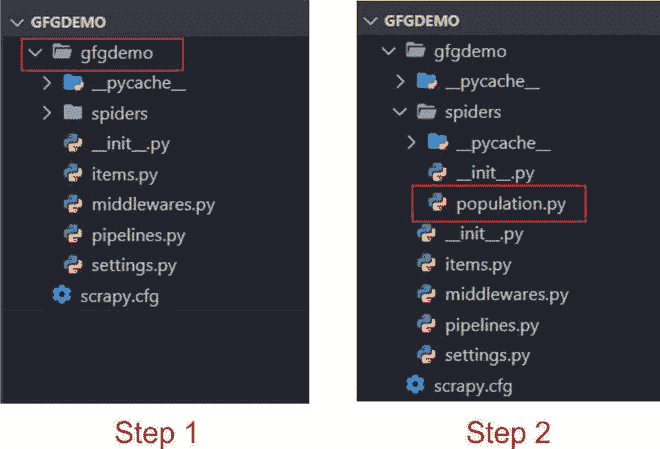
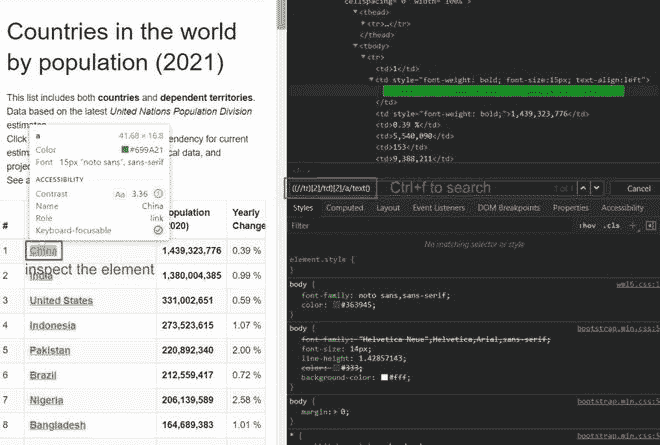
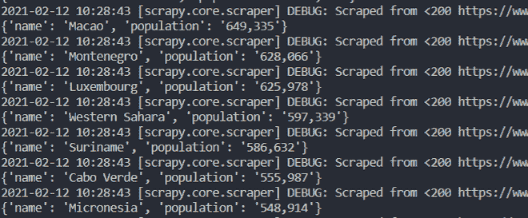
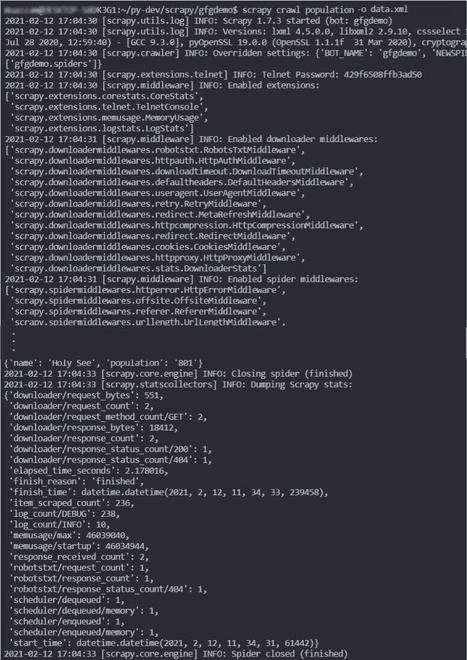

# 如何在 XML 文件中获取 Scrapy 输出文件？

> 原文:[https://www . geesforgeks . org/how-get-scrapy-output-file-in-XML-file/](https://www.geeksforgeeks.org/how-to-get-scrapy-output-file-in-xml-file/)

前提:[用 Scrapy](https://www.geeksforgeeks.org/implementing-web-scraping-python-scrapy/) 在 Python 中实现网页抓取

**Scrapy** 提供了一个快速高效的刮网站的方法。网页抓取用于从网站中提取数据。在 Scrapy 中，我们创建了一个蜘蛛，然后用它来抓取网站。在这篇文章中，我们将从世界人口统计网站上提取按国家分列的人口数据。

### 让我们逐步实现:

**第一步:创建一个剪贴簿项目**

```
scrapy startproject gfgdemo
```

我们在命令行中使用上面的命令来创建项目，然后将目录更改为 gfgdemo。之后，我们在自己选择的编辑器*(此处为 VS Code)* 中打开项目。

**第二步:为群体创建蜘蛛**

> scrapy genspider 人口 www . world ometers . info/world-population/按国家分列的人口

一个名为 corona.py 的新文件被添加到**蜘蛛**目录中。



**第三步:对人口进行以下更改。py**

## 蟒蛇 3

```
# only keep the base domain
allowed_domains = ['www.worldometers.info'] 

# change http to https
start_urls = ['https://www.worldometers.info/world-population/population-by-country/']
```

**第四步:准备文件刮数据**

首先，我们将访问 www . world ometers . info/world-population/population-by-country 并禁用 javascript，如下所示

*   按下 **Ctrl+Shift+i** 打开检查器工具
*   然后按 **Ctrl+Shift+p** 写 javascript，点击黄色显示的调试器，禁用 javascript，然后刷新页面。


*   之后，我们将使用 xpath 选择器选择要刮削的零件。



*   编写提取特定数据的代码。我们在 spider 的解析方法中编写了以下代码。

## 蟒蛇 3

```
def parse(self, response):
        countries = response.xpath("//tr")

        for country in countries:
            name = country.xpath("(.//td)[2]/a/text()").get()
            population = country.xpath("(.//td)[3]/text()").get()
            yield {
                'name':name,
                'population':population

            }
```

**第五步:刮数据**

在命令行中，编写以下命令来收集国家名称及其人口的数据。

```
scrapy crawl population
```



我们将数据作为命令行输出，如上所示。

**为了将数据提取为 XML 文件，我们在命令行中编写了以下代码。**

```
scrapy crawl {spider} -o {filename}.xml
Ex: scrapy crawl population -o data.xml
```

**输出:**



这将在项目目录中创建一个带有抓取数据的 XML 文件。这里的 **data.xml** 文件包含如下数据

**输出:**

```
<?xml version="1.0" encoding="utf-8"?>
<items>
<item><name>None</name><population>None</population></item>
<item><name>China</name><population>1,439,323,776</population></item>
<item><name>India</name><population>1,380,004,385</population></item>
<item><name>United States</name><population>331,002,651</population></item>
<item><name>Indonesia</name><population>273,523,615</population></item>
.
.
.
<item><name>Niue</name><population>1,626</population></item>
<item><name>Tokelau</name><population>1,357</population></item>
<item><name>Holy See</name><population>801</population></item>
</items>
```

