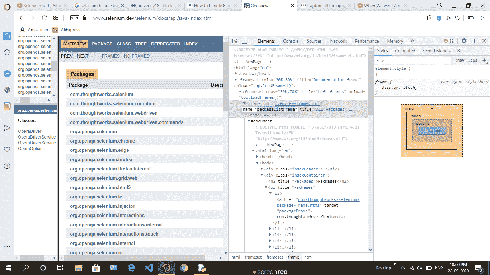
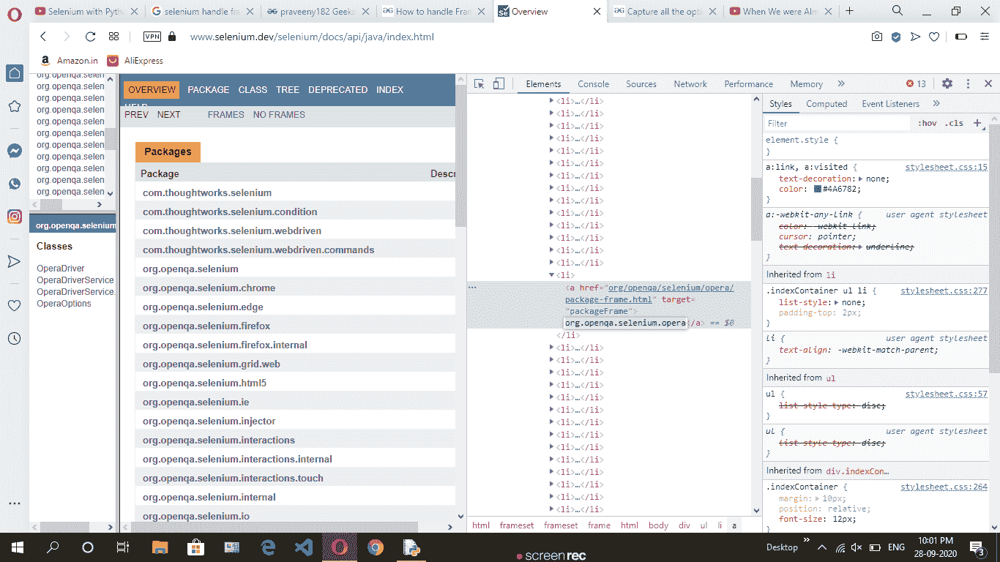
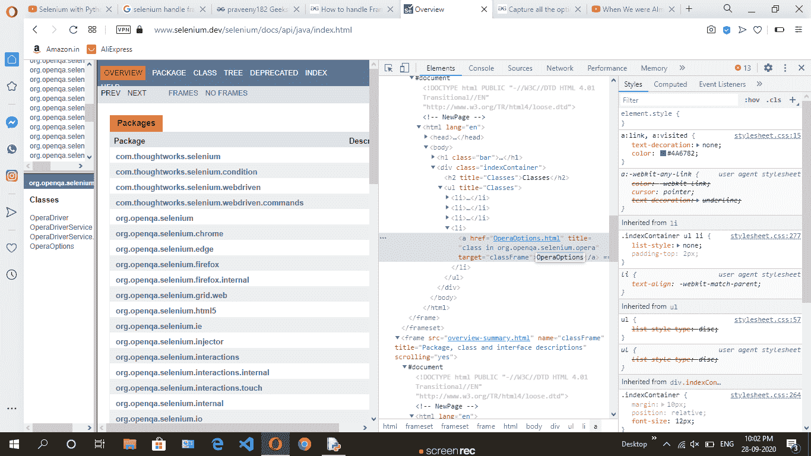
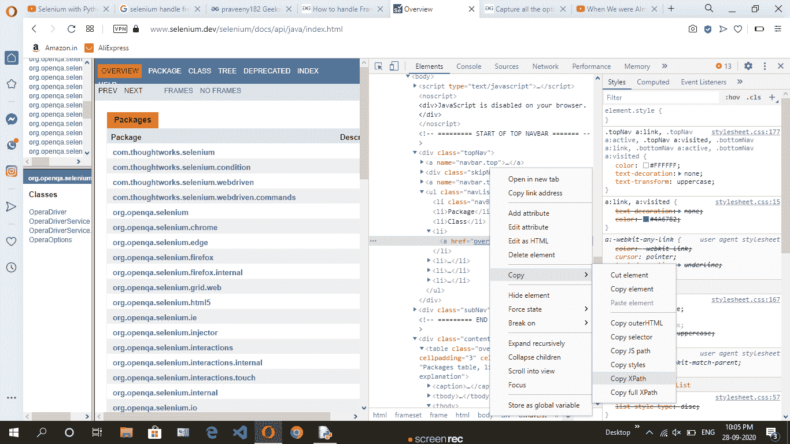

# 如何用 Python 处理 Selenium 中的框架/iFrames

> 原文:[https://www . geesforgeks . org/如何处理框架-python 硒中的 iframe/](https://www.geeksforgeeks.org/how-to-handle-frames-iframes-in-selenium-with-python/)

硒是通过程序控制互联网浏览器的有效设备。它对所有浏览器都是有目的的，适用于所有基本操作系统，其脚本是用许多语言编写的，如 Python、Java、C#等，我们可以用 Python 运行。

HTML 大纲用于将您的程序窗口隔离成多个部分，每个部分可以堆叠不同的 HTML 报告。程序窗口中的各种边被称为框架集。窗口被分割成轮廓，同样表格被组成:线和段。

**要求:**需要安装 chromedriver 并设置路径。 [**点击此处**](https://sites.google.com/a/chromium.org/chromedriver/downloads) 下载，详情如下 [**此链接**](https://www.geeksforgeeks.org/browser-automation-using-selenium/) 。

**处理框架/画框:-**

> **switch_to.frame(名称)**

**流程:**


此网页分为三个框架，左上方(第一个框架)和左下方(第二个框架)以及第三个框架。所有的框架都是相互连接的。然后我们通过硒来执行这些动作:

*   首先，切换到默认帧到第一帧。
*   然后使用链接文本方法找到元素
*   回到默认框架。
*   然后转到第二帧
*   使用链接文本方法查找元素
*   回到默认框架
*   然后切换到第三帧。
*   然后通过 x 路径找到元素。

    

**实施:**

## 蟒蛇 3

```py
# importing the modules
from selenium import webdriver
from selenium.webdriver.support.ui import Select
import time

# using chrome driver
driver = webdriver.Chrome()

# web page url
driver.get("https://www.selenium.dev/selenium/docs/api/java/index.html")

# switch to 1st frame
driver.switch_to.frame("packageListFrame")

# click on 1st frame
driver.find_element_by_link_text("org.openqa.selenium.opera").click()

# back to default web page frame
driver.switch_to.default_content()

# switch to 2nd frame
driver.switch_to.frame("packageFrame")

# click on  2nd frame 
driver.find_element_by_link_text("OperaOptions").click()

# back to default web page frame
driver.switch_to.default_content()

# switch to 3rd frame
driver.switch_to.frame("classFrame")

# click on  2nd frame
driver.find_element_by_xpath('/html/body/div[1]/ul/li[4]/a').click()
time.sleep(4)
```

**输出:**–

<video class="wp-video-shortcode" id="video-493218-1" width="640" height="360" preload="metadata" controls=""><source type="video/mp4" src="https://media.geeksforgeeks.org/wp-content/uploads/20200928221221/frame.mp4?_=1">[https://media.geeksforgeeks.org/wp-content/uploads/20200928221221/frame.mp4](https://media.geeksforgeeks.org/wp-content/uploads/20200928221221/frame.mp4)</video>