# 如何在 Windows 上安装 Python Pycharm？

> 原文:[https://www . geesforgeks . org/how-install-python-py charm-on-windows/](https://www.geeksforgeeks.org/how-to-install-python-pycharm-on-windows/)

**先决条件:** [Python 语言简介](https://www.geeksforgeeks.org/python-language-introduction/)

Python 是一种广泛使用的通用高级编程语言。它最初由吉多·范·罗苏姆在 1991 年设计，由 Python 软件基金会开发。它主要是为了强调代码的可读性而开发的，它的语法允许程序员用更少的代码行来表达概念。
Python 是一种编程语言，可以让你快速工作，更高效地集成系统。
我们需要一个解释器来解释和运行我们的程序。网上有一些像 [GFG-IDE](https://ide.geeksforgeeks.org/) 、 [IDEONE](http://ideone.com/) 或 [CodePad](http://codepad.org/) 等的翻译。在离线解释器上运行 Python 代码比使用在线 IDE 兼容得多。

PyCharm 是 JetBrains 开发的最流行的 Python-IDE 之一，用于执行 Python 语言的脚本编写。PyCharm 提供了一些非常有用的特性，比如代码完成和检查、调试过程、对各种编程框架的支持，比如 Flask 和 Django、包管理等。PyCharm 为 Python 中的生产性开发提供了各种工具。

**安装 Python:**

在开始在 Windows 中安装 PyCharm 的过程之前，必须确保他们的系统上安装了 Python。检查系统是否配备 Python，进入**命令行**(在运行对话框中搜索**cmd**(<link rel="stylesheet" href="https://maxcdn.bootstrapcdn.com/font-awesome/4.6.1/css/font-awesome.min.css">***+R**)。
现在运行以下命令:*

```py
*python --version* 
```

*如果已经安装了 Python，它将生成一条消息，其中包含可用的 Python 版本。
*

*如果 Python 不存在，请通过[如何在 Windows 上安装 Python？](https://www.geeksforgeeks.org/how-to-install-python-on-windows/)并按照提供的说明操作。*

### *下载和安装 PyCharm:*

*在开始安装过程之前，需要下载 PyCharm。为此，PyCharm 在[jetbrains.com](https://www.jetbrains.com/pycharm/download/#section=windows)上提供。
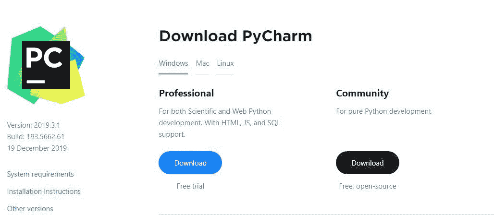
下载 PyCharm 并按照进一步的说明进行安装。*

***从安装开始:***

*   ***入门:**
    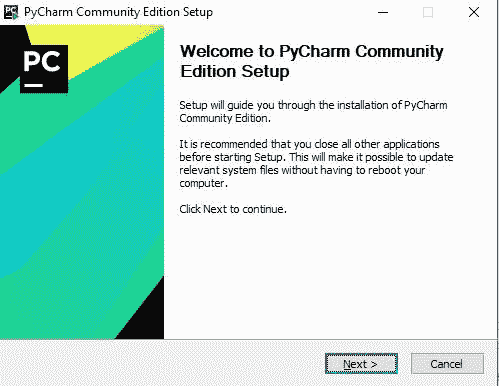*
*   ***选择安装地点:**
    *
*   ***安装选项:**
    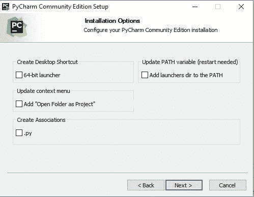*
*   ***选择开始菜单文件夹:**
    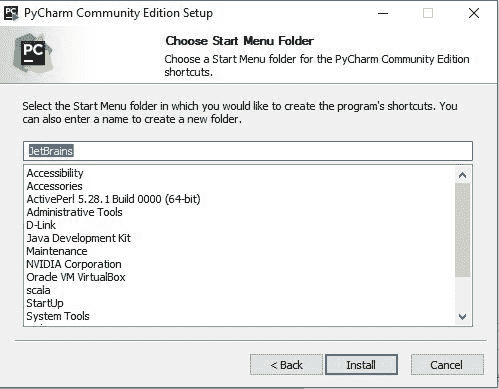*
*   ***加工安装:**
    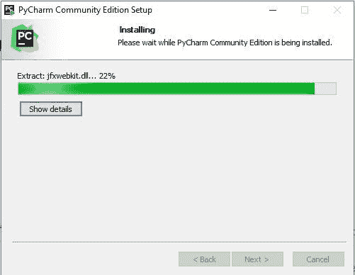*
*   ***安装完毕:**
    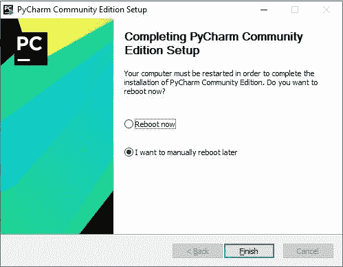*

### *PyCharm 入门:*

*安装完成后，可以从开始菜单中搜索并启动 PyCharm。按照下面给出的步骤进行操作:*

*   ***从开始菜单搜索:**
    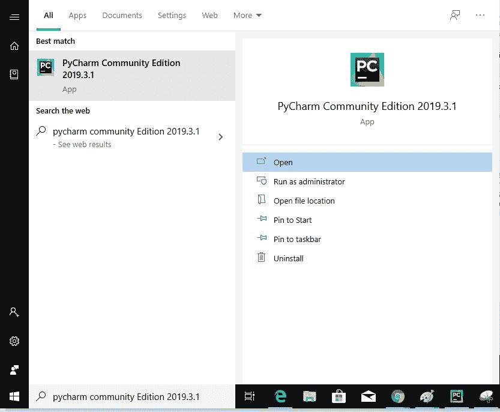*
*   ***完成许可协议:**
    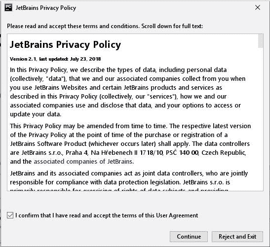*
*   ***设置 UI 主题:**
    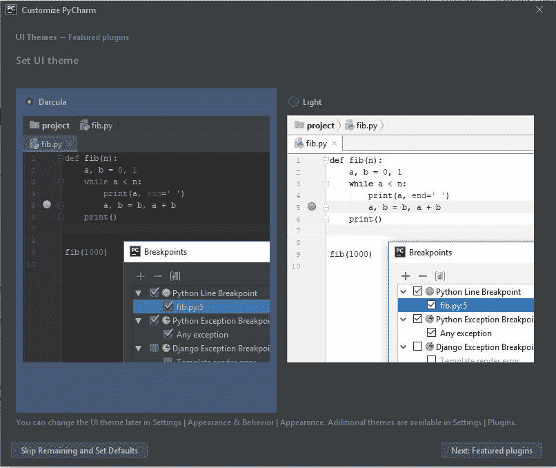*
*   ***下载插件:**
    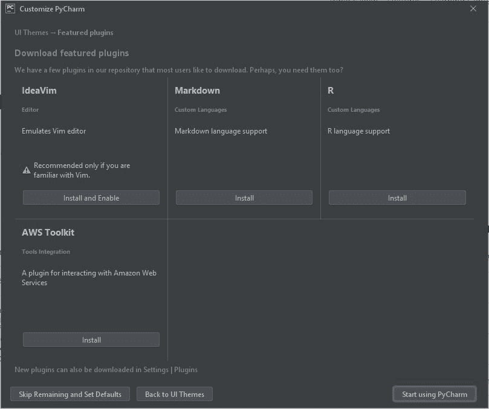*
*   ***开始使用 PyCharm:**
    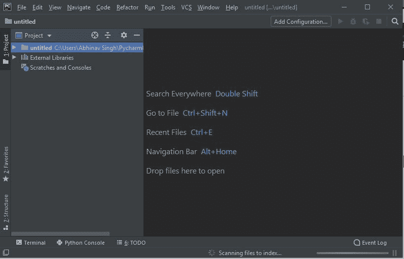*