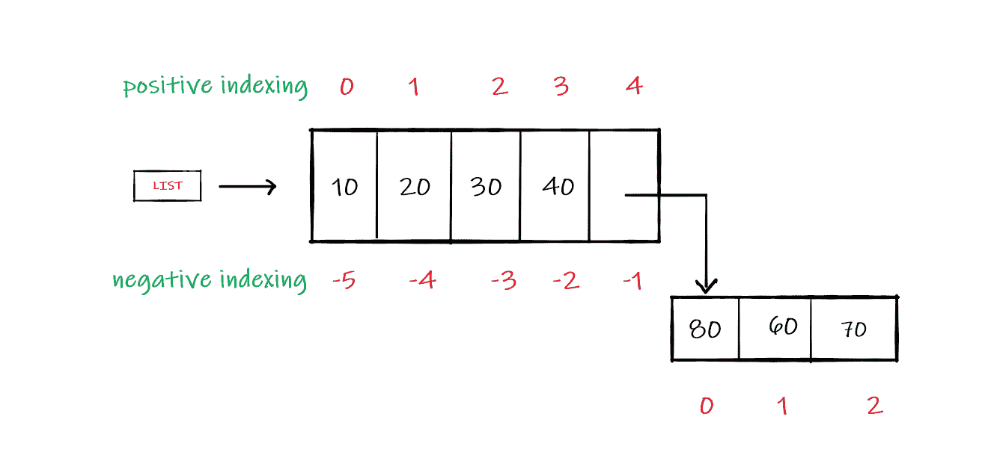
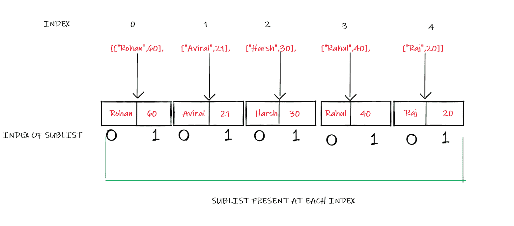

# 如何在 Python 中迭代嵌套列表？

> 原文:[https://www . geesforgeks . org/如何迭代 python 中的嵌套列表/](https://www.geeksforgeeks.org/how-to-iterate-through-a-nested-list-in-python/)

在本文中，我们将看到如何迭代嵌套列表。一个列表可以用来存储多种数据类型，如整数、字符串、对象，还可以在它自己的中**另一个列表。列表中的这个**子列表**就是通常所说的嵌套列表。**

## 遍历嵌套列表

让我们看看典型的嵌套列表是什么样子的:

![list=[10, 20, 30, 40, [ 80,60, 70 ] ]](img/6c62017612433971e8f05bcb3c7841bc.png "Rendered by QuickLaTeX.com")



有多种方法可以迭代嵌套列表:

**方法 1:** 使用索引遍历列表

**正指数的使用:**

## 蟒蛇 3

```
# code
list = [10, 20, 30, 40, [80, 60, 70]]

# Printing sublist at index 4
print(list[4])

# Printing 1st element of the sublist
print(list[4][0])

# Printing 2nd element of the sublist
print(list[4][1])

# Printing 3rd element of the sublist
print(list[4][2])
```

**输出:**

```
[80, 60, 70]
80
60
70
```

**负指数的使用**

## 蟒蛇 3

```
# code
list = [10, 20, 30, 40, [80, 60, 70]]

# Printing sublist at index 4
print(list[-1])

# Printing 1st element of the sublist
print(list[-1][-3])

# Printing 2nd element of the sublist
print(list[-1][-2])

# Printing 3rd element of the sublist
print(list[-1][-1])
```

**输出:**

```
[80, 60, 70]
80
60
70
```

**方法 2:** 使用循环遍历列表



## 蟒蛇 3

```
# code
# LIST
list = [["Rohan", 60], ["Aviral", 21], 
        ["Harsh", 30], ["Rahul", 40],
        ["Raj", 20]]

# looping through nested list using indexes
for names in list:
    print(names[0], "is", names[1],
          "years old.")
```

**输出:**

```
Rohan is 60 years old.
Aviral is 21 years old.
Harsh is 30 years old.
Rahul is 40 years old.
Raj is 20 years old.
```

**在循环中使用临时变量。**

## 蟒蛇 3

```
# code
# LIST
list = [["Rohan", 60], ["Aviral", 21], 
        ["Harsh", 30], ["Rahul", 40],
        ["Raj", 20]]

# looping through nested list using multiple 
# temporary variables
for name, age in list:
    print(name, "is",
          age, "years old.")
```

**输出:**

```
Rohan is 60 years old.
Aviral is 21 years old.
Harsh is 30 years old.
Rahul is 40 years old.
Raj is 20 years old.
```

**方法 3:** 切片的使用

## 蟒蛇 3

```
# code
# list
list = [10, 20, 30, 40,
        [80, 60, 70]]

# print the entire Sublist at index 4
print(list[4][:])

# printing first two element
print(list[4][0 : 2])
```

**输出:**

```
[80, 60, 70]
[80, 60]
```