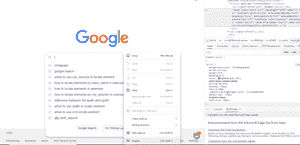

# 如何用硒蟒定位元素？

> 原文:[https://www . geesforgeks . org/如何使用硒元素定位-python/](https://www.geeksforgeeks.org/how-to-locate-elements-using-selenium-python/)

**Selenium:** 是一个开源工具，可以自动运行 web 浏览器。它提供了一个单一的接口，允许您用像 Ruby、Java、NodeJS、PHP、Perl、Python 和 C#等编程语言编写测试脚本。我个人更喜欢 python，因为用 Python 编写代码非常容易。然后，浏览器驱动程序在设备的浏览器实例上执行这些脚本。要安装此模块，请在您的终端上运行此命令。

**安装:**

```py
pip install selenium
```

### **我们来看看如何从网页中复制元素:**

**步骤 1:** 左键单击页面上的任意位置，然后单击检查。将鼠标悬停在元素上，它将突出显示所需的元素，在控制台或突出显示区域中左键单击，然后复制您喜欢使用的路径。


第一步

**步骤 2:** 现在再次左键点击你想要检查的元素，这里是谷歌搜索框。之后单击检查。



第二步

**步骤 3:** 将鼠标悬停在元素上，它将在控制台或突出显示区域中突出显示所需的元素，然后复制您喜欢使用的路径。


第三步

**硒提供定位元素的方法。一些最常用的元素是:**

*   查找元素 by XPath
*   find _ element _ by _ css _ 选择器
*   按名称查找元素
*   查找元素 by id
*   按类名查找元素

**我们来看看分步实现:**

**步骤 1:** 导入库并使用 chromedrivermanager。

## 蟒蛇 3

```py
import selenium
import time
import webdriver_manager
from selenium.webdriver.common.keys import Keys
from selenium import webdriver

# To make it work on older versions
# of chrome we will use ChromeDriverManager
from webdriver_manager.chrome import ChromeDriverManager
driver = webdriver.Chrome(ChromeDriverManager().install())

driver.get('https://www.google.com')
```

**第二步:**通过 _xpath 找到 _element_by。

当我们没有合适的 id 或名称属性时，您可能需要使用该属性。

## 蟒蛇 3

```py
ele = driver.find_element_by_xpath(
    '/html/body/div[2]/div[2]/form/div[2]/div[1]/div[1]/div/div[2]/input').click()
```

**第三步:**find _ element _ by _ CSS _ selector。

这是最精确的选择器之一。用 class_attribute 名称返回名称会有所帮助。

## 蟒蛇 3

```py
ele = driver.find_element_by_css_selector(
    '#tsf > div:nth-child(2) > div.A8SBwf > div.RNNXgb > div > div.a4bIc > input').click()
```

**第四步:**查找 _element_by_name。

我们还可以使用名称来查找元素。我们必须指定我们想要定位元素的名称

## 蟒蛇 3

```py
ele = driver.find_element_by_name('q').click()
```

**第五步:**查找 _ 元素 _by_id

这是定位元素的最简单方法。CSS 标识对于页面上的每个元素都是唯一的。因此，一个标识可以唯一地标识一个元素。

## 蟒蛇 3

```py
ele = driver.find_element_by_id( 'id name').click()
```

**第 6 步:**查找 _ 元素 _by_class_name

这不是首选方式，因为许多元素具有相同的类，我们也可以使用 css_selector 而不是 class_name。此外，它将返回第一个给定的类名元素“无异常”。

## 蟒蛇 3

```py
ele = driver.find_element_by_class_name("gLFyf gsfi").click()
```

**下面是完整的实现:**

## 蟒蛇 3

```py
import selenium
import time
import webdriver_manager
from selenium.webdriver.common.keys import Keys
from selenium import webdriver

# To make it work on older versions 
# of chrome we will use ChromeDriverManager
from webdriver_manager.chrome import ChromeDriverManager
driver = webdriver.Chrome(ChromeDriverManager().install())
driver.get('https://www.google.com')

# We can use any one of the ele to locate the element
ele = driver.find_element_by_xpath(
    '/html/body/div[2]/div[2]/form/div[2]/div[1]/div[1]/div/div[2]/input').click()

ele = driver.find_element_by_css_selector(
    '#tsf > div:nth-child(2) > div.A8SBwf.emcav > div.RNNXgb > div > div.a4bIc > input').click()

ele = driver.find_element_by_name('q').click()
ele = driver.find_element_by_class_name('gLFyf gsfi').click()
```

**输出:**


使用这些定位器中的任何一个自动选择谷歌搜索框