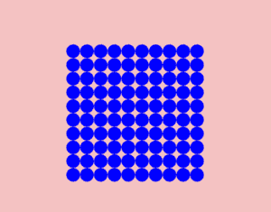

# 如何利用 Python 街机借助嵌套循环制作盒子？

> 原文:[https://www . geeksforgeeks . org/如何使用 python arcade 借助嵌套循环制作盒子/](https://www.geeksforgeeks.org/how-to-make-a-box-with-the-help-of-nested-loops-using-python-arcade/)

街机图书馆是目前用于制作 2D 游戏的现代框架。这里讨论的嵌套循环类似于任何其他编程语言中的嵌套循环。

下面的教程将逐步解释如何使用 Python 的 arcade 模块借助嵌套循环绘制一个框。

1.  导入街机库。
2.  在这里，我们将使用圆圈来形成一个盒子。因此，声明参数，这些参数将在以后的程序中用于指定两个圆之间的间距和边距。
3.  使用 arcade.open_window()指定输出屏幕的宽度、高度和标题。
4.  设置输出屏幕的背景颜色。(可选)
5.  告诉街机模块，你现在将发送绘图命令。
6.  使用嵌套循环定义功能，即一个循环在另一个循环内。我们已经为每行定义了一个[循环](https://www.geeksforgeeks.org/loops-in-python/)，在此之内为每列定义了另一个循环。
7.  最后，我们需要通知街机模块，我们想要的盒子应该由哪个对象组成。这里，使用了一个圆，但是您可以定义您选择的任何其他几何形状。
8.  告诉 arcade 你已经画好了，让它在输出窗口停止输出，直到用户不按 exit。

下面是实现。

## 蟒蛇 3

```py
#import module
import arcade

#specify parameters
col_spacing = 20
row_spacing = 20
lmargin = 110
bmargin = 110

# Open the window
arcade.open_window(500, 500, "BOX")

#set the background
arcade.set_background_color(arcade.color.BABY_PINK)

# Start the render process.
arcade.start_render()

# Loop for each row
for row in range(10):

    # Loop for each column
    for col in range(10):

        # Calculate our location
        x = col * col_spacing + lmargin
        y = row * row_spacing + bmargin

        # Draw the objects
        arcade.draw_circle_filled(x+1, y+2, 10, arcade.color.BLUE)

# Finish.
arcade.finish_render()

# Keep the window up.
arcade.run()
```

**输出:**

