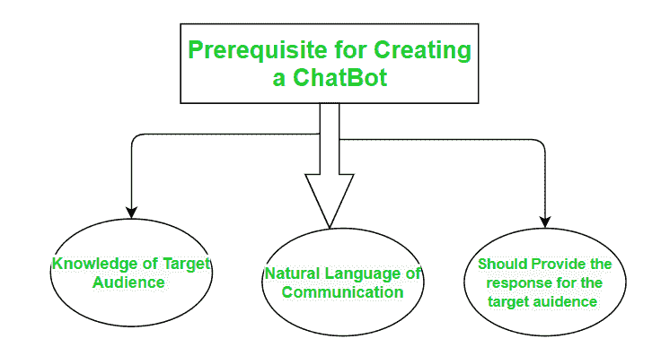
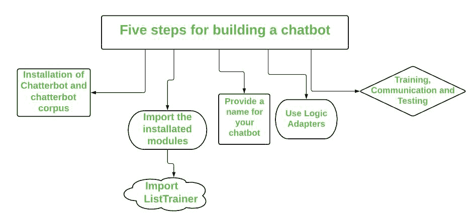

# 如何使用查特机器人模块用 Python 制作查特机器人？

> 原文:[https://www . geeksforgeeks . org/how-to-make-a-chat bot-in-python-use-chat bot-module/](https://www.geeksforgeeks.org/how-to-make-a-chatbot-in-python-using-chatterbot-module/)

一个**聊天机器人**基本上是一个计算机程序，通过听觉或文本的方法在用户和计算机之间进行对话。它可以作为现实世界的对话伙伴。



**ChatterBot** 是 python 中的一个库，它会对用户输入产生响应。它使用了许多机器学习算法来生成各种各样的响应。这使得用户更容易使用 chatterbot 库制作 chatter bot，以获得更准确的响应。聊天机器人的设计是这样的，它允许机器人以多种语言进行交互，包括西班牙语、德语、英语和许多地区语言。机器学习算法也使机器人更容易根据用户输入自行改进。

## 如何用 Python 五步制作聊天机器人？

我们将采取循序渐进的方法，最终制造出我们自己的聊天机器人。



让我们以最短的方式开始我们自己的聊天机器人之旅

**第一步。安装查特机器人和查特机器人语料库模块:**

第一步也是最重要的一步是安装 chatterbot 库。您还需要安装 chatterbot _ 文集库。基本上，语料库意味着一堆单词。Chatterbot 语料库包含一堆包含在 chatterbot 模块中的数据。语料库被机器人用来训练自己。

在终端上运行以下 pip 命令进行安装:

```py
pip install chatterbot
pip install chatterbot_corpus
```

**第二步。导入模块**

我们必须导入两个类:来自 chatterbot 的 chatterbot 和来自 chatter bot . trainer 的 ListTrainer。

**列表训练器:**允许使用字符串列表训练聊天机器人，其中列表代表一个对话。

## 蟒蛇 3

```py
from chatterbot import ChatBot
from chatterbot.trainers import ListTrainer
```

**第三步。命名我们的聊天机器人:**

现在，我们会给我们选择的聊天机器人起任何名字。只需创建一个聊天机器人对象。在这里，聊天机器人被称为“机器人”，只是为了让它可以理解。

## 蟒蛇 3

```py
bot = ChatBot('Bot')
```

**第四步。逻辑适配器的使用:**

逻辑适配器管理聊天机器人背后的逻辑，也就是说，它为提供给它的任何输入挑选响应。此参数包含所有逻辑运算符的列表。当一个以上的逻辑适配器投入使用时，chatbot 将计算置信度，计算出的置信度最高的响应将作为输出返回。

这里我们使用了两个逻辑适配器:

1.  **最佳匹配:**最佳匹配适配器帮助它从已经提供的响应列表中选择最佳匹配。
2.  **time logicaladapter:**time logicaladapter 标识询问当前时间问题的语句。如果检测到匹配的问题，则返回包含当前时间的响应。

## 蟒蛇 3

```py
chatbot = ChatBot(
    'JARVIS',  
    logic_adapters=[
        'chatterbot.logic.BestMatch',
        'chatterbot.logic.TimeLogicAdapter'],
)  
```

**第五步。培训、交流**、**和测试:**

在培训过程中，您需要传递一个语句列表，其中每个语句的顺序基于它在给定对话中的位置。我们必须训练机器人来提高它的性能。为此，我们需要通过传递一系列句子来调用 **train()** 方法。培训确保机器人有足够的知识开始对特定的输入做出特定的反应。培训结束后，我们来检查一下它的沟通技巧。最后一步是做测试

您现在必须执行以下命令:

## 蟒蛇 3

```py
from chatterbot.trainers import ListTrainer

trainer = ListTrainer(bot)

trainer.train([
    'Hi',
    'Hello',
    'I need roadmap for Competitive Programming',
    'Just create an account on GFG and start',
    'I have a query.',
    'Please elaborate, your concern',
    'How long it will take to become expert in Coding ?',
    'It usually depends on the amount of practice.',
    'Ok Thanks',
    'No Problem! Have a Good Day!'
])
```

**现在，让我们测试聊天机器人:**

## 蟒蛇 3

```py
response = bot.get_response("Good morning!")

print(response)
```

**输出:**

```py
Hello
```

**以下是完整实现:**

## 蟒蛇 3

```py
from chatterbot import ChatBot
from chatterbot.trainers import ListTrainer
from chatterbot.trainers import ListTrainer

bot = ChatBot('Bot')

trainer = ListTrainer(bot)

trainer.train([
    'Hi',
    'Hello',
    'I need roadmap for Competitive Programming',
    'Just create an account on GFG and start',
    'I have a query.',
    'Please elaborate, your concern',
    'How long it will take to become expert in Coding ?',
    'It usually depends on the amount of practice.',
    'Ok Thanks',
    'No Problem! Have a Good Day!'
])

while True:
    request=input('you :')
    if request == 'OK' or request == 'ok':
        print('Bot: bye')
        break
    else:
        response=bot.get_response(request)
        print('Bot:', response)
```

**输出:**

