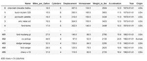
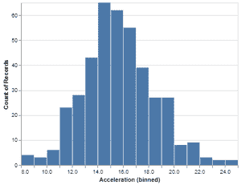
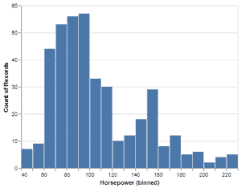
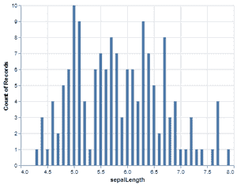
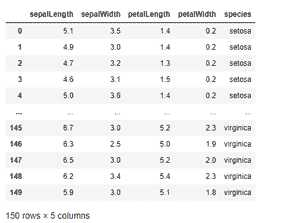
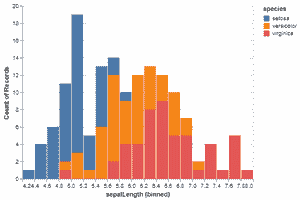

# 如何用 Python 中的牛郎星制作简单的直方图？

> 原文:[https://www . geeksforgeeks . org/如何用 python 中的牛郎星制作简单直方图/](https://www.geeksforgeeks.org/how-to-make-a-simple-histogram-with-altair-in-python/)

**先决条件:** [**牛郎星**](https://www.geeksforgeeks.org/introduction-to-altair-in-python/)

简单直方图是用矩形表示频率分布，矩形的宽度代表类别间隔。直方图是将分组数据点组织到指定范围的图形表示。通过使用直方图，我们可以将大量数据及其频率可视化为一个连续的图。

**安装:**

为了安装牛郎星库和 vega _ datasets，我们在命令提示符下运行以下命令。

```py
pip install altair
pip install vega-datasets
```

在这篇文章中，我们将在阿尔泰程序库的帮助下，通过使用下面不同例子中的 cars 和 iris 数据集来绘制简单直方图。

**分步方法:**

*   导入库。
*   创建或加载数据集。
*   从数据集中选择要制作直方图的列。
*   为了制作直方图，在牛郎星库中我们必须给出三个重要的元素(牛郎星。Chart()，mark_bar()，encode())。
*   把它放在变量中，让它被命名为“hist”。
*   然后为了看到这个情节，我们必须写一行代码 hist.show()，我们就完成了。

> **语法:**
> 
> 牛郎星。图表(数据集的名称)。mark_bar()。encode(x =“name _ of _ col 1 ”, y =“name _ of _ col 2 ”)

**例 1:打印汽车数据集()**

## 计算机编程语言

```py
# importing libraries
import altair as alt
from vega_datasets import data
import vega_datasets

# importing cars dataset form
# vega_datasets provided by altair
car_data  = data.cars()

# printing the dataset
display(car_data)
```

**输出:**



**示例 2:使用汽车数据集制作默认的简单直方图。**

## 计算机编程语言

```py
# importing libraries
import altair as alt
from vega_datasets import data

# importing cars dataset
# form vega_datasets provided by altair
car_data  = data.cars()

# making the simple histogram on Acceleration
hist = alt.Chart(car_data).mark_bar().encode(x = 'Acceleration',
                                             y = 'count()')
# showing the histogram
hist.show()
```

**输出:**


**示例 3:通过将 bin 设置为“加速”，使用 cars 数据集制作简单直方图。**

## 计算机编程语言

```py
# importing libraries
import altair as alt
from vega_datasets import data

# importing cars dataset
# form vega_datasets provided by altair
car_data  = data.cars()

# making the simple histogram
# on Acceleration by setting the bin
hist = alt.Chart(car_data).mark_bar().encode(x = alt.X('Acceleration',
                                                       bin = alt.BinParams(maxbins = 30)),
                                             y = 'count()')
# showing the histogram
hist.show()
```

**输出:**



**示例 4:通过将 bin 设置为马力，使用汽车数据集制作简单直方图。**

## 计算机编程语言

```py
# importing libraries
import altair as alt
from vega_datasets import data

# importing cars dataset
# form vega_datasets provided by altair
car_data  = data.cars()

# making the simple histogram
# on Horsepower by setting the bin
hist = alt.Chart(car_data).mark_bar().encode(x = alt.X('Horsepower',
                                                       bin = alt.BinParams(maxbins = 20)),
                                             y = 'count()')
# showing the histogram
hist.show()
```

**输出:**



**示例 5:在 sepalLength 上使用虹膜数据集制作默认的简单直方图。**

## 计算机编程语言

```py
# importing libraries
import altair as alt
from vega_datasets import data

# importing cars dataset
# form vega_datasets provided by altair
iris_data  = data.iris()

# making the simple histogram on sepal length
hist = alt.Chart(iris_data).mark_bar().encode(x = 'sepalLength',
                                              y = 'count()')

# showing the histogram
hist.show()
```

**输出:**



加载虹膜数据集后，我们还可以在程序中使用 print(iris_data)打印虹膜数据集。我们的虹膜数据集打印后是这样的。



**例 6:通过设置仓位和颜色制作简单直方图。**

## 计算机编程语言

```py
# importing libraries
import altair as alt
from vega_datasets import data

# importing cars dataset
# form vega_datasets provided by altair
iris_data  = data.iris()

# making the simple histogram
# on sepal length by setting bin
# and color on the basis of species
hist = alt.Chart(iris_data).mark_bar().encode(x = alt.X('sepalLength',
                                                        bin = alt.BinParams(maxbins = 20)),
                                              y = 'count()',color = 'species')
# showing the histogram
hist.show()
```

**输出:**



同样，我们可以在数据集的任何值上制作简单的直方图，并相应地设置颜色。

**示例 7:通过设置 bin 和颜色，在花瓣宽度上使用虹膜数据集制作简单直方图。**

## 计算机编程语言

```py
# importing libraries
import altair as alt
from vega_datasets import data

# importing cars dataset
# form vega_datasets provided by altair
iris_data  = data.iris()

# making the simple histogram
# on petal width by setting bin
# and color on the basis of species
hist = alt.Chart(iris_data).mark_bar().encode(x = alt.X('petalWidth',
                                                        bin = alt.BinParams(maxbins = 10)),
                                              y = 'count()', color = 'species')
# showing the histogram
hist.show()
```

**输出:**

