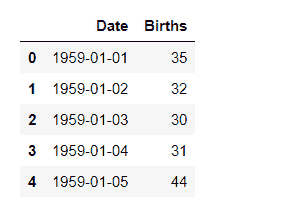
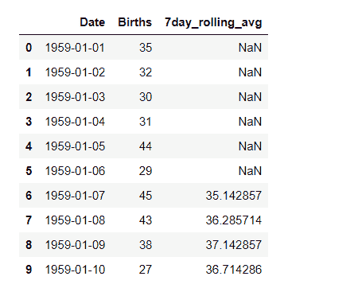
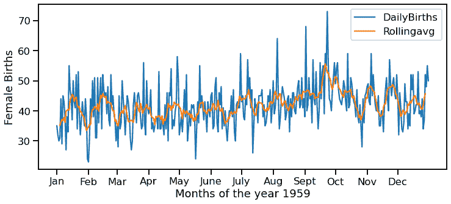

# 如何用 Python 做一个滚动平均的时间序列图？

> 原文:[https://www . geeksforgeeks . org/如何制作时间序列图-带滚动平均值的 python/](https://www.geeksforgeeks.org/how-to-make-a-time-series-plot-with-rolling-average-in-python/)

时间序列图用于观察数据集在一段时间内的各种趋势。在这样的问题中，数据是按时间排序的，并且可以根据数据集中考虑的时间单位(日、月、秒、小时等)而波动。).在绘制时间序列数据时，这些波动可能会阻止我们清楚地了解图中的波峰和波谷。因此，为了清楚地从数据中获得价值，我们使用滚动平均概念来绘制时间序列图。

滚动平均值或移动平均值是最后 n 个值的简单平均值。它可以帮助我们发现本来很难发现的趋势。此外，它们可以用来确定长期趋势。你可以简单地计算滚动平均值，将之前的“n”个值相加，然后除以“n”本身。但就此而言，滚动平均值的第一个(n-1)值将是南。

在本文中，我们将学习如何使用 Pandas 和 Seaborn 库在 Python 中制作滚动平均值的时间序列图。下面是使用熊猫计算滚动平均值的语法。

> **语法:**熊猫。DataFrame.rolling(n)。平均值()

我们将使用“每日女性出生数据集”。这个数据集描述了 1959 年加州每日女性出生的数量。从 1959 年 1 月 1 日到 1959 年 12 月 31 日，共有 365 次观测。可以从这个[链接](https://raw.githubusercontent.com/jbrownlee/Datasets/master/daily-total-female-births.csv)下载数据集。

**让我们逐步实现:**

**步骤 1:** 导入库。

## 蟒蛇 3

```
# import the libraries
import pandas as pd
import seaborn as sns
import matplotlib.pyplot as plt
```

**步骤 2:** 导入数据集

## 蟒蛇 3

```
# import the dataset
data = pd.read_csv( "https://raw.githubusercontent.com/jbrownlee/ \
                   Datasets/master/daily-total-female-births.csv")

#view the dataset
display( data.head())
```

**输出:**



**步骤 3:** 使用 seaborn.lineplot()绘制一个简单的时间序列图

## 蟒蛇 3

```
# set figure size
plt.figure( figsize = ( 12, 5))

# plot a simple time series plot
# using seaborn.lineplot()
sns.lineplot( x = 'Date',
             y = 'Births',
             data = data,
             label = 'DailyBirths')

plt.xlabel( 'Months of the year 1959')

# setting customized ticklabels for x axis
pos = [ '1959-01-01', '1959-02-01', '1959-03-01', '1959-04-01', 
       '1959-05-01', '1959-06-01', '1959-07-01', '1959-08-01',
       '1959-09-01', '1959-10-01', '1959-11-01', '1959-12-01']

lab = [ 'Jan', 'Feb', 'Mar', 'Apr', 'May', 'June', 
       'July', 'Aug', 'Sept', 'Oct', 'Nov', 'Dec']

plt.xticks( pos, lab)

plt.ylabel('Female Births')
```

**输出:**


我们可以注意到，由于数据波动很大，从上面的图中获取知识非常困难。所以，让我们再次绘制它，但这次使用滚动平均概念。

**第四步:使用熊猫计算滚动平均值。DataFrame.rolling.mean()。**

对于滚动平均，我们必须采取一定的窗口大小。这里，我们取窗口大小= 7，即 7 天或 1 周的滚动平均值。

## 蟒蛇 3

```
# computing a 7 day rolling average
data[ '7day_rolling_avg' ] = data.Births.rolling( 7).mean()

# viewing the dataset
Display(data.head(10))
```

**输出:**



我们可以观察到“7day_rolling_avg”列的前 6 个值是 NaN 值。这是因为这 6 个值没有足够的数据来计算 7 天的滚动平均值。同样，在图中，对于前六个值，没有绘制任何值。

**第 5 步:**使用第 4 步中计算的滚动平均值绘制时间序列图

## 蟒蛇 3

```
# set figure size
plt.figure( figsize = ( 12, 5))

# plot a simple time series plot
# using seaborn.lineplot()
sns.lineplot( x = 'Date',
             y = 'Births',
             data = data,
             label = 'DailyBirths')

# plot using rolling average
sns.lineplot( x = 'Date',
             y = '7day_rolling_avg',
             data = data,
             label = 'Rollingavg')

plt.xlabel('Months of the year 1959')

# setting customized ticklabels for x axis
pos = [ '1959-01-01', '1959-02-01', '1959-03-01', '1959-04-01', 
       '1959-05-01', '1959-06-01', '1959-07-01', '1959-08-01',
       '1959-09-01', '1959-10-01', '1959-11-01', '1959-12-01']

lab = [ 'Jan', 'Feb', 'Mar', 'Apr', 'May', 'June', 
       'July', 'Aug', 'Sept', 'Oct', 'Nov', 'Dec']

plt.xticks( pos, lab)

plt.ylabel('Female Births')
```

**输出:**



从上图中我们可以清楚地看到，滚动平均值平滑了女性出生人数，我们可以更明显地注意到峰值。