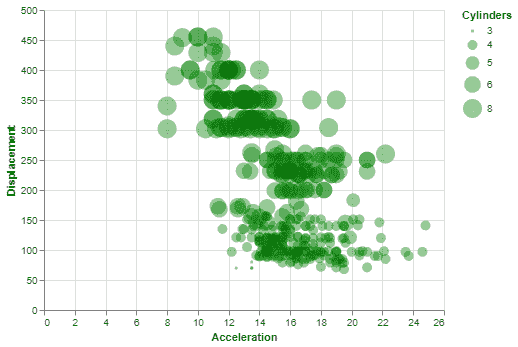

# 如何用 Python 用牛郎星制作泡泡图？

> 原文:[https://www . geeksforgeeks . org/如何用 python 中的牛郎星制作泡泡图/](https://www.geeksforgeeks.org/how-to-make-bubble-plot-with-altair-in-python/)

**先决条件:**[Python 中的牛郎星介绍](https://www.geeksforgeeks.org/introduction-to-altair-in-python/#:~:text=Altair%20is%20a%20statistical%20visualization,efficient%20way%20to%20visualize%20datasets.)

**牛郎星**是一个简单易用的 python 统计可视化库。它包含许多类型的内置地块和各种选项来修改属性和生成其他地块。**气泡图**对于第三个变量的数据的二元分析是非常有用的可视化。它不容易在阿尔泰库中找到，但可以通过对散点图进行一些简单的修改来实现。

## 什么是泡沫图？

气泡图基本上是两个变量/数据列之间的散点图，其中代替数据点的是不同大小的气泡/圆圈，表示第三个变量。第三个变量可以是数量型、序数型或名义型，但在气泡图中使用的最佳类型是序数型，即具有特定排序的数据。图例显示了哪个圆的大小对应于哪个数据值。

气泡图可以帮助我们看到两个变量相对于第三个变量的关系。泡沫越大，对应的数据价值就越大。

## 创建气泡图

要绘制气泡图，用户只需将数据集中合适的变量映射到简单散点图中的大小编码。

这些文章中使用的数据集来自 Vega_datasets 库。

## 蟒蛇 3

```py
# Python3 program to illustrate 
# How to make a bubble plot
# using the altair library

# Importing altair and vega_datasets 
import altair as alt 
from vega_datasets import data 

# Selecting the cars dataset 
cars = data.cars() 

# Making the base scatter plot 
alt.Chart(cars).mark_point().encode( 

  # Map the sepalLength to x-axis 
    x = 'Acceleration', 

  # Map the petalLength to y-axis 
    y = 'Displacement',

  # Map the Cylinders variable to size
  # and specify it as a nominal variable
      size = 'Cylinders:N'
)
```

**输出:**


使用牛郎星的简单气泡图

### 自定义气泡图

您可以对气泡图进行以下自定义:

*   **颜色**:通过设置 mark_point()方法的颜色参数，可以改变气泡的默认颜色。
*   **不透明度**:通过设置 mark_point()方法的不透明度参数，可以改变气泡的默认不透明度。范围从 0 到 1。
*   **填充**:默认为假，但可以将填充参数改为真，从而用指定的颜色填充气泡。

**示例:**

## 蟒蛇 3

```py
# Python3 program to illustrate
# how to customize a bubble plot

# Importing altair and vega_datasets
import altair as alt
from vega_datasets import data

# Selecting the cars dataset
cars = data.cars()

# Making the base scatter plot
# and adding the customizations
alt.Chart(cars).mark_point(color='green',
                           filled=True,
                           opacity=0.4).encode(

    # Map the sepalLength to x-axis
    x='Acceleration',

    # Map the petalLength to y-axis
    y='Displacement',

    # Map the Cylinders variable to size
    # and specify it as a nominal variable
    size='Cylinders:N'
)
```

**输出:**



使用牛郎星定制气泡图