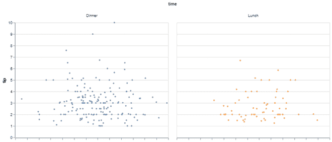
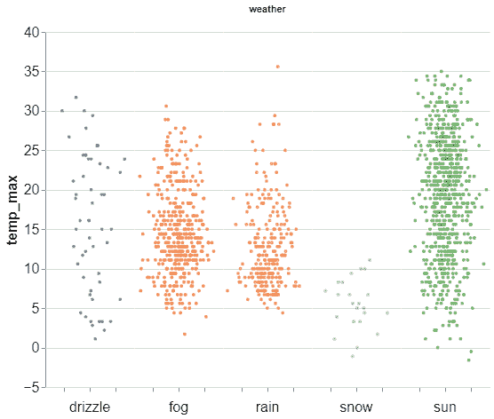
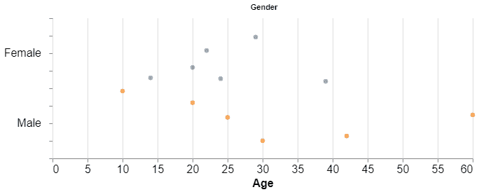

# 如何在阿尔泰 Python 中制作抖动的脱衣舞？

> 原文:[https://www . geeksforgeeks . org/如何在 altair-python 中制作抖动剥离批次/](https://www.geeksforgeeks.org/how-to-make-stripplot-with-jitter-in-altair-python/)

**先决条件:** [牛郎星](https://www.geeksforgeeks.org/introduction-to-altair-in-python/)

Altair 是一个 python 中的统计数据可视化库，它基于 Vega 和 Vega-Lite 可视化语法。剥离物用于图形数据分析。这是一个简单的响应值图，沿着单个轴按排序顺序排列。带状图由两个不同的轴(X，Y)组成。带状图为直方图和其他基于密度的图提供了替代方案，通常用于小型数据集。

简单的带状图用于将数据绘制为点，这对我们可能不是很有用。为了让简单的脱衣舞更加有教养，我们添加了随机抖动。简单来说，抖动就是给数据增加少量可变性(水平或垂直)，以确保所有数据点都可见。

### **进场:**

*   导入库
*   导入或创建数据
*   使用牛郎星创建一个简单的脱衣舞场
*   向轴添加抖动变量
*   修改不同属性的值以获得更好的可视化效果(可选)。
*   显示图

### 使用的功能

calculate_transform()允许用户在数据集中定义使用表达式从其他字段计算的新字段。

**语法:**

```py
calculate_transform(<some_expression>)
```

下面给出了使用上述方法各种实现

**例 1:**

在这个项目中，我们将使用小费数据集来研究午餐时间和晚餐时间作为小费支付的金额。

## 蟒蛇 3

```py
#import libraries
import seaborn
import altair as alt

# Getting data
tip = seaborn.load_dataset('tips')

# plotting the stripplot
stripplot = alt.Chart(tip).mark_circle(size=14).encode(
    # X-axis jitter Vertical
    x=alt.X(
        'jitter:Q',
        title=None,
        axis=alt.Axis(ticks=True, grid=False, labels=False),
        scale=alt.Scale(),
    ),
    y=alt.Y('tip:Q',
            scale=alt.Scale()),
    color=alt.Color('time:N', legend=None),
    column=alt.Column(
        'time:N',
    ),
).transform_calculate(
    # Generate Gaussian jitter with a Box-Muller transform
    jitter='sqrt(-2*log(random()))*cos(2*PI*random())')
stripplot
```

**输出:**



**例 2:**

这个项目研究西雅图地区不同天气条件下的最高温度。

## 蟒蛇 3

```py
#import libraries
import altair as alt
from vega_datasets import data

# Getting data
weather = data.seattle_weather()

# plotting the stripplot
stripplot = alt.Chart(weather).mark_circle(size=14).encode(
    x=alt.X(
        'jitter:Q',
        title=None,
        axis=alt.Axis(ticks=True, grid=False, labels=False),
        scale=alt.Scale(),
    ),
    y=alt.Y('temp_max:Q',
            scale=alt.Scale(
                domain=(-1, 40))),
    color=alt.Color('weather:N', legend=None),
    column=alt.Column(
        'weather:N',
        header=alt.Header(
            labelFontSize=16,
            labelAngle=0,
            titleOrient='top',
            labelOrient='bottom',
            labelAlign='center',
            labelPadding=25,
        ),
    ),
).transform_calculate(
    # Generate Gaussian jitter with a Box-Muller transform
    jitter='sqrt(-2*log(random()))*cos(2*PI*random())'
).configure_facet(
    spacing=0
).configure_view(
    stroke=None
).configure_axis(
    labelFontSize=16,
    titleFontSize=16
).properties(height=400, width=100)
stripplot
```

**输出:**



**例 3。**

该图描绘了给定数据的年龄和性别。(水平图)

## 蟒蛇 3

```py
#import libraries
import seaborn
import altair as alt
import pandas as pd

# Creating our own data
data = [['Tom', 10, 'Male'], ['Nick', 25, 'Male'], ['Juli', 14, 'Female'],
        ['Sarah', 30, 'Male'], ['Pulkit', 20, 'Male'], ['Ritika', 20, 'Female'],
        ['Sayantan', 60, 'Male'], ['Pam', 39, 'Female'], ['Peter', 42, 'Male'],
        ['Jenefer', 24, 'Female'], ['Tony', 29, 'Female'], ['Myler', 22, 'Female']]
df = pd.DataFrame(data, columns=['Name', 'Age', 'Gender'])

# plotting the stripplot Horizontal
horizontal_stripplot = alt.Chart(df, width=600, height=100).mark_circle(size=40).encode(
    y=alt.Y(
        'jitter:Q',
        title=None,
        axis=alt.Axis(ticks=True, grid=False, labels=False),
        scale=alt.Scale(),
    ),
    x=alt.X('Age:Q', scale=alt.Scale()),
    color=alt.Color('Gender:N', legend=None),
    row=alt.Row(
        'Gender:N',
        header=alt.Header(
            labelAngle=0,
            labelFontSize=16,
            titleOrient='top',
            labelOrient='left',
            labelAlign='left',
        ),
    ),
).transform_calculate(
    # Generate Gaussian jitter with a Box-Muller transform
    jitter='sqrt(-2*log(random()))*cos(2*PI*random())'
).configure_facet(
    spacing=0
).configure_view(
    stroke=None
).configure_axis(
    labelFontSize=16,
    titleFontSize=16
)
horizontal_stripplot
```

**输出:**

