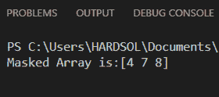
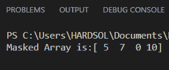

# 如何在 Python 中使用另一个数组来屏蔽一个数组？

> 原文:[https://www . geeksforgeeks . org/如何使用 python 中的另一个数组来屏蔽一个数组/](https://www.geeksforgeeks.org/how-to-mask-an-array-using-another-array-in-python/)

在本文中，我们将学习如何在 Python 中使用另一个数组来屏蔽一个数组。当使用数据数组或数据帧时，屏蔽非常有用。掩码是一个数组，包含给定条件的布尔值列表。屏蔽数组是指包含无效或缺失条目的数组。

使用数组掩码，我们可以轻松处理数组或数据集/数据帧中缺失、无效或不需要的条目。掩码对于布尔值列表非常重要，即“真”或“假”，当应用于原始数组以返回感兴趣的元素时，“真”指满足给定条件的值，“假”指不满足条件的值。

我们可以使用以下函数使用另一个来屏蔽数组

> numpy.ma.masked_where(条件，arr)
> 
> num py . ma . get ask(arr)
> 
> numpy.ma.masked_array(arr，mask=)
> 
> 哪里，
> 
> **条件:**掩蔽条件
> 
> **arr:** arr 待屏蔽
> 
> **屏蔽:**屏蔽数组的结果

### 所需步骤

*   导入库。
*   创建掩蔽函数。
*   屏蔽可以通过以下两种方法完成
    *   **使用 masked_where()函数:**将函数中的两个数组作为参数传递，然后使用 *numpy.ma.masked_where()* 函数传递要屏蔽的条件和数组。在本文中，我们通过使用一个数组并为该条件屏蔽另一个数组来给出屏蔽条件。
    *   **使用 masked_where()、getmask()和 masked_array()函数:**将函数中的两个数组作为参数传递，然后使用 *numpy.ma.masked_where()* 函数传递掩蔽条件和要掩蔽的数组在这里我们使用的是给定 make 条件的同一个数组和要掩蔽的数组，并将结果存储在变量中，然后使用 *numpy.ma.getmask()* 函数传递 marked_where 函数的结果并将其存储在变量中现在使用创建的掩码屏蔽另一个数组，为此，我们使用 *numpy.ma.masked_array()* 函数，该函数传递要制作的数组和参数掩码='res_mask '，用于使用另一个数组制作数组，并将其存储在一个名为' masked '的变量中。
*   然后从函数中返回被屏蔽的。
*   现在创建主函数
*   创建两个数组，一个用于屏蔽另一个。
*   然后调用我们上面创建的函数，将函数中的两个数组作为参数传递，并将结果存储在名为“masked”的变量 let 中。
*   现在，为了获得一维数组，我们使用 *numpy.ma.compressed()* 将掩码作为参数传递。
*   然后打印屏蔽阵列。

**例 1:使用** **第二阵**掩蔽 **第一阵**

在上面的例子中，我们根据第一数组 mod 7 的每个元素为真的条件，使用第二数组来屏蔽第一数组，在第一数组中屏蔽那些满足索引元素条件的元素。

由于我们有 array1 = [1，2，4，5，7，8，9]和 array2 = [10，12，14，5，7，0，13]，我们给出了 array2%7 的条件，因此在 array2 中，元素 14，7 和 0 满足该条件，它们出现在索引 2，4 和 5 处，因此在 array1 中的相同索引处，元素被屏蔽，因此我们得到的数组是[4，7，8]。

## 计算机编程语言

```
# importing the library
import numpy as np

# function to create masked array
def masking(ar1, ar2):

  # masking the array1 by using array2 
  # where array2 mod 7 is true
  mask = np.ma.masked_where(ar2%7,ar1)

  return mask

# main function
if __name__ == '__main__':

  # creating two arrays
  x = np.array([1,2,4,5,7,8,9])
  y = np.array([10,12,14,5,7,0,13])

  # calling masking function to get 
  # masked array
  masked = masking(x,y)

  # getting the values as 1-d array which 
  # are non masked 
  masked_array = np.ma.compressed(mask)

  # printing the resultant array after masking
  print(f'Masked Array is:{masked_array}')
```

**输出:**



**示例 2:使用第一阵列**掩蔽第二阵列

在上面的例子中，我们使用第一个数组来屏蔽第二个数组，给定条件 array1<5 意味着 array1 中小于 5 的元素满足该条件，并且该元素的索引将在第二个数组中被屏蔽。

因为我们有 array1 = [1，2，4，5，7，8，9]和 array2 = [10，12，14，5，7，0，13]，所以在 array1 中，元素 1，2 和 4 小于 5，它们出现在索引 0，1 和 2 中，所以这个元素满足条件，所以在 array2 中，出现在同一索引中的元素被屏蔽，我们使用函数 numpy.ma.compressed()，所以这个函数返回非屏蔽值。所以掩蔽后我们有[5 7 0 10]。

## 计算机编程语言

```
# importing the library
import numpy as np

# function to create masked array
def masking(ar1, ar2):

    # masking the array2 by using array1
    # where condition array1 is less than
    # 5 is true
    mask = np.ma.masked_where(ar1 < 5, ar2)

    return mask

# main function
if __name__ == '__main__':

    # creating two arrays
    x = np.array([1, 2, 4, 5, 7, 8, 9])
    y = np.array([10, 12, 14, 5, 7, 0, 13])

    # calling masking function to get
    # masked array
    masked = masking(x, y)

    # getting the values as 1-d array which 
    # are non masked
    masked_array = np.ma.compressed(mask)

    # printing the resultant array after masking
    print(f'Masked Array is:{masked_array}')
```

**输出:**



**示例 3:通过 getmask()函数**使用第二个数组来屏蔽第一个数组

在上面的例子中，为了使用第二个数组制作第一个数组的掩码，首先我们通过为 ar2 给出条件 ar2%3 来创建第二个数组的掩码。然后我们使用 *numpy.ma.getmask()* 函数传递创建的掩码的结果，然后我们使用 *numpy.ma.masked_array()* 创建第一个数组的掩码，其中传递 ar1，传递 mask=res_mask，这是数组 2 的掩码。

这样，我们可以使用另一个数组来屏蔽一个数组。

## 计算机编程语言

```
# importing the library
import numpy as np

# function to create masked array
def masking(ar1, ar2):

    # creating the mask of array2 where
    # condition array2 mod 3 is true
    mask = np.ma.masked_where(ar2 % 3, ar2)

    # getting the mask of the array
    res_mask = np.ma.getmask(mask)

    # masking the array1 with the result 
    # of mask of array2
    masked = np.ma.masked_array(ar1, mask=res_mask)

    return masked

# main function
if __name__ == '__main__':

    # creating two arrays
    x = np.array([1, 2, 4, 5, 7, 8, 9])
    y = np.array([10, 12, 14, 5, 7, 0, 12])

    # calling masking function to get masked
    # array
    masked = masking(x, y)
    masked_array = np.ma.compressed(masked)

    # printing the resultant array after masking
    print(f'Masked Array is:{masked_array}')
```

**输出:**


**示例 4:通过 getmask()函数**使用第一个数组屏蔽第二个数组

在上面的例子中，为了使用第一个数组制作第二个数组的掩码，首先我们通过给定条件 ar1 <4 for ar1\. Then we are using *numpy.ma.getmask()* 函数来创建第一个数组的掩码，其中我们传递创建的掩码的结果，然后我们使用 *numpy.ma.masked_array()* 来创建第二个数组的掩码，其中传递 ar2 和传递 mask=res_mask，这是数组 1 的掩码。

这样，我们可以使用另一个数组来屏蔽一个数组。

## 计算机编程语言

```
# importing the library
import numpy as np

# function to create masked array
def masking(ar1, ar2):

    # creating the mask of array2 where
    # condition array2 mod 3 is true
    mask = np.ma.masked_where(ar2 % 3, ar2)

    # getting the mask of the array
    res_mask = np.ma.getmask(mask)

    # masking the array1 with the result of 
    # mask of array2
    masked = np.ma.masked_array(ar1, mask=res_mask)

    return masked

# main function
if __name__ == '__main__':

    # creating two arrays
    x = np.array([1, 2, 4, 5, 7, 8, 9])
    y = np.array([10, 12, 14, 5, 7, 0, 12])

    # calling masking function to get
    # masked array
    masked = masking(x, y)
    masked_array = np.ma.compressed(masked)

    # printing the resultant array after masking
    print(f'Masked Array is:{masked_array}')
```

**输出:**

