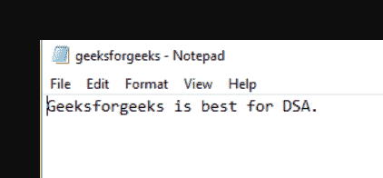

# 如何使用 with 语句

打开文件

> 原文:[https://www . geesforgeks . org/如何使用 with-statement 打开文件/](https://www.geeksforgeeks.org/how-to-open-a-file-using-the-with-statement/)

Python 中带有 关键字的 ***被用作[上下文管理器](https://www.geeksforgeeks.org/context-manager-in-python/)。与任何编程语言一样，文件操作或数据库连接等资源的使用非常普遍。但是这些资源供应有限。因此，主要问题在于确保在使用后释放这些资源。如果它们没有被释放，那么它将导致资源泄漏，并可能导致系统变慢或崩溃。***

众所周知，open()函数通常用于 python 中的文件处理。但是使用上下文管理器(比如关键字)来处理文件是一种标准的做法，因为一旦使用完成，它就会自动释放文件。

> **语法:**以 open(file_name)作为文件
> 
> **其中:** file_name:是文件的名称。

**示例 1:** 使用 with 语句的简单示例。

我们的系统中已经有了一个文件名 *geeksforgeeks.txt* ，它有以下数据:



现在我们将打开文件并使用带有语句的*读取它的数据。*

## 蟒蛇 3

```
with open("geeksforgeeks.txt","r") as gfg_file:
   lines = gfg_file.readlines()
   print(lines)
```

**输出:**

```
['Geeksforgeeks is best for DSA']
```

**示例 2:** 我们还可以使用带有语句的*向文件中追加或写入数据。我们将附加字符串*T5“你好，极客！”* 到我们的 geeksforgeeks.txt 文件。*

## 蟒蛇 3

```
# appending string to file
with open("geeksforgeeks.txt","a") as gfg_file:
   gfg_file.write("Hello Geeks!")

# reading the file contents
# to verify if successfully appended the data
with open("geeksforgeeks.txt","r") as gfg_file:
    lines = gfg_file.readlines()
    print(lines)
```

**输出:**

```
['Geeksforgeeks is best for DSAHello Geeks!']
```