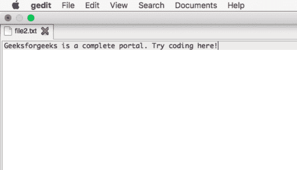

# 如何在 Python 中一起打开两个文件？

> 原文:[https://www . geesforgeks . org/如何在 python 中一起打开两个文件/](https://www.geeksforgeeks.org/how-to-open-two-files-together-in-python/)

Python 提供了同时打开和处理多个文件的能力。不同的文件可以以不同的模式打开，以模拟同时写入或读取这些文件。可以使用 Python 2.7 或更高版本支持的 open()方法打开任意数量的文件。以下语法用于打开多个文件:

```py
with open(file_1) as f1, open(file_2) as f2
```

*   file_1:指定第一个文件的路径
*   file_2:指定第二个文件的路径

不同的文件有不同的名称。文件可以分别以读取、写入或追加模式打开。操作同步执行，两个文件同时打开。默认情况下，打开文件是为了支持读取操作。

以下文本文件用于后面的代码部分:

 

### 所需步骤

在 Python 中一起打开多个文件的步骤:

*   这两个文件都是用 open()方法打开的，每个文件使用不同的名称
*   可以使用 readline()方法访问文件的内容。
*   可以对这些文件的内容执行不同的读/写操作。

**例 1:**

## 蟒蛇 3

```py
# opening both the files in reading modes
with open("file1.txt") as f1, open("file2.txt") as f2:

  # reading f1 contents
  line1 = f1.readline()

  # reading f2 contents
  line2 = f2.readline()

  # printing contents of f1 followed by f2 
  print(line1, line2)
```

**输出:**

```py
Geeksforgeeks is a complete portal. Try coding here!
```

**例 2:**

下面的代码表示将一个文件的内容存储到另一个文件中。

## 蟒蛇 3

```py
# opening file1 in reading mode and file2 in writing mode
with open('file1.txt', 'r') as f1, open('file2.txt', 'w') as f2:

  # writing the contents of file1 into file2
  f2.write(f1.read())
```

**输出:**本次操作后文件 2 的内容如下:

