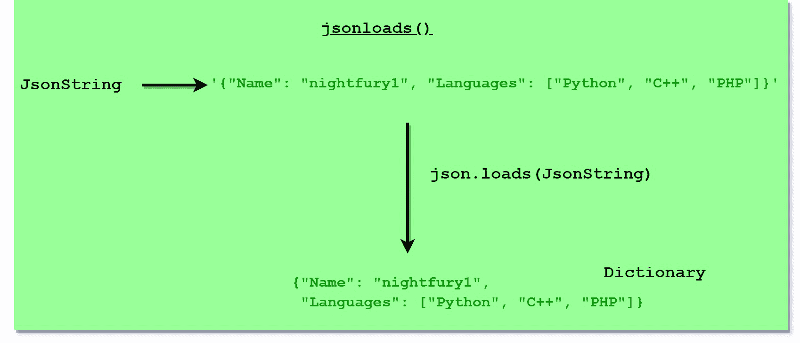
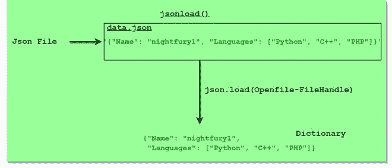

# 如何将数据从 JSON 解析成 Python？

> 原文:[https://www . geesforgeks . org/如何将数据从 json 解析为 python/](https://www.geeksforgeeks.org/how-to-parse-data-from-json-into-python/)

**JSON 是一种轻量级的数据交换格式。人类很容易读写，机器也很容易解析和生成。基本上，它用于以指定的格式表示数据，以便于访问和处理数据。在这里，我们将学习如何从 JSON 创建和解析数据并使用它。**

在开始解析数据的细节之前，我们应该了解一下 Python 中的***【JSON】***模块。它提供了一个类似于 pickle 的应用编程接口，用于将 Python 中的内存对象转换为序列化表示，并使解析 JSON 数据和文件变得容易。下面是一些使用 Python 解析 JSON 数据的方法:

*   **Python JSON 到字典:**借助 ***json.loads()*** 函数，我们可以解析 JSON 对象到字典。



## 蟒蛇 3

```py
# importing json library
import json

geek = '{"Name": "nightfury1", "Languages": ["Python", "C++", "PHP"]}'
geek_dict = json.loads(geek)

# printing all elements of dictionary
print("Dictionary after parsing: ", geek_dict)

# printing the values using key
print("\nValues in Languages: ", geek_dict['Languages'])
```

**输出:**

> 解析后的字典:{ ' Name ':' nighfurly 1 '，' Languages': ['Python '，' C++ '，' PHP']}
> 
> 语言中的值:[“Python”、“C++”、“PHP”]

*   **Python JSON to Ordered Dictionary:**我们必须使用相同的 ***json.loads()*** 函数来解析对象，但是要进入 Ordered，我们必须从 *<u>collections</u>* 模块中添加关键字“**object _ pairs _ hook = ordereddct**”。

## 蟒蛇 3

```py
import json
from collections import OrderedDict

#create Ordered Dictionary using keyword
# 'object_pairs_hook=OrderDict'
data = json.loads('{"GeeksforGeeks":1, "Gulshan": 2, "nightfury_1": 3, "Geek": 4}',
                  object_pairs_hook=OrderedDict)
print("Ordered Dictionary: ", data)
```

**输出:**

> 有序字典:有序字典([('GeeksforGeeks '，1)、(' Gulshan '，2)、(' nightfury_1 '，3)、(' Geek '，4)]

*   **使用 json 文件解析:**借助 ***json.load()*** 方法，我们可以通过打开所需的 JSON 文件，将 JSON 对象解析为字典格式。



## 蟒蛇 3

```py
# importing json library
import json

with open('data.json') as f:
  data = json.load(f)

# printing data after loading the json file
print(data)
```

**输出:**

> {'Name': 'nightfury1 '，' Language': ['Python '，' C++ '，' PHP']}