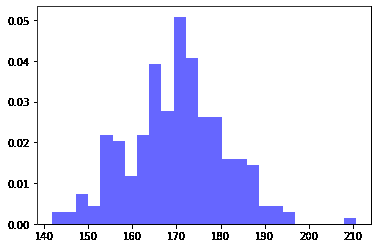
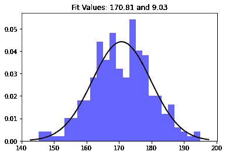

# 如何在 Python 中绘制直方图上的正态分布？

> 原文:[https://www . geeksforgeeks . org/如何在 python 直方图上绘制正态分布图/](https://www.geeksforgeeks.org/how-to-plot-normal-distribution-over-histogram-in-python/)

在本文中，我们将讨论如何使用 Python 绘制直方图上的正态分布。首先，我们将分别讨论直方图和正态分布图，然后我们将两个图合并在一起。

### 柱状图

直方图是在用户定义的范围内排列的一组数据点的图形表示。类似于条形图，条形图通过将多个数据点分组到逻辑区域或容器中，将一系列数据压缩成易于解释的可视对象。

要绘制这个，我们将使用:

*   **random.normal()** 求数据正态分布的方法。它有三个参数:
    *   **锁定**–(平均)钟形件顶部的位置。
    *   **缩放**–(标准差)您希望图表分布的均匀程度。
    *   **尺寸**–返回阵列的形状
*   **Matplotlib 库**的 **Pyplot** 模块中的功能 **hist()** 用于绘制直方图。它有如下参数:
    *   **数据**:该参数为数据序列。
    *   **bin** :此参数可选，包含整数、序列或字符串。
    *   **密度**:该参数为可选参数，包含布尔值。
    *   **Alpha** : Value 为 0 到 1 之间的整数，代表每个直方图的透明度。n 值越小，直方图越透明。

## 蟒蛇 3

```py
import numpy as np
import matplotlib.pyplot as plt

# Generating some random data
# for an example
data = np.random.normal(170, 10, 250)

# Plotting the histogram.
plt.hist(data, bins=25, density=True, alpha=0.6, color='b')

plt.show()
```

**输出:**



### 正态分布

**正态分布图**有两个参数:

*   平均值，代表图表的最大值，图表总是对称的。
*   标准偏差决定了平均值以外的变化量。较小的标准偏差(与平均值相比)显得更陡，而较大的标准偏差(与平均值相比)显得平坦。

**绘制正态分布**

*   NumPy arange()用于创建和返回对均匀分布的 ndarray 实例的引用。
*   借助**均值()**和 **stdev()** 方法，计算均值和标准差，初始化为**均值**和 **sd** 变量。
*   在图()方法中，我们使用了一种方法 **pdf()** 来显示概率密度函数。这个 **pdf()** 方法呈现在 **scipy.stats.norm.** 里面

**示例:**

## 蟒蛇 3

```py
import numpy as np
import matplotlib.pyplot as plt
from scipy.stats import norm
import statistics

# Plot between -30 and 30 with
# 0.1 steps.
x_axis = np.arange(-30, 30, 0.1)

# Calculating mean and standard 
# deviation
mean = statistics.mean(x_axis)
sd = statistics.stdev(x_axis)

plt.plot(x_axis, norm.pdf(x_axis, mean, sd))
plt.show()
```

**输出:**


### 直方图上的正态分布

现在，我们已经完成了直方图和正态分布图的分离讨论，但是如果我们能够将它们可视化在具有相同比例的图形中，那就太好了。这可以通过访问同一单元格中的两个图表，然后使用 **plt.show()轻松实现。**现在，让我们讨论一下使用 Python 绘制直方图上的正态分布。

我们认为一些数据的直方图遵循正态分布。SciPy 有多种方法可以用来估计随机变量的最佳分布，也有参数可以最好地模拟这种适应性。例如，对于这个问题中的数据，最佳拟合正态分布的均值和标准差可以如下找到:

```py
# Make the normal distribution fit the data: 
mu, std = norm.fit (data) # mean and standard deviation
```

Matplotlib 库的 Pyplot 模块中的函数 xlim()用于获取或设置该轴的 x 极限。

> **语法:**matplotlib . pyplot . xlim(* args，**kwargs)
> 
> **参数:**该方法使用以下参数，如下所述:
> 
> *   **左侧**:使用该参数将 xlim 设置为左侧。
> *   **右侧**:使用该参数在右侧设置 xlim。
> *   **** kwargs** :该参数是控制标签外观的文本属性。
> 
> **返回值:**
> 
> *   **左，右:**返回 x 轴新极限值的元组。

## 蟒蛇 3

```py
import numpy as np
from scipy.stats import norm
import matplotlib.pyplot as plt

# Generate some data for this 
# demonstration.
data = np.random.normal(170, 10, 250)

# Fit a normal distribution to
# the data:
# mean and standard deviation
mu, std = norm.fit(data) 

# Plot the histogram.
plt.hist(data, bins=25, density=True, alpha=0.6, color='b')

# Plot the PDF.
xmin, xmax = plt.xlim()
x = np.linspace(xmin, xmax, 100)
p = norm.pdf(x, mu, std)

plt.plot(x, p, 'k', linewidth=2)
title = "Fit Values: {:.2f} and {:.2f}".format(mu, std)
plt.title(title)

plt.show()
```

**输出:**

