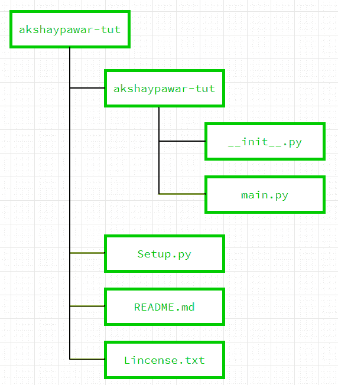
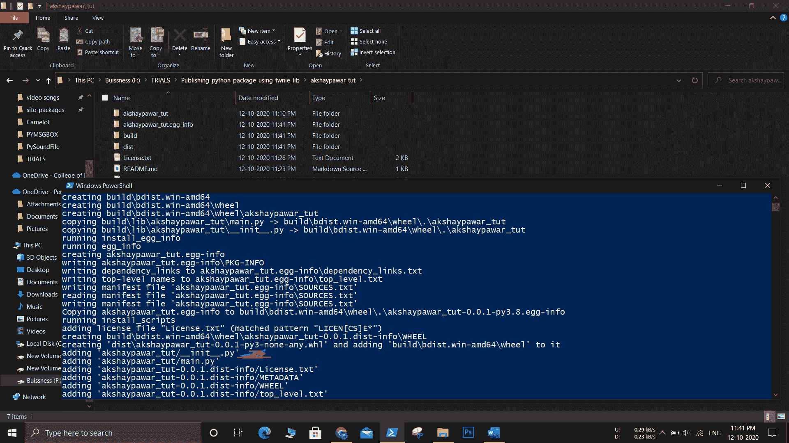

# 如何使用 Twine 模块在 PyPi 发布 Python 包？

> 原文:[https://www . geesforgeks . org/how-publish-python-package-at-pypi-using-twine-module/](https://www.geeksforgeeks.org/how-to-publish-python-package-at-pypi-using-twine-module/)

Python 如此灵活和易于使用是因为它的可用包托管在[pypi.org](https://pypi.org/)上，让我们看看如何使用 *Twine* 模块在 PyPi 上发布您自己的包。

### **要求:**

*   如果不创建帐户，您必须有 pypi.org 的帐户
*   创建*缠绕*库是为了简化 *pypi* 中的包上传。安装*缠绕*库。

```py
pip install twine
```

*   准备好你的包裹。

### **发布包的步骤:**

**第一步:准备并整理包裹**

*   创建文件夹的名称必须与包的名称相同。(确保您的包的名称在 PyPi 中不存在)
*   在这个里面创建另一个同名或者包名相同的文件夹，里面放所有*。py* 文件强制使用单个 *__init__。py* 文件和所有文件夹/程序必须导入 *__init__。皮。*
*   现在在程序文件夹外和根文件夹内，必须创建 *Setup.py* 文件、 *README.md* 文件和 *License.txt* 文件。下面是层次结构的流程图:



对于子文件夹 *akshaypawar-tut* :

 

**第二步:创建*****readme . MD*****文件**

*。md* 文件是标记语言一样的标记文件，它有自己的语法，它作为一个用户友好的*自述文件*将显示在主页上。

您可以使用 VS Code 的扩展或任何在线编辑器，如[https://dillinger.io/](https://dillinger.io/)来创建[自述文件。](https://drive.google.com/file/d/1i9WBEmpIUHM_aL6nzTKKKV8vNCezMzxr/view?usp=sharing)

**第三步:创建*****license . txt*****文件**

你的包必须有许可证，如果你不想在全世界分享，你可以使用 [License.txt](https://drive.google.com/file/d/1G_I5oYvxALcLg92uG0WjIv8UJprR0bGO/view?usp=sharing) 。如果你的包有政策，你可以使用任何在线许可证制造商网站，如[https://choosealicense.com/。](https://choosealicense.com/)

**第四步:创建** ***Setup.py*** **文件**

您的包必须有一个 *Setup.py* 文件，因为它是包的绑定组件之一，它描述了包的依赖关系和作者版本等。

以下是通用*设置代码。*一个人需要使用自己的凭证。

## 蟒蛇 3

```py
import setuptools

with open("README.md", "r") as fh:
    long_description = fh.read()

setuptools.setup(
    # Here is the module name.
    name="akshaypawar_tut",

    # version of the module
    version="0.0.1",

    # Name of Author
    author="Akshay Pawar",

    # your Email address
    author_email="akshaygpawar15@gmail.com",

    # #Small Description about module
    # description="adding number",

    # long_description=long_description,

    # Specifying that we are using markdown file for description
    long_description=long_description,
    long_description_content_type="text/markdown",

    # Any link to reach this module, ***if*** you have any webpage or github profile
    # url="https://github.com/username/",
    packages=setuptools.find_packages(),

    # if module has dependencies i.e. if your package rely on other package at pypi.org
    # then you must add there, in order to download every requirement of package

    #     install_requires=[
    #      "package1",
    #    "package2",
    #    ],

    license="MIT",

    # classifiers like program is suitable for python3, just leave as it is.
    classifiers=[
        "Programming Language :: Python :: 3",
        "License :: OSI Approved :: MIT License",
        "Operating System :: OS Independent",
    ],
)
```

**第五步:最后阶段**

这里你必须在[pypi.org](https://pypi.org/)上创建账户，我们也将使用*缠绕*库。整个包以*的形式上传。dist* 文件。

创建*。dist* 文件使用命令:

```py
# Windows
python setup.py bdist_wheel 
```

或者

```py
# Linux/Mac
python3 setup.py bdist_wheel 
```

执行上述命令时，您将在 Powershell 上看到此消息。



现在我们的二进制*。dist* 文件被创建，现在我们需要使用下面的命令上传它:

```py
twine upload dist/* 
```

输入关于*pypi.org*账户的所需凭证，包将被上传。


成功上传后，您将获得您的项目和所有细节的链接

[点击此处](https://pypi.org/project/akshaypawar-tut/)查看文章中讨论的上传包。