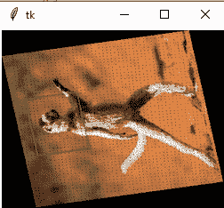

# 如何在 Python–Tkinter 中调整 Image 的大小？

> 原文:[https://www . geesforgeks . org/如何调整大小-python 中的图像-tkinter/](https://www.geeksforgeeks.org/how-to-resize-image-in-python-tkinter/)

**先决条件:**

*   tkinter
*   [箭](https://www.geeksforgeeks.org/python-pillow-a-fork-of-pil/)

Python 为开发图形用户界面提供了多个选项。在所有的 GUI 方法中，Tkinter 是最常用的方法。它是 Python 附带的 Tk 图形用户界面工具包的标准 Python 接口。Python 搭配 Tkinter 是创建 GUI 应用程序最快最简单的方法。使用 Tkinter 创建图形用户界面是一项简单的任务。

在本文中，我们将学习如何在 this 中使用 python 调整图像的大小。在 Tkinter 中，没有内置的方法或任何包来处理图像。这里我们就用 [**枕**](https://www.geeksforgeeks.org/python-pillow-a-fork-of-pil/) 库为图像。

**我们来了解一下分步实施:-**

*   导入所需库

## 蟒蛇 3

```
# Import Module
from tkinter import *
from PIL import Image, ImageTk
```

*   使用**枕**库中的 **open()** 方法读取图像

**语法:**

```
Image.open("Enter Image File Path", mode='r', **attr)
```

## 蟒蛇 3

```
# Read the Image
image = Image.open("Image File Path")
```

*   使用 [**调整图像大小()**](https://www.geeksforgeeks.org/python-pil-image-resize-method/) 方法。它返回该图像的一个调整大小的副本。

**语法:**

```
Image.resize((width,height) , resample=3, **attr)
```

## 蟒蛇 3

```
# Resize the image using resize() method
resize_image = image.resize((width, height))
```

*   添加标签并添加调整大小的图像

## 蟒蛇 3

```
img = ImageTk.PhotoImage(resize_image)

# create label and add resize image
label1 = Label(image=img)
label1.image = img
label1.pack()
```

**下面是实现:**

## 蟒蛇 3

```
# Import Module
from tkinter import *
from PIL import Image, ImageTk

# Create Tkinter Object
root = Tk()

# Read the Image
image = Image.open("Image File Path")

# Resize the image using resize() method
resize_image = image.resize((width, height))

img = ImageTk.PhotoImage(resize_image)

# create label and add resize image
label1 = Label(image=img)
label1.image = img
label1.pack()

# Execute Tkinter
root.mainloop()
```

**输出:-**



**250×200**

在上例中，在图像文件路径处输入文件名或路径，并根据需要输入宽度和高度的值。