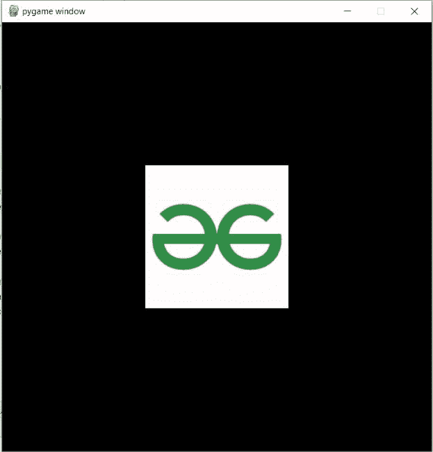

# 如何使用 PyGame 旋转和缩放图像？

> 原文:[https://www . geeksforgeeks . org/如何使用 pygame 旋转和缩放图像/](https://www.geeksforgeeks.org/how-to-rotate-and-scale-images-using-pygame/)

在本文中，我们将看到如何旋转和缩放图像。图像缩放是指调整原始图像的大小，图像旋转是指以某个角度旋转图像。坐标平面中的旋转是逆时针的。让我们继续使用方法和完整的代码来执行这些任务。

## 缩放图像

为了缩放图像，我们使用**pygame . transform . scale(IMAGE，DEFAULT_IMAGE_SIZE)** 方法，传递我们要缩放的图像和我们将根据需要手动设置的默认图像大小。

**示例:**

**使用的图像:**


## 蟒蛇 3

```
# Import pygame
import pygame

# Initialise pygame
pygame.init()

# Set window size
size = width,height = 600, 600
screen = pygame.display.set_mode(size)

# Clock
clock = pygame.time.Clock()

# Load image
image = pygame.image.load('gfg.png')

# Set the size for the image
DEFAULT_IMAGE_SIZE = (200, 200)

# Scale the image to your needed size
image = pygame.transform.scale(image, DEFAULT_IMAGE_SIZE)

# Set a default position
DEFAULT_IMAGE_POSITION = (200,200)

# Prepare loop condition
running = False

# Event loop
while not running:

    # Close window event
    for event in pygame.event.get():
        if event.type == pygame.QUIT:
            running = True

    # Background Color
    screen.fill((0, 0, 0))

    # Show the image
    screen.blit(image, DEFAULT_IMAGE_POSITION)

    # Part of event loop
    pygame.display.flip()
    clock.tick(30)
```

**输出:**



## **旋转图像**

要旋转图像，我们使用 **pygame.transform.rotate(图像，度数)**方法，在该方法中，我们传递要旋转的**图像**和要进行旋转的**度数**。

**示例:**

## 蟒蛇 3

```
# Import pygame
import pygame

# Initialise pygame
pygame.init()

# Set window size
size = width,height = 600, 600
screen = pygame.display.set_mode(size)

# Clock
clock = pygame.time.Clock()

# Load image
image = pygame.image.load('gfg.png')

# Set the size for the image
DEFAULT_IMAGE_SIZE = (200, 200)

# Rotate the image by any degree
image = pygame.transform.rotate(image, 180)

# Set a default position
DEFAULT_IMAGE_POSITION = (200,200)

# Prepare loop condition
running = False

# Event loop
while not running:

    # Close window event
    for event in pygame.event.get():
        if event.type == pygame.QUIT:
            running = True

    # Background Color
    screen.fill((0, 0, 0))

    # Show the image
    screen.blit(image, DEFAULT_IMAGE_POSITION)

    # Part of event loop
    pygame.display.flip()
    clock.tick(30)
```