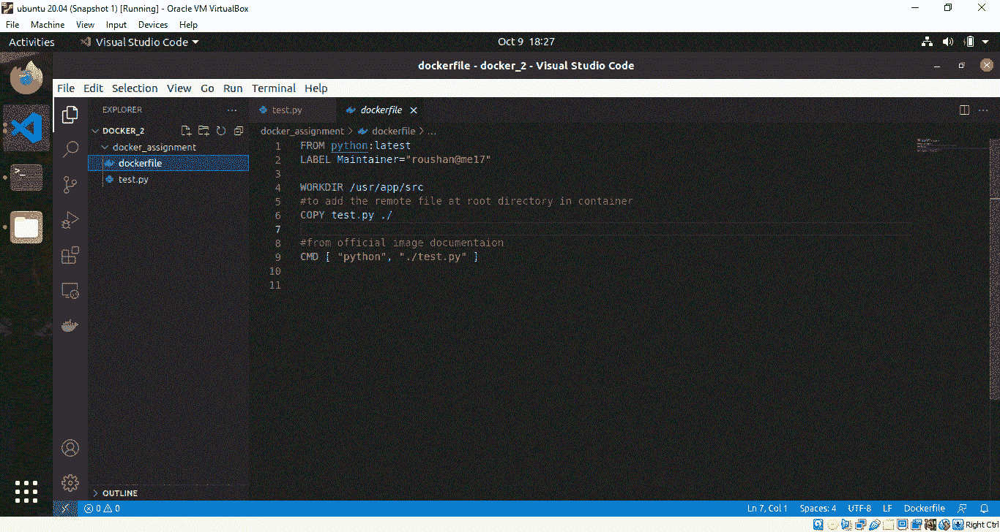

# 如何使用 Docker 运行 Python 脚本？

> 原文:[https://www . geesforgeks . org/如何运行 python 脚本使用 docker/](https://www.geeksforgeeks.org/how-to-run-a-python-script-using-docker/)

任务是构建一个 docker 映像，并执行一个添加两个给定数字的 python 脚本。这是通过一系列步骤实现的。

### **步骤 1:创建文件和文件夹**

我们将在电脑的桌面位置创建一个文件夹 docker_2。在文件夹内部，创建了另一个名为 docker_assignment 的文件夹。然后在这个文件夹中创建两个文件 dockerfile 和 test.py。



文件夹

### **步骤 2:创建文档文件**

在 dockerfile 中，我们将首先从 docker hub 获取 python 基础图像。一个最新的标签用于获取最新的官方 python 图像。在容器中设置工作目录非常重要。我选择了/usr/src/app。所有命令都将在这里执行，图像也将只在这里复制。

然后，我将 test.py 文件从我的 pc 复制到容器当前工作目录(。/或/usr/src/app)。

```py
#Deriving the latest base image
FROM python:latest

#Labels as key value pair
LABEL Maintainer="roushan.me17"

# Any working direcrtory can be chosen as per choice like '/' or '/home' etc
# i have chosen /usr/app/src
WORKDIR /usr/app/src

#to COPY the remote file at working directory in container
COPY test.py ./
# Now the structure looks like this '/usr/app/src/test.py'

#CMD instruction should be used to run the software
#contained by your image, along with any arguments.

CMD [ "python", "./test.py"]
```

### **步骤 3:构建码头工人容器**

在创建了 Python 脚本和 Dockerfile 之后，现在可以使用 Docker 构建命令来构建 Docker 映像。

这里-t 用于添加标签，以便轻松识别您的图像。

```py
docker container build -t python:0.0.1 /home/roushan/Desktop/docker_2/docker_assignment
```


### **步骤 4:验证图像构建**

构建好 Docker 映像后，您可以列出所有映像来检查映像是否已成功构建。

```py
docker images
```

您会发现您的图像名称列在这里，通过标签名称，您可以很容易地找到它。


### **步骤 5:运行码头工人容器**

现在，您可以使用 Docker 运行命令来运行您的 Docker 容器。

```py
docker run python:0.0.1
```


运行 Docker 容器后，您将看到将两个数字相加后的输出。

最后，在本文中，我们看到了如何构建一个简单的附加 Python 脚本，并在 Docker 容器中运行它。