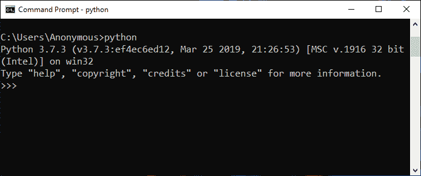
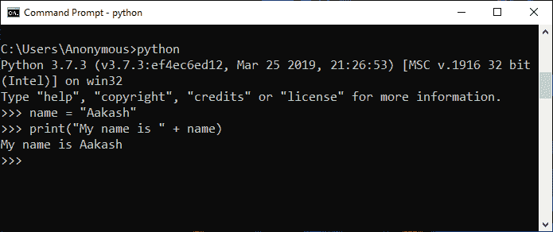
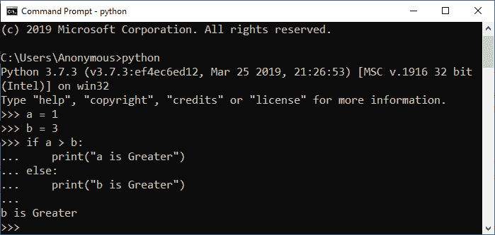
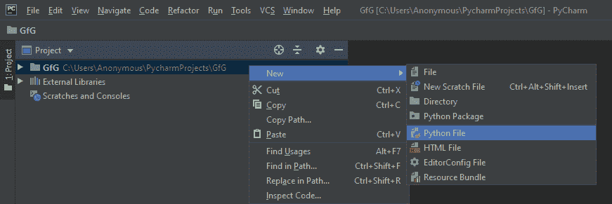

# 如何运行 Python 脚本

> 原文:[https://www.geeksforgeeks.org/how-to-run-a-python-script/](https://www.geeksforgeeks.org/how-to-run-a-python-script/)

**[Python](https://www.geeksforgeeks.org/python-programming-language/)** 是一种众所周知的高级编程语言。Python 脚本基本上是一个包含用 Python 编写的代码的文件。包含 python 脚本的文件扩展名为“`.py`”，如果在 windows 机器上运行，也可以扩展名为“`.pyw`”。要运行 python 脚本，我们需要一个需要下载和安装的 python 解释器。

下面是一个简单的 python 脚本来打印“`Hello World!`”:

```
print('Hello World!')

```

这里的“`print()`”功能是打印出括号内写的任何文字。我们可以使用上面脚本中显示的**单引号**或**双引号**来编写我们想要打印的文本。

如果您来自任何其他语言，那么您还会注意到语句末尾没有分号**，就像 Python 一样，您不需要指定行尾。此外，我们不需要包含或导入任何文件来运行简单的 python 脚本。**

**运行 python 脚本的方式不止一种，但是在走向运行 python 脚本的不同方式之前，我们首先要检查系统上是否安装了 **[python 解释器](https://www.geeksforgeeks.org/python-language-introduction/)** 。因此在窗口中，打开**‘cmd’(命令提示符)**并键入以下命令。**

```
python -V 
```

**该命令将给出安装的 Python 解释器的版本号，否则将显示一个错误。**

****

#### **运行 Python 脚本的不同方法**

**以下是我们运行 Python 脚本的方法。**

1.  **对话方式**
2.  **命令行**
3.  **文本编辑器(VS 代码)**
4.  **这里(皮加尔省)**

1.  ****Interactive Mode**:
    In Interactive Mode, you can run your script line by line in a sequence.

    要进入交互模式，您必须在 windows 机器上打开命令提示符，键入“`python`”并按下`Enter`。

    

    **示例 1:**
    在交互模式下运行以下一行:

    ```
    print('Hello World !')
    ```

    **输出:**

    

    **例 2:**
    在交互模式下，一条一条的运行以下几行:

    ```
    name = "Aakash"
    print("My name is " + name)
    ```

    **输出:**

    

    **例 3:**
    在交互模式下，依次运行以下一行:

    ```
    a = 1
    b = 3
    if a > b:
        print("a is Greater") 
    else:
        print("b is Greater")
    ```

    **输出:**

    

    **注意:**要退出此模式，请按“`Ctrl+Z`”，然后按“回车”或键入“`exit()`”，然后按`Enter`。** 
2.  ****命令行**
    要在命令行中运行存储在“`.py`”文件中的 Python 脚本，我们必须在命令提示符下的文件名前写入“`python`”关键字。**
 **```
python hello.py

```

你可以写自己的文件名来代替“ **hello.py** ”。

**输出:**


*   **Text Editor (VS Code)**
    To run Python script on a text editor like **[VS Code (Visual Studio Code)](https://code.visualstudio.com/)** then you will have to do the following:
    *   进入分机部分或在 windows 上按“`Ctrl+Shift+X`”，然后搜索并安装名为“`Python`”和“`Code Runner`”的分机。之后重启`vs code`。
    *   现在，创建一个名为“ **hello.py** 的新文件，并在其中写入以下代码:

        ```
        print('Hello World!')

        ```

    *   然后，在文本区域的任意位置单击鼠标右键，选择显示“`Run Code`”的选项或按“`Ctrl+Alt+N`”运行代码。

    **输出:**
    

    *   **IDE (PyCharm)**
    要在像 PyCharm 这样的 **[IDE(集成开发环境)上运行 Python 脚本，您必须执行以下操作:](https://www.jetbrains.com/pycharm/)**
    *   创建新项目。
    *   将该项目命名为“GfG”，然后单击“创建”。
    *   Select the root directory with the project name we specified in the last step. **Right click** on it, go in **New** and click on ‘**Python file**’ option. Then give the name of the file as ‘**hello**’ (you can specify any name as per your project requirement). This will create a ‘**hello.py**’ file in the project root directory.
        **Note:** You don’t have to specify the extension as it will take it automatically.

        

    *   现在编写下面的 Python 脚本来打印消息:

        ```
        print('Hello World !')
        ```

    *   To run this python script, **Right click** and select ‘**Run File in Python Console**’ option. This will open a console box at the bottom and show the out put there. We can also run using the **Green Play Button** at the top right corner of the IDE.

        

**输出:**
**