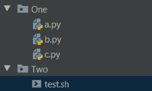

# 如何在一个文件夹中接连运行多个 Python 文件？

> 原文:[https://www . geesforgeks . org/如何一个接一个地运行多个 python 文件夹中的文件/](https://www.geeksforgeeks.org/how-to-run-multiple-python-file-in-a-folder-one-after-another/)

在本文中，我们将讨论如何在一个文件夹中一个接一个地运行多个 python 文件。这个任务可以有很多种方法，在这里，我们将讨论其中的几种。为了完成这个程序，我们必须在一个文件夹中创建一些 python 文件，并给这个文件夹起一些名字。

**a.py** 文件中的内容:

```
print("a")
```

**b.py** 文件中的内容:

```
print("b")
```

**c.py** 文件中的内容:

```
print("c")
```

**方法 1:** 使用 Bash 脚本:

我们已经创建了另一个名为**二的文件夹。**其中， **test.sh** 存在。



> **语法:**
> 
> #!/bin/bash
> 
> 对于$(查找$Folder_Path -name *)中的 python_file_name。py)
> 
> 做
> 
> python $python_file_name
> 
> 完成的

为了动态运行给定文件夹<folder_name>中的所有 python 程序文件，我们可以运行一个 bash 脚本文件来完成这个任务。借助上面这个脚本，我们可以运行所有**。位于给定文件夹路径中的 py** 扩展名文件。随着每次迭代，这个程序将运行每个 python 文件。</folder_name>

现在，让我们看看它的实现，

```
#!/bin/bash

for py_file in $(find ../one -name *.py)
do
    python $py_file
done
```

将此内容保存在 bash 脚本文件中(表示**)。sh** 分机)。现在，是时候运行这个文件了。如果我们使用的是 windows，那么我们必须在 **Git Bash** 中运行这个文件。

在 **Git Bash 终端运行该命令。**我们可以用“**”。/** ”(或任何有效的目录规范)在文件名之前:

```
./test.sh
```

**输出:**

```
a
b
c
```

**方法 2:** 使用命令提示符:

如果我们想使用命令提示符从另一个文件夹运行多个 python 文件。然后，我们需要采取文件的路径。在文件夹**一中，**我们已经创建了三个文件，现在我们在文件夹**二中。**

在文件夹中运行 python 文件的简单命令:

```
python a.py
```

但是在这里，我们在另一个文件夹中，所以我们需要采用 python 文件的路径，如下所示…

```
python ../One/a.py
```

现在，让我们看看如何从另一个文件夹运行多个文件的实现:

```
python ../One/a.py & python ../One/b.py & python ../One/c.py
```

**输出:**

```
a
b
c
```

这个讨论的方法不是有效的方法，因为我们不能编写这个复杂的命令来运行几个文件。

**方法三:**使用 Python 文件:

借助 **os** 模块，我们可以执行脚本，该脚本可以从另一个文件夹运行我们的 python 文件。首先，我们需要导入**操作系统**模块。

```
import os
```

在 **os** 模块内部，有一个名为**系统()的方法。**我们将我们的运行脚本命令称为参数。

```
os.system('python ../One/a.py')
```

**现在，让我们看看它的实现:**

## 蟒蛇 3

```
import os

os.system('python ../One/a.py')
os.system('python ../One/b.py')
os.system('python ../One/c.py')
```

**输出:**

```
a
b
c
```

**视频演示:**

<video class="wp-video-shortcode" id="video-564494-1" width="640" height="360" preload="metadata" controls=""><source type="video/mp4" src="https://media.geeksforgeeks.org/wp-content/uploads/20210225200618/GFG.mp4?_=1">[https://media.geeksforgeeks.org/wp-content/uploads/20210225200618/GFG.mp4](https://media.geeksforgeeks.org/wp-content/uploads/20210225200618/GFG.mp4)</video>