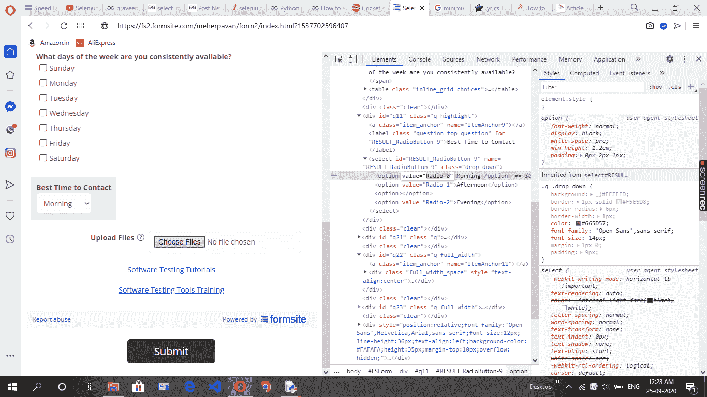
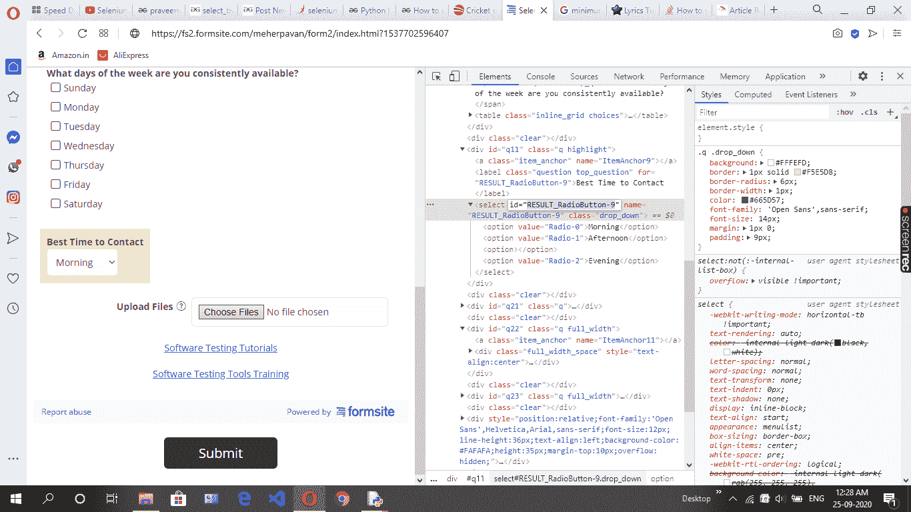

# 如何使用 Python 中的 Selenium 选择下拉菜单值？

> 原文:[https://www . geesforgeks . org/如何选择-下拉菜单-价值-使用-python 中的硒/](https://www.geeksforgeeks.org/how-to-select-a-drop-down-menu-value-using-selenium-in-python/)

**先决条件:** [使用硒的浏览器自动化](https://www.geeksforgeeks.org/browser-automation-using-selenium/)

硒是通过程序控制互联网浏览器的有效设备。它对所有浏览器都是有目的的，适用于所有基本操作系统，其脚本是用许多语言编写的，即 Python、Java、C#等，我们将使用 Python。

**要求:**

需要从这里[下载安装 chrome 驱动点击这里](https://sites.google.com/a/chromium.org/chromedriver/downloads)设置路径。

**使用下拉列表:**

最初你必须导入选择类，然后你必须建立选择类的案例。在*选择*类的情况下，可以在该场合执行选择策略，从下拉列表中选择。

导入*选择*类:

```py
from selenium.webdriver.support.ui import Select

```

供选择:

```py
drop=Select(driver.find_element_by_id(' ')

drop.select_by_value(" ")

```

**循序渐进法:**

*   从*硒*模块导入*网络驱动程序*。

## 蟒蛇 3

```py
# Import required module
from selenium import webdriver
```

*   导入*选择*类模块。

## 蟒蛇 3

```py
# Importing Select class
from selenium.webdriver.support.ui import Select
```

*   使用网页进行下拉列表(例如:[网址](https://fs2.formsite.com/meherpavan/form2/index.html?1537702596407) <u>)</u> 。
*   导航选项栏的 id。



*   html 网页中的导航选项值。



**以下是上述方法的完整程序:**

## 蟒蛇 3

```py
# Import required module
import time
from selenium import webdriver

# Import Select class
from selenium.webdriver.support.ui import Select

# Using chrome driver
driver = webdriver.Chrome()

# Web page url
driver.get("https://fs2.formsite.com/meherpavan/form2/index.html?1537702596407")

# Find id of option
x = driver.find_element_by_id('RESULT_RadioButton-9')
drop = Select(x)

# Select by value
drop.select_by_value("Radio-0")
time.sleep(4)
driver.close()
```

**输出:**

<video class="wp-video-shortcode" id="video-493197-1" width="640" height="360" preload="metadata" controls=""><source type="video/mp4" src="https://media.geeksforgeeks.org/wp-content/uploads/20200925011814/by-value.mp4?_=1">[https://media.geeksforgeeks.org/wp-content/uploads/20200925011814/by-value.mp4](https://media.geeksforgeeks.org/wp-content/uploads/20200925011814/by-value.mp4)</video>