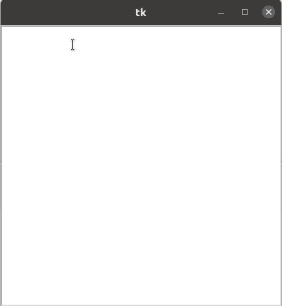

# 如何在 Tkinter 中设置 Text 小部件中的制表符大小？

> 原文:[https://www . geeksforgeeks . org/如何设置文本中的标签大小-widget-in-tkinter/](https://www.geeksforgeeks.org/how-to-set-the-tab-size-in-text-widget-in-tkinter/)

**先决条件:**[Tkit](https://www.geeksforgeeks.org/python-gui-tkinter/)

Python 为开发图形用户界面提供了多个选项。在所有的 GUI 方法中，Tkinter 是最常用的方法。它是 Python 附带的 Tk 图形用户界面工具包的标准 Python 接口。Python 搭配 Tkinter 是创建 GUI 应用程序最快最简单的方法。使用 Tkinter 创建图形用户界面是一项简单的任务。

在本文中，我们将学习如何在 Tkinter 中使用 Python 设置文本小部件中的选项卡大小。这里的制表符大小意味着按下制表符按钮后将打印多少空格。让我们看看做同样事情的方法。

**我们来了解一下分步实施:**

*   创建一个普通 Tkinter 窗口

## 蟒蛇 3

```
# Import Module
from tkinter import *

# Create Object
root = Tk()

# Set Geometry
root.geometry("400x400")

# Execute Tkinter
root.mainloop()
```

**输出:**


*   添加文本小部件

**语法:**

```
T = Text(root, bg, fg, bd, height, width, font, ..)
```

## 蟒蛇 3

```
# Add Text Box
text = Text(root)
text.pack()
```

*   设置制表符大小

这里将使用**字体**包中的 **tkfont()** 方法

## 蟒蛇 3

```
# Set Font
font = tkfont.Font(font=text['font'])

# Set Tab size
tab_size = font.measure('        ')
text.config(tabs=tab_size)
```

**下面是实现:**

## 蟒蛇 3

```
# Import Module
from tkinter import *
import tkinter.font as tkfont

# Create Object
root = Tk()

# Set Geometry
root.geometry("400x400")

# Add Text Box
text = Text(root)
text.pack()

# Set Font
font = tkfont.Font(font=text['font'])

# Set Tab size
tab_size = font.measure('           ')
text.config(tabs=tab_size)

# Execute Tkinter
root.mainloop()
```

**输出:**

