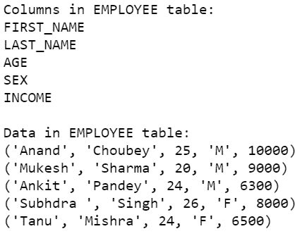
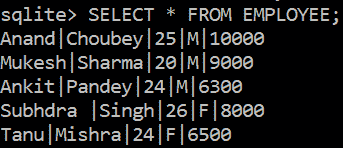

# 如何使用 Python 显示 SQLite 数据库中的所有列？

> 原文:[https://www . geeksforgeeks . org/如何使用 python 显示 sqlite 数据库中的所有列/](https://www.geeksforgeeks.org/how-to-show-all-columns-in-the-sqlite-database-using-python/)

在本文中，我们将讨论如何使用 **sqlite3** 模块从 Python 中显示 SQLite 数据库中一个表的所有列。

### 方法:

*   使用 **connect()** 方法连接到数据库。
*   创建一个**光标**对象，并使用创建的光标对象执行查询，以便创建一个表并将值插入其中。
*   使用光标对象的**描述**关键字获取列名。description 关键字只指定二维元组中表的列，该元组不包含任何值，只包含列名。

```py
data=cursor.execute('''SELECT * FROM table_name''')
print(data.description)
```

上面的代码以二维元组的形式显示给定表的所有列。

*   使用光标对象执行以下查询，显示表格中的数据。

```py
SELECT * FROM table_name
```

*   最后，提交数据库中的更改并关闭连接。

### 以下是实施情况:

**创建表格**

在下面的程序中，我们连接到一个名为 gfg.db 的数据库，然后创建一个 EMPLOYEE 表并将值插入其中。最后，我们提交数据库中的更改并终止连接。

## 蟒蛇 3

```py
# Import module
import sqlite3

# Connecting to sqlite
conn = sqlite3.connect('gfg1.db')

# Creating a cursor object using the cursor() method
cursor = conn.cursor()

# Creating table
table ="""CREATE TABLE EMPLOYEE(FIRST_NAME VARCHAR(255), 
                                LAST_NAME VARCHAR(255),
                                AGE int, 
                                SEX CHAR(1), 
                                INCOME int);"""
cursor.execute(table)
print('Table Created!')

# Queries to INSERT records.
cursor.execute('''INSERT INTO EMPLOYEE(FIRST_NAME, LAST_NAME, AGE, SEX, INCOME) 
                       VALUES ('Anand', 'Choubey', 25, 'M', 10000)''')
cursor.execute('''INSERT INTO EMPLOYEE(FIRST_NAME, LAST_NAME, AGE, SEX, INCOME) 
                    VALUES ('Mukesh', 'Sharma', 20, 'M', 9000)''')
cursor.execute('''INSERT INTO EMPLOYEE(FIRST_NAME, LAST_NAME, AGE, SEX, INCOME) 
                    VALUES ('Ankit', 'Pandey', 24, 'M', 6300)''')
cursor.execute('''INSERT INTO EMPLOYEE(FIRST_NAME, LAST_NAME, AGE, SEX, INCOME) 
                    VALUES ('Subhdra ', 'Singh', 26, 'F', 8000)''')
cursor.execute('''INSERT INTO EMPLOYEE(FIRST_NAME, LAST_NAME, AGE, SEX, INCOME) 
                    VALUES ('Tanu', 'Mishra', 24, 'F', 6500)''')

print('Data inserted into the table')

# Commit your changes in the database    
conn.commit()

# Closing the connection
conn.close()
```

**输出:**

```py
Table Created!
Data inserted into the table
```

**从表中检索列:**

现在我们已经创建了一个表，并将值插入到数据库的表中。我们将连接到之前创建 EMPLOYEE 表的数据库。然后我们将首先显示所有的列，然后显示列中的数据值。

## 蟒蛇 3

```py
# Import module
import sqlite3

# Connecting to sqlite
conn = sqlite3.connect('gfg.db')

# Creating a cursor object using the cursor() method
cursor = conn.cursor()

# Display columns
print('\nColumns in EMPLOYEE table:')
data=cursor.execute('''SELECT * FROM EMPLOYEE''')
for column in data.description:
    print(column[0])

# Display data
print('\nData in EMPLOYEE table:')
data=cursor.execute('''SELECT * FROM EMPLOYEE''')
for row in data:
    print(row)

# Commit your changes in the database    
conn.commit()

# Closing the connection
conn.close()
```

**输出:**



**SQLite:**

