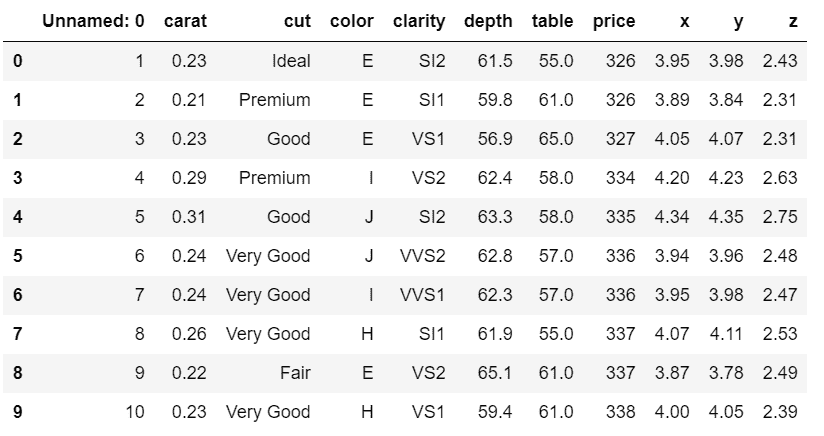
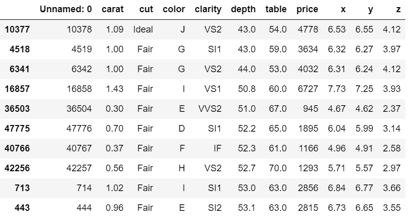
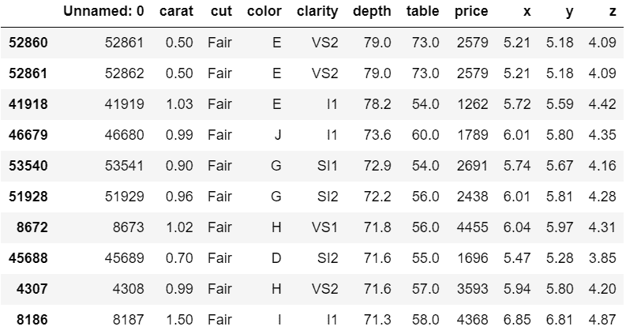

# Python 中如何按多列排序 CSV？

> 原文:[https://www . geesforgeks . org/how-sort-CSV-按 python 中的多列排序/](https://www.geeksforgeeks.org/how-to-sort-csv-by-multiple-columns-in-python/)

在本文中，我们将讨论如何按多列对 CSV 文件进行排序。首先，我们将 CSV 文件转换成一个数据帧，然后我们将使用 [**sort_values()**](https://www.geeksforgeeks.org/python-pandas-dataframe-sort_values-set-1/) 方法对数据帧进行排序。

> **语法:** *数据框. sort_values(by，axis=0，升序=True，inplace=False，kind='quicksort '，na_position='last')*
> 
> **返回类型:** *返回与函数调用方数据框具有相同维度的排序数据框。*

将 CSV 文件转换为数据框后，我们需要通过 *sort_values()* 方法中的参数将 CSV 文件的两个或多个列名添加为*，轴赋值为 0，如下所示:*

> sort_values('column1 '，' column 2 '……' column n '，axis=0)

**使用中的 CSV 文件:**



以下是描述如何按多列对 CSV 文件进行排序的各种示例:

**例 1:**

在下面的程序中，我们首先将 CSV 文件转换为数据帧，然后按照升序按单个列对数据帧进行排序。

## 蟒蛇 3

```py
# importing pandas package
import pandas as pd

# making data frame from csv file
data = pd.read_csv("diamonds.csv")

# sorting data frame by a column
data.sort_values("carat", axis=0, ascending=True,
                 inplace=True, na_position='first')

# display
data.head(10)
```

**输出:**


**例 2:**

这里，转换成数据帧后，CSV 文件按多列排序，深度列先按升序排序，然后表格列按每个深度的升序排序。

## 蟒蛇 3

```py
# importing pandas package
import pandas as pd

# making data frame from csv file
data = pd.read_csv("diamonds.csv")

# sorting data frame by multiple columns
data.sort_values(["depth", "table"], axis=0,
                 ascending=True, inplace=True)

# display
data.head(10)
```

**输出:**



**例 3:**

在下面的示例中，CSV 文件按深度降序排序，然后按每个深度的表升序排序。

## 蟒蛇 3

```py
# importing pandas package
import pandas as pd

# making data frame from csv file
data = pd.read_csv("diamonds.csv")

# sorting data frame by multiple columns
data.sort_values(["depth", "table"], axis=0,
                 ascending=[False, True], inplace=True)

# display
data.head(10)
```

**输出:**


**例 4:**

下面是另一个示例，其中 CSV 文件按多列排序。

## 蟒蛇 3

```py
# importing pandas package
import pandas as pd

# making data frame from csv file
data = pd.read_csv("diamonds.csv")

# sorting data frame by multiple columns
data.sort_values(["depth", "table", "carat"], axis=0,
                 ascending=[False, True, False], inplace=True)

# display
data.head(10)
```

**输出:**

