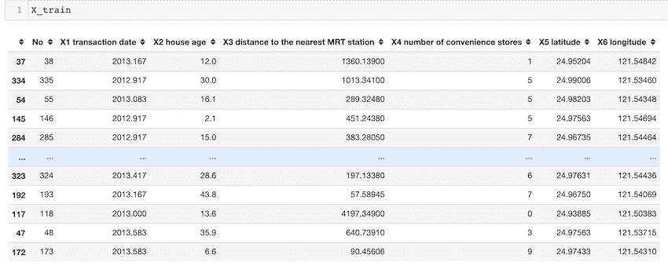

# 如何使用 Python 将数据集分割成训练集和测试集

> 原文:[https://www . geeksforgeeks . org/如何使用 python 将数据集拆分为训练集和测试集/](https://www.geeksforgeeks.org/how-to-split-a-dataset-into-train-and-test-sets-using-python/)

在本文中，我们将讨论如何在 Python 中将数据集拆分为训练集和测试集。

训练测试分割用于估计适用于基于预测的算法/应用的机器学习算法的性能。这种方法执行起来既快速又简单，因此我们可以将自己的机器学习模型结果与机器结果进行比较。默认情况下，测试集分为 30 %的实际数据，而训练集分为 70%的实际数据

我们需要将数据集分割成训练集和测试集，以评估我们的机器学习模型的性能。训练集用于拟合模型，训练集的统计量是已知的。第二个集合叫做测试数据集，这个集合只用于预测。

## 数据集分割:

Scikit-learn 别名 sklearn 是 Python 中最有用、最健壮的机器学习库。

scikit-learn 库为我们提供了 model_selection 模块，其中有拆分器函数 train_test_split()。

**语法**:

> train _ test _ split(*数组，test _ size =无，train _ size =无，random _ state =无，shuffle =真，分层=无)
> 
> **参数**:
> 
> 1.  *数组:列表、数组、数据框或矩阵等输入
> 2.  test_size:这是一个浮点值，其值在 0.0 和 1.0 之间。它代表了我们测试规模的比例。它的默认值是无。
> 3.  train_size:这是一个浮点值，其值在 0.0 和 1.0 之间。它代表了我们火车规模的比例。它的默认值是无。
> 4.  random_state:该参数用于在应用拆分之前控制应用于数据的洗牌。它就像一颗种子。
> 5.  shuffle:此参数用于在拆分前对数据进行 shuffle。它的默认值为真。
> 6.  分层:此参数用于以分层方式拆分数据。

### 示例:

要查看或下载示例中使用的 CSV 文件，请单击此处的。


**代码**:

## 蟒蛇 3

```py
# import modules
import pandas as pd
from sklearn.linear_model import LinearRegression

# read the dataset
df = pd.read_csv('Real estate.csv')

# get the locations
X = df.iloc[:, :-1]
y = df.iloc[:, -1]

# split the dataset
X_train, X_test, y_train, y_test = train_test_split(
    X, y, test_size=0.05, random_state=0)
```

在上面的例子中，我们导入了熊猫包和 sklearn 包。之后要导入 CSV 文件我们使用 [read_csv()](https://www.geeksforgeeks.org/python-read-csv-using-pandas-read_csv/) 方法。变量 df 现在包含数据帧。在示例中，“房价”是我们必须预测的列，因此我们将该列作为 y，其余列作为我们的 X 变量。test_size = 0.05 指定整个数据中只有 5%作为我们的测试集，95%作为我们的训练集。随机状态帮助我们每次获得相同的随机分裂。

**输出**:

 