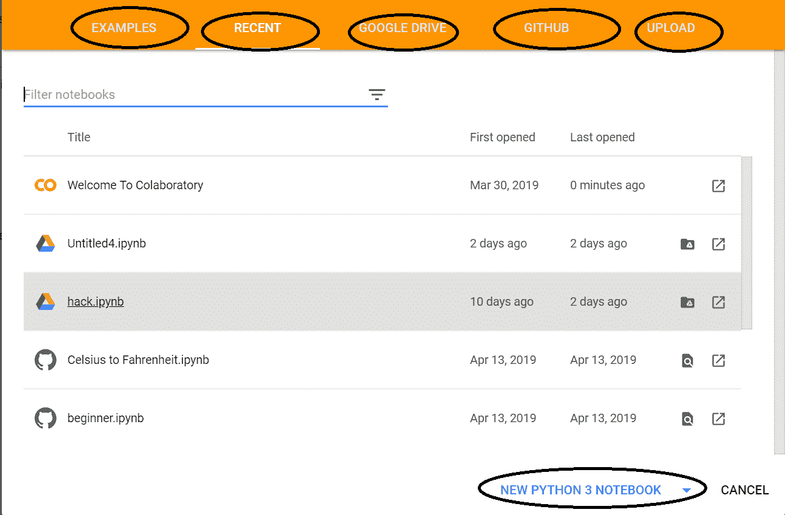
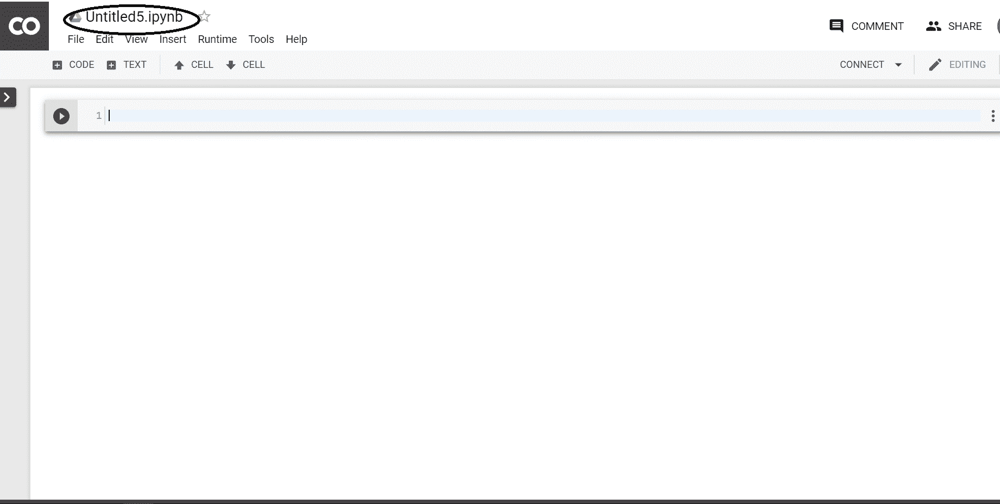
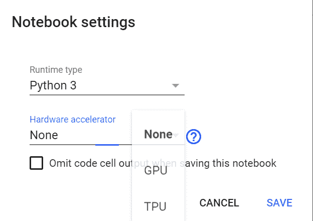
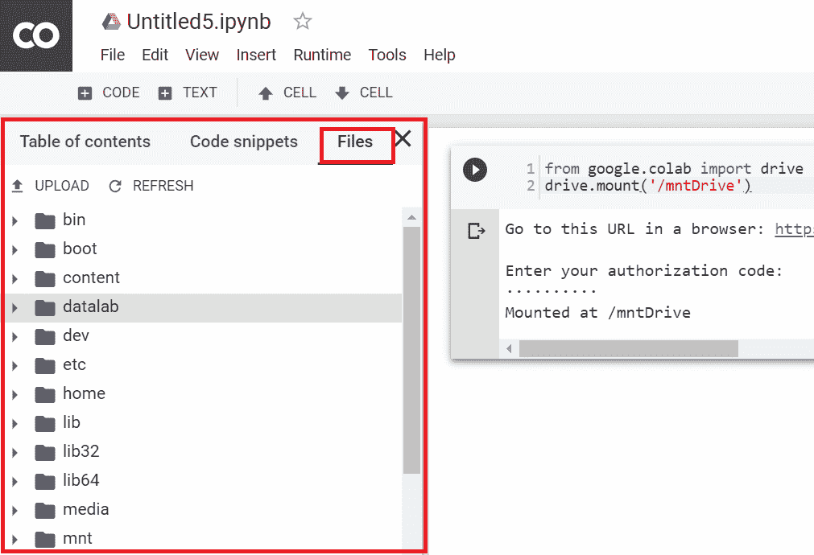
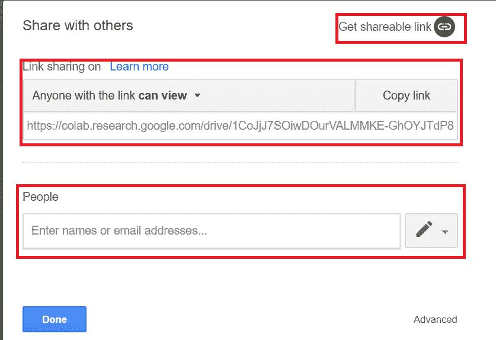

# 如何使用谷歌 Colab

> 原文:[https://www.geeksforgeeks.org/how-to-use-google-colab/](https://www.geeksforgeeks.org/how-to-use-google-colab/)

如果你想创建一个机器学习模型，但说你没有一台可以承担工作量的电脑，**谷歌 Colab** 就是适合你的平台。即使你有一个图形处理器或一台好电脑，用 anaconda 创建一个本地环境，安装软件包和解决安装问题也是一件麻烦事。
协同实验室是一个由谷歌提供的免费 Jupyter 笔记本环境，在这里你可以使用免费的 GPU 和 TPU，可以解决所有这些问题。

#### 入门指南

要开始使用 Colab，您首先需要登录您的谷歌帐户，然后转到此链接[https://colab.research.google.com](https://colab.research.google.com)。

**打开 Jupyter 笔记本:**
打开网站时，您会看到包含以下选项卡的弹出窗口–


> **示例:**包含多个不同示例的 Jupyter 笔记本。
> **近期:**你最近用过的 Jupyter 笔记本。
> **GOOGLE DRIVE:** 你的 GOOGLE DRIVE 里的 Jupyter 笔记本。
> **GitHub:** 可以从你的 GITHUB 中添加 Jupyter 笔记本，但首先需要将 Colab 与 GITHUB 连接。
> **上传:**从本地目录上传。

否则您可以通过点击右下角的“新蟒蛇 3 笔记本”或“新蟒蛇 2 笔记本”来*创建一个新的蟒蛇笔记本*。

**笔记本的描述:**

在创建新笔记本时，它会创建一个带有 `Untitled0.ipynb`的 Jupyter 笔记本，并将其保存到您的谷歌驱动器中一个名为 **Colab Notebooks** 的文件夹中。现在，由于它本质上是一个 Jupyter 笔记本，Jupyter 笔记本的所有命令都将在这里工作。不过，您可以参考【Jupyter 笔记本入门中的详细信息。

**我们来说说这里有什么不同。**

**更改运行时环境:**
点击**【运行时】**下拉菜单。选择**“更改运行时类型”**。从**“运行时类型”**下拉菜单中选择 python2 或 3。
 

**使用 GPU 和 TPU:**
点击**【运行时】**下拉菜单。选择**“更改运行时类型”**。现在在**“硬件加速器”**下拉菜单中选择你想要的任何东西(图形处理器、中央处理器、无)。



**验证 GPU:**

```
import tensorflow as tf
tf.test.gpu_device_name()
```

如果 gpu 已连接，它将输出以下内容–

```
'/device:GPU:0'

```

否则，它将输出以下内容

```
''

```

**核实 TPU:**

```
import os

if 'COLAB_TPU_ADDR' not in os.environ:
  print('Not connected to TPU')
else:
  print("Connected to TPU")
```

如果 gpu 已连接，它将输出以下内容

```
Connected to TPU

```

否则，它将输出以下内容

```
Not connected to TPU

```

**安装 Python 包–**
使用可以使用 **pip** 安装任意包。例如:

```
! pip install pandas
```

**克隆 GitHub 转贴:**
使用 **git 克隆**命令。例如:

```
! git clone https://github.com/souvik3333/Testing-and-Debugging-Tools
```

**上传文件:**

```
from google.colab import files
uploaded = files.upload()
```

选择“选择文件”并上传您想要的文件。如果禁用了第三方 cookies，请启用它们。


然后，您可以将其保存在数据框中。

```
import io
df2 = pd.read_csv(io.BytesIO(uploaded['file_name.csv']))
```

**通过挂载谷歌硬盘上传文件:**
要将硬盘挂载到“mntDrive”文件夹中，请执行以下操作–

```
from google.colab import drive
drive.mount('/mntDrive')
```

然后你会看到一个链接，点击链接，然后允许访问，复制弹出的代码，粘贴在“输入您的授权码:”处。

现在要查看 google 驱动器中的所有数据，您需要执行以下操作:

```
! ls "/mntDrive/My Drive"
```


**文件层次:**
也可以通过点击控制按钮(代码、文本、单元格)左上方的“>”来查看文件层次。




**下载文件:**
假设你想下载“file_name.csv”。您可以通过执行以下操作将文件复制到您的 google 驱动器(在“数据”文件夹中，您需要在 google 驱动器中创建“数据”文件夹):

```
cp file_name.csv "/mntDrive/My Drive/data/renamed_file_name.csv"
```

该文件将保存在“数据”文件夹中，名称为“重命名的文件名称. csv”。现在你可以直接从那里下载，或者，你可以打开文件层次结构，右键单击将给出下载选项。

**下载 Jupyter 笔记本:**
点击左上角**【文件】**下拉菜单。选择**“下载。ipynb"** 或**"下载。py"**


**分享 Jupyter 笔记本:**
你可以通过添加其他人的电子邮件地址或创建一个可共享的链接来分享你的笔记本。

