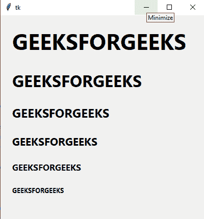

# 如何在 Tkinter–Python 中使用 HTML？

> 原文:[https://www . geeksforgeeks . org/如何使用-html-in-tkinter-python/](https://www.geeksforgeeks.org/how-to-use-html-in-tkinter-python/)

**先决条件:**[Tkit](https://www.geeksforgeeks.org/python-gui-tkinter/)

Python 为开发图形用户界面提供了多个选项。在所有的 GUI 方法中，Tkinter 是最常用的方法。它是 Python 附带的 Tk 图形用户界面工具包的标准 Python 接口。Python 搭配 Tkinter 是创建 GUI 应用程序最快最简单的方法。使用 Tkinter 创建图形用户界面是一项简单的任务。

在本文中，我们将学习如何在 Tkinter 中使用 HTML 标签。这里我们将使用 **tkhtmlview** 模块。

**tkhtmlview** 模块是一个 Tkinter 小部件的集合，其文本可以设置为 HTML 格式。一个 HTML 小部件不是一个网络浏览器框架，它只是一个简单而轻量级的 HTML 解析器，用来格式化 Tkinter Text 基类使用的标签。

**安装**

```py
pip install tkhtmlview
```

tkhtmlview 中支持的 HTML 标签列表:

*   a
*   b
*   英国铁路公司
*   密码
*   差异
*   全身长的
*   h1、h2、h3、h4、h5、h6
*   我
*   img
*   li， ul， ol
*   标记
*   p
*   在…之前
*   跨度
*   强烈的
*   u

我们将使用 **HTMLLabel()** 类来编写 HTML 标签

**HTMLLabel()** :带标签外观的文本框小部件

**语法:**

```py
HTMLLabel(Object Name, html="ENTER HTML CODE")
```

下面是一些例子来描述如何在 Tkinter GUI 中使用 HTML。

**示例 1:** 使用标题标签。

## 蟒蛇 3

```py
# Import Module
from tkinter import *
from tkhtmlview import HTMLLabel

# Create Object
root = Tk()

# Set Geometry
root.geometry("400x400")

# Add label
my_label = HTMLLabel(root, html="""
        <h1>GEEKSFORGEEKS</h1>
        <h2>GEEKSFORGEEKS</h2>
        <h3>GEEKSFORGEEKS</h3>
        <h4>GEEKSFORGEEKS</h4>
        <h5>GEEKSFORGEEKS</h5>
        <h6>GEEKSFORGEEKS</h6>
    """)

# Adjust label
my_label.pack(pady=20, padx=20)

# Execute Tkinter
root.mainloop()
```

**输出:**



**示例 2:** 使用锚点，段落&图像标签

## 蟒蛇 3

```py
# Import Module
from tkinter import *
from tkhtmlview import HTMLLabel

# Create Object
root = Tk()

# Set Geometry
root.geometry("400x400")

# Add label
my_label = HTMLLabel(root, html="""
    <a href='https://www.geeksforgeeks.org/'>GEEKSFORGEEKS</a>

<p>Free Tutorials, Millions of Articles, Live, Online and Classroom Courses ,Frequent Coding Competitions ,Webinars by Industry Experts, Internship opportunities and Job Opportunities.</p>

    
    """)

# Adjust label
my_label.pack(pady=20, padx=20)

# Execute Tkinter
root.mainloop()
```

**输出:**


**示例 3:** 使用列表标签并为每个标签添加链接

## 蟒蛇 3

```py
# Import Module
from tkinter import *
from tkhtmlview import HTMLLabel

# Create Object
root = Tk()

# Set Geometry
root.geometry("400x400")

# Add label
my_label = HTMLLabel(root, html="""
    <ul>
        <li><a href='https://www.geeksforgeeks.org/python-programming-language/'>Python</a></li>
        <li><a href='https://www.geeksforgeeks.org/c-plus-plus/'>C++</a></li>
        <li><a href='https://www.geeksforgeeks.org/java/'>Java</a></li>
    </ul>
    """)

# Adjust label
my_label.pack(pady=20, padx=20)

# Execute Tkinter
root.mainloop()
```

**输出:**


同样，我们可以使用所有其他标签。