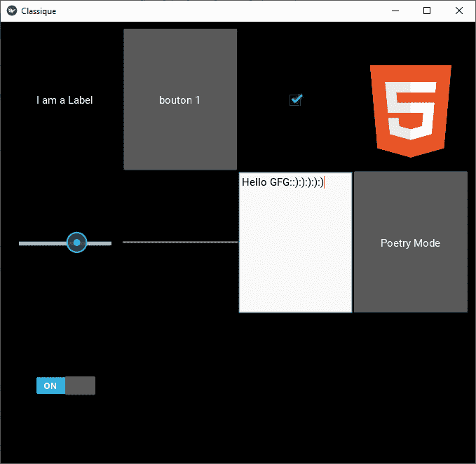

# 如何在 kivy | Python 中使用多个 UX 小部件

> 原文:[https://www . geeksforgeeks . org/如何使用多 ux-widgets-in-kivy-python/](https://www.geeksforgeeks.org/how-to-use-multiple-ux-widgets-in-kivy-python/)

Kivy 是 Python 中独立于平台的 GUI 工具。因为它可以在安卓、IOS、linux 和 Windows 等平台上运行。它基本上是用来开发安卓应用程序的，但并不意味着它不能在桌面应用程序上使用。

> ？？？？？？？？ [Kivy 教程–通过示例学习 Kivy](https://www.geeksforgeeks.org/kivy-tutorial/)。

## UX 部件:

经典的用户界面小部件，准备组装以创建更复杂的小部件。有多个 UX 部件，如标签，按钮，复选框，图像，滑块，进度条，文本输入，切换按钮，开关。

*   **标签**:标签小部件用于呈现文本。它支持 ascii 和 unicode 字符串。
*   **按钮:**按钮是带有相关动作的标签，当按钮被按下(或在点击/触摸后被释放)时触发。
*   **复选框:**复选框是一个特定的双态按钮，可以选中也可以不选中。
*   **图像:**图像小部件用于显示图像。
*   **滑块:**滑块小部件看起来像滚动条。它支持水平和垂直方向、最小值/最大值和默认值。
*   **进度条:**进度条小部件用于可视化某个任务的进度。
*   **文本输入:**文本输入小部件为可编辑的纯文本提供了一个框。
*   **切换按钮:**切换按钮小部件就像一个复选框。当您触摸或点按它时，状态会在“正常”和“向下”之间切换(与只要按下就只能“向下”的按钮相反)。
*   **开关:**开关小部件处于活动或非活动状态，就像机械灯光开关一样。

在这里，我们将使用几乎所有这些 UX 小部件，这样您就可以理解如何在单个代码中使用它们。

```py
Basic Approach:
1) import kivy
2) import kivyApp
3) import window
4) Set minimum version(optional)
5) Create the App class
6) Create the .kv file 
7) Make the run method/ run the App
```

**实施办法:**
**。py 文件:**

## 蟒蛇 3

```py
# Program to Show how to use multiple UX widget

# import kivy module   
import kivy 

# base Class of your App inherits from the App class.   
# app:always refers to the instance of your application  
from kivy.app import App

# this restrict the kivy version i.e 
# below this kivy version you cannot 
# use the app or software 
kivy.require('1.9.0')

# Here for providing colour to the background
from kivy.core.window import Window

# Setting the window size
Window.size = (1120, 630)

# Add the App class
class ClassiqueApp(App):
    def build(FloatLayout):
        pass

# Run the App
if __name__ == '__main__':
    ClassiqueApp().run()
```

**。千伏档:**

## 蟒蛇 3

```py
# .kv file implementation of the App

# Using Grid layout
GridLayout:

    cols: 4
    rows: 3
    padding: 10

    # Adding label
    Label:
        text: "I am a Label"

    # Add Button
    Button:
        text: "button 1"

    # Add CheckBox
    CheckBox:
        active: True

    # Add Image
    Image:
        source: 'html.png'

    # Add Slider
    Slider:
        min: -100
        max: 100
        value: 25

    # Add progress Bar
    ProgressBar:
        min: 50
        max: 100

    # Add TextInput
    TextInput:
        text: "Enter the text"

    # Add toggle Button
    ToggleButton:
        text: " Poetry Mode "

    # Add Switch
    Switch:
        active: True

```

**输出:**

