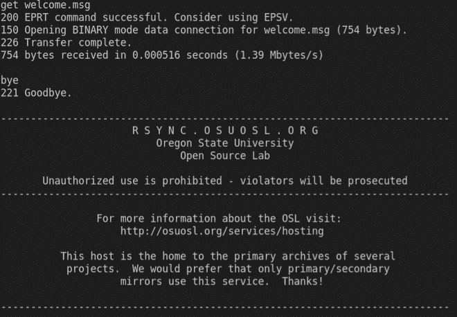

# 如何使用 Python Pexpect 实现 Linux 命令的自动化？

> 原文:[https://www . geesforgeks . org/如何使用-python-PE expect-to-automation-Linux-commands/](https://www.geeksforgeeks.org/how-to-use-python-pexpect-to-automate-linux-commands/)

**Pexpect** 是一个 Python 库，用于生成子进程并自动控制它们。Pexpect 可用于自动化交互式应用程序，如 SSH、FTP、密码、telnet 等。Pexpect 通过产生子进程和响应预期模式来工作。

### **安装:**

可以使用以下命令安装 Pexpect。

```py
pip3 install pexpect
```

### 自动化 Linux 命令:

**可以通过不同的方式完成:**

*   使用 run()方法
*   使用种子类
*   使用 sendline()方法

安装完成后，让我们看看如何自动执行 Linux 命令。

**方法 1:使用 run()方法**

可以调用**PE expect . run()**方法来执行命令并返回其输出。这个功能可以用来替代 os.system。

**示例:**

## 蟒蛇 3

```py
import pexpect

print(pexpect.run('echo hello'))
```


图 1

**方法二:使用产卵类**

产卵类是启动一个新的子进程并控制它的主要接口。种子中的字符串可以被需要执行的 shell 命令替换。

> **语法:**PE expect . spawn(" RM。/dev)

pexpect .产卵类的重要方法是 expect()。

> **语法:** expect(模式，超时=-1，searchwindowsize=-1，async_= False)

此方法等待子进程返回给定的字符串。在 except 方法中指定的模式将在整个字符串中匹配。超时用于引发 PE expect . time out。search windowsize 参数用于设置类的 maxread 属性。创建非阻塞应用程序时，设置 async_ = True。

**示例:**

## 蟒蛇 3

```py
import pexpect

# start a child  process with spawn
# It just echos  geeksforgeeks
child = pexpect.spawn("echo geeksforgeeks")

# prints he matched index of string.
print(child.expect(["hai", "welcome", "geeksforgeeks"]))
```

**输出:**


图 2

该示例打印与子进程匹配的索引。

**方法 3:使用 sendline(**s = "**)**

此方法将字符串写入子进程，并返回写入的字节数。在孩子看来，这个过程就像有人在终端上打字一样。

**示例:**

## 蟒蛇 3

```py
import pexpect

# Start a child process with spawn
# This process  waits for the input
# form user
child = pexpect.spawn("cat")

# The input to the cat process is sent
# by the sendline()
child.sendline("hai geek")

# prints the index of matched string
# expressing with child process
print(child.expect(["hello", "hai geek"]))
```

**输出:**


图 3

让我们看一个复杂的例子，以便更好地理解。这里将使用 FTP 客户端登录 ftp.us.debian.org，下载 welcome.msg 文件并打印该文件。在这里，我们将使用 FTP 客户端从远程机器登录和下载文件，然后打印。

**进场:**

*   导入 pexpect。
*   用 PE expect .产卵(' ftp ftp.us.debian.or ')产卵一个子代。
*   FTP 客户端要求用户名。将模式与期望的('名称)匹配。*: ')
*   使用 sendline 方法将用户名发送给子进程。
*   然后 FTP 客户端要求输入密码。将模式与预期匹配('密码: ')
*   然后发球登录。然后你可以下载文件。
*   通过存在“ftp >”来检测是否可以将命令发送到 FTP 服务器。
*   然后通过 sendline 发送命令(' get welcome.msg ')，这只是将文件下载到本地机器。
*   然后使用“bye”命令关闭 FTP 客户端。
*   最后，打印与子进程的所有交互。
*   使用 pexpect.run 从 FTP 服务器打印下载文件的内容。

## 蟒蛇 3

```py
import pexpect

def main():

    # spawn a child process.
    child = pexpect.spawn('ftp ftp.us.debian.org')

    # search for the Name pattern.
    child.expect('Name .*: ')

    # send the username with sendline
    child.sendline('anonymous')

    # search for the  Password pattern
    child.expect('Password:')

    # send the password to the childprocess
    # by sendline
    child.sendline('anonymous@')

    # detect ftp accepts command from user
    # by 'ftp> ' pattern
    child.expect('ftp> ')

    # If  it accepts command then download the
    # welcome.msg file from the ftp server
    child.sendline('get welcome.msg')

    # again check wheather ftp client accepts
    # command from user by 'ftp> ' pattern
    child.expect('ftp> ')

    # close the ftp client.
    child.sendline('bye')

    # print the interactions with the child
    # process.
    print(child.before.decode())
    child.interact()

    # print the downloaded file by executing cat
    # command with pexpect.run method
    print(pexpect.run('cat ./welcome.msg').decode())

if __name__ == '__main__':
    main()
```

**输出:**



图 4