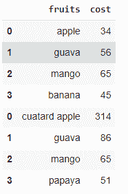
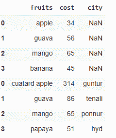

# Python 中如何使用 rbind？

> 原文:[https://www.geeksforgeeks.org/how-to-use-rbind-in-python/](https://www.geeksforgeeks.org/how-to-use-rbind-in-python/)

在本文中，我们将讨论 python 中的 rbind()。

## 方法 1:对相等的列使用 rbind()函数

这里我们必须取两个列相等的数据帧，并应用 [concat()](https://www.geeksforgeeks.org/pandas-concat-function-in-python/) 函数。这将基于列组合行。

**语法**:

```
pandas.concat([dataframe1, dataframe2])
```

在哪里

*   数据帧 1 是第一个数据帧
*   数据帧 2 是第二个数据帧

**示例:**

## 蟒蛇 3

```
# import pandas module
import pandas as pd

# create first dataframe
data1 = pd.DataFrame({'fruits': ['apple', 'guava', 'mango', 'banana'],
                      'cost': [34, 56, 65, 45]})

# create second dataframe
data2 = pd.DataFrame({'fruits': ['cuatard apple', 'guava', 'mango', 'papaya'],
                      'cost': [314, 86, 65, 51]})

# concat two columns
pd.concat([data1, data2])
```

**输出**:



## 方法 2:对不等列使用 rbind()函数

这里的两个数据框列不相等，在这种情况下，不匹配的列将在其列中获得 NAN 替换行。

**语法**:

```
pandas.concat([dataframe1, dataframe2])
```

哪里，

*   数据帧 1 是第一个数据帧
*   数据帧 2 是第二个数据帧

**示例:**

## 蟒蛇 3

```
# import pandas module
import pandas as pd

# create first dataframe with 2 columns
data1 = pd.DataFrame({'fruits': ['apple', 'guava', 'mango', 'banana'],
                      'cost': [34, 56, 65, 45]})

# create second dataframe with 3 columns
data2 = pd.DataFrame({'fruits': ['cuatard apple', 'guava', 'mango', 'papaya'],
                      'cost': [314, 86, 65, 51],
                      'city': ['guntur', 'tenali', 'ponnur', 'hyd']})

# concat two columns
pd.concat([data1, data2])
```

**输出**:



这里我们观察到行的索引再次从 0 开始，为了避免这种情况，我们不得不使用[。reset_index()](https://www.geeksforgeeks.org/python-pandas-dataframe-reset_index/) 方法。这将重置新数据帧的索引。

**语法**:

```
pandas.concat([dataframe1, dataframe2]).reset_index(drop=True)
```

**例**:

## 蟒蛇 3

```
# import pandas module
import pandas as pd

# create first dataframe with 2 columns
data1 = pd.DataFrame({'fruits': ['apple', 'guava', 'mango', 'banana'],
                      'cost': [34, 56, 65, 45]})

# create second dataframe with 3 columns
data2 = pd.DataFrame({'fruits': ['cuatard apple', 'guava', 'mango', 'papaya'],
                      'cost': [314, 86, 65, 51],
                      'city': ['guntur', 'tenali', 'ponnur', 'hyd']})

# concat two columns
pd.concat([data1, data2]).reset_index(drop=True)
```

**输出**:

