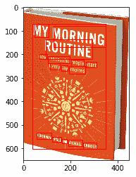
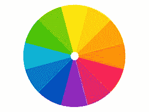

# 如何使用谷歌云的 Vision API | Set-2

> 原文:[https://www . geeksforgeeks . org/如何使用-vision-API-from-Google-cloud-set-2/](https://www.geeksforgeeks.org/how-to-use-vision-api-from-google-cloud-set-2/)

先决条件:[在谷歌云中创建虚拟机并设置应用编程接口](https://www.geeksforgeeks.org/create-a-virtual-machine-and-set-up-api-on-google-cloud/)

在[上一篇文章](https://www.geeksforgeeks.org/how-to-use-vision-api-from-google-cloud/)中，我们已经看到了如何使用 Vision API 使用 Vision 的面部检测、徽标检测、标签检测和地标检测功能，现在让我们再看看一些像光学字符识别、手写文本检测、图像属性检测等功能。

### 文本检测(光学字符识别):

它检测并提取图像中的文本。

```py
import os
import io
from google.cloud import vision
from matplotlib import pyplot as plt
from matplotlib import patches as pch

os.environ['GOOGLE_APPLICATION_CREDENTIALS'] = 
     os.path.join(os.curdir, 'credentials.json')

client = vision.ImageAnnotatorClient()

f = 'image_filename.jpg'
with io.open(f, 'rb') as image:
    content = image.read()

image = vision.types.Image(content = content)
response = client.text_detection(image = image)
texts = response.text_annotations

a = plt.imread(f)
fig, ax = plt.subplots(1)
ax.imshow(a)

for text in texts:
    print(text.description)

    vertices = ([(vertex.x, vertex.y) 
                 for vertex in text.bounding_poly.vertices]) 

    print('Vertices covering text: {}\n\n'.format(vertices))
    rect = pch.Rectangle(vertices[0], (vertices[1][0] - vertices[0][0]), 
                        (vertices[2][1] - vertices[0][1]), linewidth = 1, 
                                       edgecolor ='r', facecolor ='none') 
    ax.add_patch(rect)

plt.show()
```

上面的代码从给定的图像中提取文本，并打印包含文本的矩形顶点的坐标。
例如，当给定以下图像作为输入时:

**输出:**

```py
MY MORNING
ROUTINE
How Successful People Start
Every Day Inspired
BENJAMIN SPALL and MICHAEL XANDER

Vertices covering text: [(38, 71), (348, 71), (348, 602), (38, 602)]

MY
Vertices covering text: [(46, 71), (108, 82), (100, 128), (38, 117)]

MORNING
Vertices covering text: [(129, 79), (348, 118), (338, 170), (120, 131)]

ROUTINE
Vertices covering text: [(96, 135), (292, 170), (283, 219), (87, 184)]

How
Vertices covering text: [(68, 200), (101, 205), (98, 221), (65, 216)]

Successful
Vertices covering text: [(104, 207), (196, 222), (193, 238), (101, 224)]

People
Vertices covering text: [(202, 222), (257, 231), (254, 251), (199, 242)]

Start
Vertices covering text: [(265, 232), (311, 239), (309, 255), (262, 248)]

Every
Vertices covering text: [(112, 238), (155, 246), (152, 265), (109, 258)]

Day
Vertices covering text: [(160, 246), (189, 251), (185, 271), (157, 266)]

Inspired
Vertices covering text: [(194, 251), (262, 263), (258, 283), (191, 271)]

BENJAMIN
Vertices covering text: [(57, 534), (118, 546), (115, 561), (54, 549)]

SPALL
Vertices covering text: [(122, 550), (160, 558), (157, 572), (119, 564)]

and
Vertices covering text: [(165, 560), (185, 564), (182, 577), (162, 573)]

MICHAEL
Vertices covering text: [(190, 564), (250, 576), (247, 590), (187, 578)]

XANDER
Vertices covering text: [(254, 575), (311, 587), (308, 602), (251, 591)]
```



### 文档/手写文本检测:

该功能还可以对密集文档执行光学字符识别，包括手写。

```py
import os
import io
from google.cloud import vision
from matplotlib import pyplot as plt

os.environ['GOOGLE_APPLICATION_CREDENTIALS'] = 
     os.path.join(os.curdir, 'credentials.json')

client = vision.ImageAnnotatorClient()

f = 'image_filename.jpg'
with io.open(f, 'rb') as image:
    content = image.read()

image = vision.types.Image(content = content)
response = client.document_text_detection(image = image)

a = plt.imread(f)
plt.imshow(a)

txt = []
for page in response.full_text_annotation.pages:
        for block in page.blocks:
            print('\nConfidence: {}%\n'.format(block.confidence * 100))
            for paragraph in block.paragraphs:

                for word in paragraph.words:
                    word_text = ''.join([symbol.text for symbol in word.symbols])
                    txt.append(word_text)

print(txt)
```

上述代码从图像中识别和提取手写文本并输出。
例如，当我们给出以下图像作为输入:

**输出:**

```py
Block confidence: 97.00000286102295%

['Geeks', 'for', 'Geeks', 'A', 'computer', 'science', 'portal', 'for', 'Geeks', '.']
```

### 图像属性检测:

此功能检测图像的一般属性，如主色。

```py
import os
import io
from google.cloud import vision
from matplotlib import pyplot as plt

os.environ['GOOGLE_APPLICATION_CREDENTIALS'] =
      os.path.join(os.curdir, 'credentials.json')

client = vision.ImageAnnotatorClient()

f = 'image_filename.jpeg'
with io.open(f, 'rb') as image:
    content = image.read()

image = vision.types.Image(content = content)

response = client.image_properties(image = image)
properties = response.image_properties_annotation

a = plt.imread(f)
plt.imshow(a)

for color in properties.dominant_colors.colors:
        print('fraction: {}'.format(color.pixel_fraction))
        print('\tr: {}'.format(color.color.red))
        print('\tg: {}'.format(color.color.green))
        print('\tb: {}'.format(color.color.blue))
```

该代码将图像作为输入，并返回其颜色属性，即红色、绿色和蓝色的数量。例如，当给定以下图像作为输入时:

**输出:**

```py
fraction: 0.036332178860902786
        r: 5.0
        g: 185.0
        b: 6.0
fraction: 0.03337658569216728
        r: 131.0
        g: 207.0
        b: 13.0
fraction: 0.029988465830683708
        r: 253.0
        g: 169.0
        b: 5.0
fraction: 0.0262399073690176
        r: 254.0
        g: 123.0
        b: 5.0
fraction: 0.03553921729326248
        r: 253.0
        g: 248.0
        b: 12.0
fraction: 0.02104959636926651
        r: 249.0
        g: 36.0
        b: 6.0
fraction: 0.024581892415881157
        r: 3.0
        g: 35.0
        b: 188.0
fraction: 0.03424163907766342
        r: 6.0
        g: 122.0
        b: 200.0
fraction: 0.027032872661948204
        r: 140.0
        g: 32.0
        b: 185.0
fraction: 0.029411764815449715
        r: 10.0
        g: 177.0
        b: 217.0
```

### 安全搜索属性检测:

检测图像中的明确内容，如成人内容或暴力内容。该功能使用五个类别(“成人”、“欺骗”、“医疗”、“暴力”和“色情”)，并返回每个类别在给定图像中出现的可能性。

```py
import os
import io
from google.cloud import vision
from matplotlib import pyplot as plt

os.environ['GOOGLE_APPLICATION_CREDENTIALS'] = 
    os.path.join(os.curdir, 'credentials.json')

client = vision.ImageAnnotatorClient()

f = 'image_filename.jpg'
with io.open(f, 'rb') as image:
    content = image.read()

image = vision.types.Image(content = content)

a = plt.imread(f)
plt.imshow(a)

response = client.safe_search_detection(image = image)
safe = response.safe_search_annotation

likelihood_name = ('UNKNOWN', 'VERY_UNLIKELY', 'UNLIKELY',
                   'POSSIBLE', 'LIKELY', 'VERY_LIKELY')

print('Adult: {}'.format(likelihood_name[safe.adult]))
print('Medical: {}'.format(likelihood_name[safe.medical]))
print('Spoofed: {}'.format(likelihood_name[safe.spoof]))
print('Violence: {}'.format(likelihood_name[safe.violence]))
print('Racy: {}'.format(likelihood_name[safe.racy]))
```

给定一幅图像，代码将确定它是带有图形或成人内容的图像的概率。

### 物体检测:

从图像中检测并提取多个对象。它定位多个对象并返回它们的坐标。

```py
import os
import io
from google.cloud import vision
from matplotlib import pyplot as plt

os.environ['GOOGLE_APPLICATION_CREDENTIALS'] = 
      os.path.join(os.curdir, 'credentials.json')

client = vision.ImageAnnotatorClient()

f = 'image_filename.jpg'
with io.open(f, 'rb') as image:
    content = image.read()

image = vision.types.Image(content = content)

a = plt.imread(f)
plt.imshow(a)

response = client.object_localization(image = image)
objects = response.localized_object_annotations

print('Number of objects found: ', len(objects))
for object_ in objects:
    print('Object: ', object_.name)
    print('Confidence: ', object_.score)
```

例如，当我们输入以下图像时:

**输出:**

```py
Number of objects found:  1
Object:  Scissors
Confidence:  0.540185272693634
```

更多信息，请访问云视觉应用编程接口文档[此处](https://cloud.google.com/vision/docs/)。