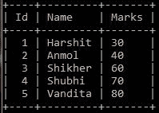

# 如何使用 Python 中的 Matploltlib 可视化 MySQL 数据库中的数据？

> 原文:[https://www . geesforgeks . org/如何使用 python 中的 matploltlib 可视化来自 mysql 数据库的数据/](https://www.geeksforgeeks.org/how-to-visualize-data-from-mysql-database-by-using-matploltlib-in-python/)

**先决条件:**Python 中的[Matplotlib](https://www.geeksforgeeks.org/python-introduction-matplotlib/)、 [MySQL](https://www.geeksforgeeks.org/mysql-common-mysql-queries/)

在使用 Python 时，我们需要使用数据库，它们可能是不同的类型，如 MySQL、SQLite、NoSQL 等。在本文中，我们将期待如何使用 MySQL 连接器/Python 连接 MySQL 数据库。Python 的 MySQL 连接器模块用于将 MySQL 数据库与 Python 程序连接起来，它使用 Python 数据库应用编程接口规范 v2.0 (PEP 249)来实现这一点。它使用 Python 标准库，没有依赖关系。

在本文中，我们将讨论如何使用 Python 中的 matploltlib 可视化 MySQL 数据库中的数据。为了执行这个任务，我们只需要安装一个模块名 mysqlconnector，它可以通过使用

```py
pip install mysqlconnector
```

现在要在 python 中使用 matplotlib 库，我们还需要安装它。我们可以通过以下方式安装:

```py
pip install matplotlib
```

除了这些模块，我们还将安装另一个模块 [numpy](https://www.geeksforgeeks.org/python-numpy-tutorial/) ，它将作为 matplotlib 高效工作的实用模块。另一方面，NumPy 在对数组执行数学和逻辑运算以及处理数学计算方面有着巨大的用途。

在 Windows 操作系统的命令提示符下键入上述命令，以安装所需的模块。

现在要使用已安装的模块，我们必须用 Python 导入它们。这可以通过以下方式实现:

```py
import numpy as np 
```

这里 np 只是 numpy 的别名。代替 np，我们可以取任何我们想要的名字。它被用来代替 numpy 写 np。

```py
import matplotlib.pyplot as plt  
```

[matplotlib.pyplot](https://www.geeksforgeeks.org/pyplot-in-matplotlib/) 是使 matplotlib 工作的函数集合，将其作为 plt 导入意味着我们可以编写 plt 来代替 matplotlib.pyplot。

**用 Python 连接 MySQL 数据库的步骤:**

*   我们需要做的第一件事是导入我们之前安装的 mysqlconnector，这可以通过编写:

```py
import mysql.connector
```

*   现在我们可以创建一个变量，比如 mydb，用来存储连接的结果。因此，我们可以通过使用属于 mysql.connector 类的 connect()方法将 MySQL 与 Python 连接起来。

> mydb = MySQL . connector . connect(host = " localhost "，user="root "，password="Your_Password "，database="Database_Name ")

*   正如上面这段代码中提到的，这个 connect()方法需要一些参数，如下所示:
    *   **主机**可以是你的本地主机，也可以是其他主机。
    *   **用户**，不是别人，正是 mysql 数据库的用户名。
    *   **密码**这是你在 mysql 数据库中的密码。
    *   **数据库**是要从中提取数据的数据库的名称。

至此，我们完成了 MySQL 数据库与 Python 的连接。现在我们的目的是从数据库中获取信息，所以我们创建了一个变量，比如 mycursor，它将存储当前数据库的游标。游标允许您迭代查询返回的一组行，并处理每一行以获得所需的信息。

```py
mycursor=mydb.cursor()
```

给定 MySQL 数据库中的学生记录，绘制学生姓名和学生成绩之间的图表。要解决上述问题，首先我们必须将 MySQL 连接到 Python。

**要使用的样品表:**



现在，为了获得所需的查询，我们使用 mycursor 的 execute()方法，该方法将 SQL 查询作为参数，并且我们还通过使用 mycursor 的 fetchall 来存储查询结果，这可以通过以下方式来完成:

## 蟒蛇 3

```py
mycursor.execute("select Name, Marks from student_marks")
result = mycursor.fetchall
```

正如您在上面的查询中看到的，我们试图从学生标记表中获取学生姓名和学生标记。现在，我们将学生姓名和他们各自的分数存储到两个单独的列表中，这样我们就可以将它们绘制成条形图。

## 蟒蛇 3

```py
Names = []
Marks = []

for i in mycursor:
    Names.append(i[0])
    Marks.append(i[1])

print("Name of Students = ", Names)
print("Marks of Students = ", Marks)
```

**使用 Matplotlib 可视化数据:**

## 蟒蛇 3

```py
# plt.bar to plot a bar graph 
# with given values
plt.bar(Names, Marks)

# Setting count of values in 
# y-axis
plt.ylim(0, 5)

# setting xlabel of graph
plt.xlabel("Name of Students")

# setting ylabel of graph
plt.ylabel("Marks of Students")

# setting tile of graph
plt.title("Student's Information")

# show() method to display the graph
plt.show()
```

**以下是全面实施** **以上办法:**

## 蟒蛇 3

```py
# Connecting to mysql database
import mysql.connector
import numpy as np
import matplotlib.pyplot as plt

mydb = mysql.connector.connect(host="localhost", 
                               user="root", 
                               password="password", 
                               database="student_info")
mycursor = mydb.cursor()

# Fecthing Data From mysql to my python progame
mycursor.execute("select Name, Marks from student_marks")
result = mycursor.fetchall

Names = []
Marks = []

for i in mycursor:
    Names.append(i[0])
    Marks.append(i[1])

print("Name of Students = ", Names)
print("Marks of Students = ", Marks)

# Visulizing Data using Matplotlib
plt.bar(Names, Marks)
plt.ylim(0, 5)
plt.xlabel("Name of Students")
plt.ylabel("Marks of Students")
plt.title("Student's Information")
plt.show()
```

**输出:**

 