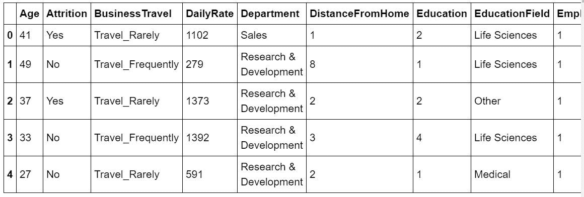
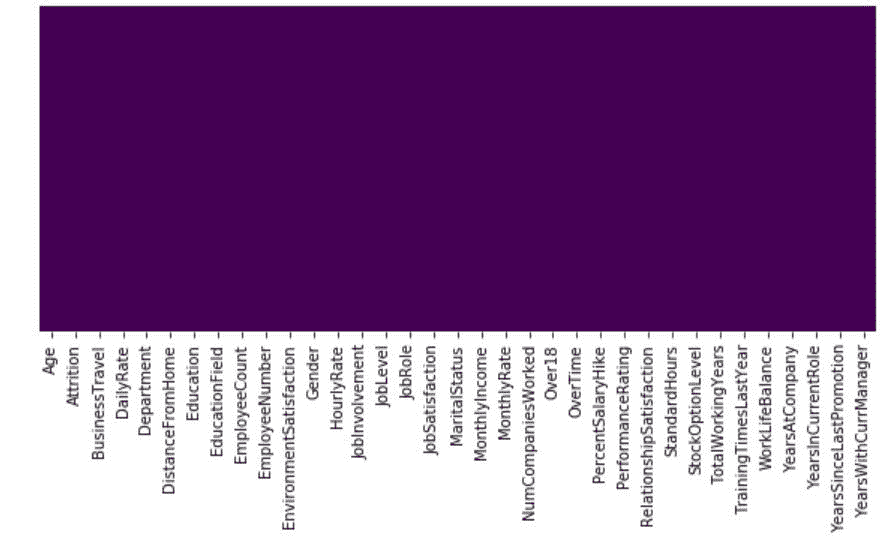
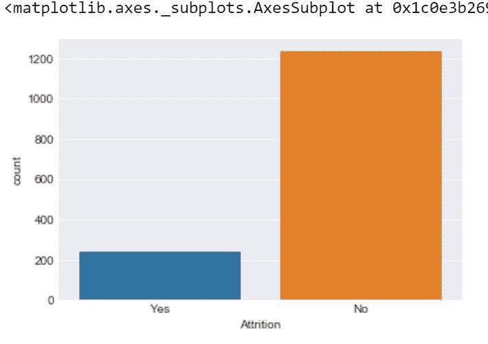
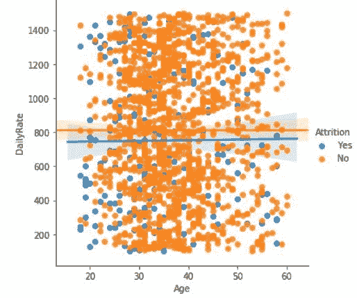
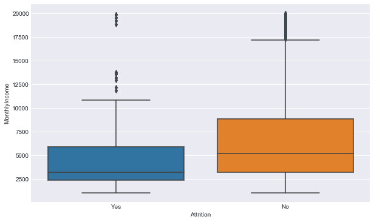
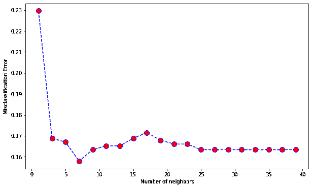

# IBM 人力资源分析员工流失&使用 KNN

的绩效

> 原文:[https://www . geesforgeks . org/IBM-HR-analytics-员工-自然减员-绩效-使用-knn/](https://www.geeksforgeeks.org/ibm-hr-analytics-employee-attrition-performance-using-knn/)

减员是一个影响所有企业的问题，无论地理位置、行业和公司规模如何。对一个组织来说，这是一个重大问题，预测人员流动是许多组织人力资源需求的首要问题。组织面临着员工流动带来的巨大成本。随着机器学习和数据科学的进步，预测员工流失成为可能，我们将使用 KNN (k 近邻)算法进行预测。
**数据集:**
由 IBM 人力资源部发布的数据集在 Kaggle 提供。
[数据集](https://www.kaggle.com/pavansubhasht/ibm-hr-analytics-attrition-dataset)
**代码:实现 KNN 算法进行分类。**
**加载库**

## 蟒蛇 3

```
# performing linear algebra
import numpy as np

# data processing
import pandas as pd

# visualisation
import matplotlib.pyplot as plt
import seaborn as sns % matplotlib inline
```

**编码:导入数据集**

## 蟒蛇 3

```
dataset = pd.read_csv("WA_Fn-UseC_-HR-Employee-Attrition.csv")
print (dataset.head)
```

**输出:**



**代码:数据集信息**

## 蟒蛇 3

```
df.info()
```

**输出:**

```
RangeIndex: 1470 entries, 0 to 1469
Data columns (total 35 columns):
Age                         1470 non-null int64
Attrition                   1470 non-null object
BusinessTravel              1470 non-null object
DailyRate                   1470 non-null int64
Department                  1470 non-null object
DistanceFromHome            1470 non-null int64
Education                   1470 non-null int64
EducationField              1470 non-null object
EmployeeCount               1470 non-null int64
EmployeeNumber              1470 non-null int64
EnvironmentSatisfaction     1470 non-null int64
Gender                      1470 non-null object
HourlyRate                  1470 non-null int64
JobInvolvement              1470 non-null int64
JobLevel                    1470 non-null int64
JobRole                     1470 non-null object
JobSatisfaction             1470 non-null int64
MaritalStatus               1470 non-null object
MonthlyIncome               1470 non-null int64
MonthlyRate                 1470 non-null int64
NumCompaniesWorked          1470 non-null int64
Over18                      1470 non-null object
OverTime                    1470 non-null object
PercentSalaryHike           1470 non-null int64
PerformanceRating           1470 non-null int64
RelationshipSatisfaction    1470 non-null int64
StandardHours               1470 non-null int64
StockOptionLevel            1470 non-null int64
TotalWorkingYears           1470 non-null int64
TrainingTimesLastYear       1470 non-null int64
WorkLifeBalance             1470 non-null int64
YearsAtCompany              1470 non-null int64
YearsInCurrentRole          1470 non-null int64
YearsSinceLastPromotion     1470 non-null int64
YearsWithCurrManager        1470 non-null int64
dtypes: int64(26), object(9)
memory usage: 402.0+ KB
```

**代码:可视化数据**

## 蟒蛇 3

```
# heatmap to check the missing value
plt.figure(figsize =(10, 4))
sns.heatmap(dataset.isnull(), yticklabels = False, cbar = False, cmap ='viridis')
```

**输出:**



因此，我们可以看到数据集中没有缺失值。
这是一个二元分类问题，因此实例在两个类中的分布如下图所示:

## 蟒蛇 3

```
sns.set_style('darkgrid')
sns.countplot(x ='Attrition', data = dataset)
```

**输出:**



**代码:**

## 蟒蛇 3

```
sns.lmplot(x = 'Age', y = 'DailyRate', hue = 'Attrition', data = dataset)
```

**输出:**



**代码:**

## 蟒蛇 3

```
plt.figure(figsize =(10, 6))
sns.boxplot(y ='MonthlyIncome', x ='Attrition', data = dataset)
```

**输出:**



**数据预处理**
数据集中有 4 个不相关的列，分别是:EmployeeCount、EmployeeNumber、Over18 和 StandardHour。所以，为了更准确，我们必须去掉这些。
T4【代码:

## 蟒蛇 3

```
dataset.drop('EmployeeCount', axis = 1, inplace = True)
dataset.drop('StandardHours', axis = 1, inplace = True)
dataset.drop('EmployeeNumber', axis = 1, inplace = True)
dataset.drop('Over18', axis = 1, inplace = True)
print(dataset.shape)
```

**输出:**

```
(1470, 31)
```

所以，我们删除了无关的栏目。
**代码:输入输出数据**

## 蟒蛇 3

```
y = dataset.iloc[:, 1]
X = dataset
X.drop('Attrition', axis = 1, inplace = True)
```

**代码:标签编码**

## 蟒蛇 3

```
from sklearn.preprocessing import LabelEncoder
lb = LabelEncoder()
y = lb.fit_transform(y)
```

在数据集中有 7 个分类数据，因此我们必须将它们更改为 int 数据，也就是说，我们必须创建 7 个虚拟变量以提高准确性。
**代码:虚拟变量创建**

## 蟒蛇 3

```
dum_BusinessTravel = pd.get_dummies(dataset['BusinessTravel'],
                                    prefix ='BusinessTravel')
dum_Department = pd.get_dummies(dataset['Department'],
                                prefix ='Department')
dum_EducationField = pd.get_dummies(dataset['EducationField'],
                                    prefix ='EducationField')
dum_Gender = pd.get_dummies(dataset['Gender'],
                            prefix ='Gender', drop_first = True)
dum_JobRole = pd.get_dummies(dataset['JobRole'],
                             prefix ='JobRole')
dum_MaritalStatus = pd.get_dummies(dataset['MaritalStatus'],
                                   prefix ='MaritalStatus')
dum_OverTime = pd.get_dummies(dataset['OverTime'],
                              prefix ='OverTime', drop_first = True)
# Adding these dummy variable to input X
X = pd.concat([x, dum_BusinessTravel, dum_Department,
               dum_EducationField, dum_Gender, dum_JobRole,
               dum_MaritalStatus, dum_OverTime], axis = 1)
# Removing the categorical data
X.drop(['BusinessTravel', 'Department', 'EducationField',
        'Gender', 'JobRole', 'MaritalStatus', 'OverTime'],
        axis = 1, inplace = True)

print(X.shape)
print(y.shape)
```

**输出:**

```
(1470, 49)
(1470, )
```

**代码:拆分数据进行训练测试**

## 蟒蛇 3

```
from sklearn.model_selection import train_test_split
X_train, X_test, y_train, y_test = train_test_split(
    X, y, test_size = 0.25, random_state = 40)
```

预处理已经完成，现在我们必须对数据集应用 KNN。
**模型执行代码:利用 KNeighborsClassifier，借助误分类错误找到最佳邻居数。**

## 蟒蛇 3

```
from sklearn.neighbors import KNeighborsClassifier
neighbors = []
cv_scores = []

from sklearn.model_selection import cross_val_score
# perform 10 fold cross validation
for k in range(1, 40, 2):
    neighbors.append(k)
    knn = KNeighborsClassifier(n_neighbors = k)
    scores = cross_val_score(
        knn, X_train, y_train, cv = 10, scoring = 'accuracy')
    cv_scores.append(scores.mean())
error_rate = [1-x for x in cv_scores]

# determining the best k
optimal_k = neighbors[error_rate.index(min(error_rate))]
print('The optimal number of neighbors is % d ' % optimal_k)

# plot misclassification error versus k
plt.figure(figsize = (10, 6))
plt.plot(range(1, 40, 2), error_rate, color ='blue', linestyle ='dashed', marker ='o',
         markerfacecolor ='red', markersize = 10)
plt.xlabel('Number of neighbors')
plt.ylabel('Misclassification Error')
plt.show()
```

**输出:**

```
The optimal number of neighbors is  7  
```



**代码:预测得分**

## 蟒蛇 3

```
from sklearn.model_selection import cross_val_predict, cross_val_score
from sklearn.metrics import accuracy_score, classification_report
from sklearn.metrics import confusion_matrix

def print_score(clf, X_train, y_train, X_test, y_test, train = True):
    if train:
        print("Train Result:")
        print("------------")
        print("Classification Report: \n {}\n".format(classification_report(
                y_train, clf.predict(X_train))))
        print("Confusion Matrix: \n {}\n".format(confusion_matrix(
                y_train, clf.predict(X_train))))

        res = cross_val_score(clf, X_train, y_train,
                              cv = 10, scoring ='accuracy')
        print("Average Accuracy: \t {0:.4f}".format(np.mean(res)))
        print("Accuracy SD: \t\t {0:.4f}".format(np.std(res)))
        print("accuracy score: {0:.4f}\n".format(accuracy_score(
                y_train, clf.predict(X_train))))
        print("----------------------------------------------------------")

    elif train == False:
        print("Test Result:")
        print("-----------")
        print("Classification Report: \n {}\n".format(
                classification_report(y_test, clf.predict(X_test))))
        print("Confusion Matrix: \n {}\n".format(
                confusion_matrix(y_test, clf.predict(X_test))))
        print("accuracy score: {0:.4f}\n".format(
                accuracy_score(y_test, clf.predict(X_test))))
        print("-----------------------------------------------------------")

knn = KNeighborsClassifier(n_neighbors = 7)
knn.fit(X_train, y_train)
print_score(knn, X_train, y_train, X_test, y_test, train = True)
print_score(knn, X_train, y_train, X_test, y_test, train = False)
```

**输出:**

```
Train Result:
------------
Classification Report: 
               precision    recall  f1-score   support

           0       0.86      0.99      0.92       922
           1       0.83      0.19      0.32       180

    accuracy                           0.86      1102
   macro avg       0.85      0.59      0.62      1102
weighted avg       0.86      0.86      0.82      1102

Confusion Matrix: 
 [[915   7]
 [145  35]]

Average Accuracy:      0.8421
Accuracy SD:          0.0148
accuracy score: 0.8621

-----------------------------------------------------------
Test Result:
-----------
Classification Report: 
               precision    recall  f1-score   support

           0       0.84      0.96      0.90       311
           1       0.14      0.04      0.06        57

    accuracy                           0.82       368
   macro avg       0.49      0.50      0.48       368
weighted avg       0.74      0.82      0.77       368

Confusion Matrix: 
 [[299  12]
 [ 55   2]]

accuracy score: 0.8179
```