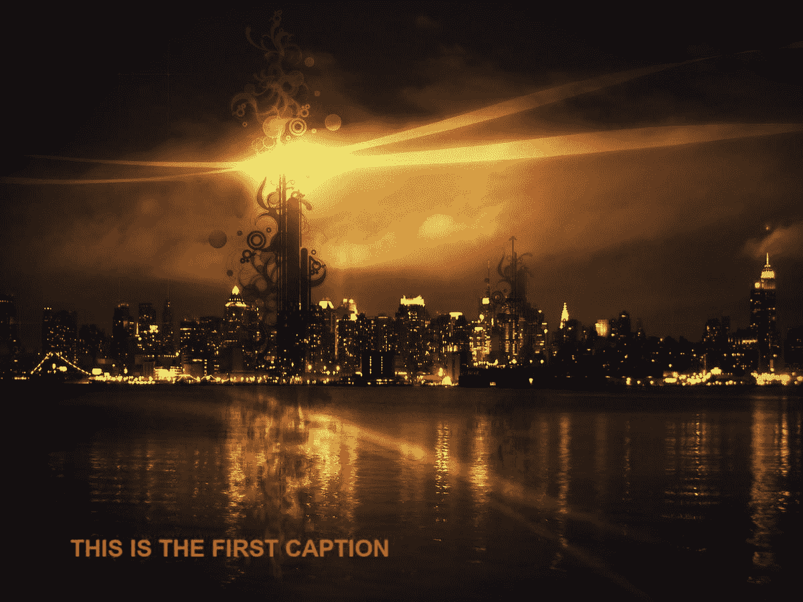

# 使用 Python 的图像字幕

> 原文:[https://www . geesforgeks . org/image-caption-use-python/](https://www.geeksforgeeks.org/image-captioning-using-python/)

图像字幕是深度学习领域中一个非常经典和具有挑战性的问题，在这个问题中，我们使用图像的属性来生成图像的文本描述，但是这里我们不使用深度学习。在本文中，我们将简单地学习如何使用 PIL 简单地为图像添加标题。

图像预处理是 Python PIL 库提供的一个很好的工具。我们不仅可以改变大小、模式、方向，还可以在图片上画画，在上面写文字。

**安装所需的库:**

```
urllib
requests
PIL
glob
shutil
```

**首先要遵循的步骤–**

*   使用[这个链接](https://github.com/foursquare/foursquair/blob/master/src/assets/fonts/Arial%20Bold.ttf)下载`font.ttf`文件(运行代码前)。
*   事先制作一个名为“字幕图像”的文件夹，在那里存储输出的字幕图像。

下面是使用 Python 的分步实现:

**步骤#1:**

```
# importing required libraries
import urllib
import requests
import os

# retrieving using image url 
urllib.request.urlretrieve("https://i.ibb.co/xY4DJJ5/img1.jpg", "img1.jpg")
urllib.request.urlretrieve("https://i.ibb.co/Gnd1Y1L/img2.jpg", "img2.jpg")
urllib.request.urlretrieve("https://i.ibb.co/Z6JgS1L/img3.jpg", "img3.jpg")

print('Images downloaded')

# get current working directory path
path = os.getcwd()

captionarr = [
    "This is the first caption",
    "This is the second caption",
    "This is the third caption"
    ]
```

**第二步:**

```
# importing necessary functions from PIL
from PIL import Image
from PIL import ImageFont
from PIL import ImageDraw 

# print(os.getcwd())

# checking the file mime types if
# it is jpg, png or jpeg
def ext(file):
    index = file.find(".jpg")
    current_file = ""
    current_file = file[index:]
    return current_file 

def ext2(file):
    index = file.find(".jpeg")
    current_file = ""
    current_file = file[index:]
    return current_file 

def ext3(file):
    index = file.find(".png")
    current_file = ""
    current_file = file[index:]
    return current_file 

# converting text from lowercase to uppercase
def convert(words):
    s = ""
    for word in words:
        s += word.upper() 
    return s

caption_first = convert(captionarr[0])
caption_second = convert(captionarr[1])
caption_third = convert(captionarr[2])

print(caption_first)
print(caption_second)
print(caption_third)

count = 0

for f in os.listdir('.'):
    try:
        # Checking for file types if jpg, png
        # or jpeg excluding other files
        if (ext(f) == '.jpg' or ext2(f) == '.jpeg' or ext3(f) == '.png'):
            img = Image.open(f) 
            width, height = img.size
            basewidth = 1200
            # print(height)

            # Resizinng images to same width height
            wpercent = (basewidth / float(img.size[0]))
            hsize = int((float(img.size[1])*float(wpercent)))
            img = img.resize((basewidth, hsize), Image.ANTIALIAS)
            new_width, new_height = img.size

            # print(new_height)
            # changing image mode if not in RGB
            if not img.mode == 'RGB':
                img = img.convert('RGB')

            draw = ImageDraw.Draw(img)
            # font = ImageFont.truetype(<font-file>, <font-size>)
            # initializing which font will be chosen by us
            font = ImageFont.truetype("Arial Bold.ttf", 35) 

             # First Caption on First image
            if count == 0:
                draw.text((new_width / 15 + 25, new_height - 100),
                           caption_first, (255, 0, 0), font = font,
                           align ="center")

            # Second Caption on Second image
            elif count == 1: 
                draw.text((new_width / 15 + 25, new_height - 100),
                          caption_second, (255, 0, 0), font = font,
                          align ="center")

            # Third Caption on Third image
            else: 
                draw.text(( new_width / 15 + 25, new_height - 100),
                            caption_third, (255, 0, 0), font = font,
                            align ="center")             

            img.save("CaptionedImges/{}".format(f))     
            print('done')
            count = count + 1

    except OSError:
        pass
```

**【步骤#3:**
根据上次修改时间对输出文件进行排序，以便它们不会按字母顺序或任何其他管理不当的顺序放置。

```
import os
import glob
import shutil

# changing directory to CaptionedImages
os.chdir(".\\CaptionedImges") 

fnames = []
for file in os.listdir('.'):
    # appending files in directory to the frames arr
    fnames.append(file) 

# sorting the files in frames array 
# on the basis of last modified time
# reverse = True means ascending order sorting
fnames.sort(key = lambda x: os.stat(x).st_ctime, reverse = True)
```

**输出:**



