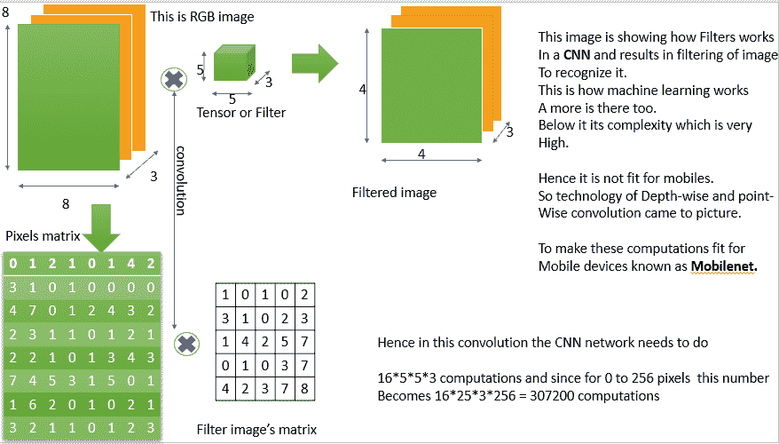

# 利用 Mobilenet 进行图像识别

> 原文:[https://www . geesforgeks . org/image-recognition-wit-mobile net/](https://www.geeksforgeeks.org/image-recognition-with-mobilenet/)

**简介:**

图像识别在医学疾病分析等许多领域发挥着重要作用。在本文中，我们将主要关注如何识别给定的图像，正在显示什么。我们假设对 [Tensorflow](https://www.geeksforgeeks.org/introduction-to-tensorflow/) 、 [Keras](https://www.geeksforgeeks.org/python-image-classification-using-keras/) 、 [Python](https://www.geeksforgeeks.org/python-programming-language/learn-python-tutorial/) 、[机器学习](https://www.geeksforgeeks.org/machine-learning/)有所了解

此外，我们将使用 Colaboratory 作为我们的笔记本来运行 python 代码和训练我们的模型。

**描述:**

我们的目标是使用机器学习来识别给定的图像。我们假设我们的张量流中已经有了一个预先训练好的模型，我们将使用它来识别图像。因此，我们将使用 Tensorflow 的 Keras 来导入架构，这将帮助我们识别图像，并使用坐标和索引以更好的方式预测图像，我们将使用 [NumPy](https://www.geeksforgeeks.org/python-numpy/) 作为工具。

**步骤:**

**1)** 首先，我们必须打开 Colaboratory，并将我们的 Gmail 帐户链接到它。

现在，首先我们将把所有的需求导入到笔记本中，然后加载我们要识别的图像。

> 导入张量流作为 tf
> 
> 将 numpy 作为 np 导入
> 
> 来自 tensorflow.keras .预处理导入图像
> 
> 将 matplotlib.pyplot 输入为 plt
> 
> 从 tensorflow.keras.applications 导入 imagenet_utils

**2)** 要将**加载到**笔记本中的图像，我们必须首先将一个图像文件添加到文件夹中，然后将其路径传递到任何变量(让它成为 FileName 截止到现在)如下:

> 文件名= '路径 _ 到 _img '
> 
> img = image.load_img(文件名，target_size=(224，224))
> 
> plt.imshow(img)

现在要显示这个图像，我们必须将它加载到张量流模型中，这可以使用*张量流. keras .预处理* **中的**图像**库来完成。**这个库用来加载我们模型中的图像，然后我们可以打印出来显示图像，如下图所示:

> 在上述方法中，默认情况下图像以 RGB 和像素格式显示。因此，我们将使用 *matplotlib.pyplot* 使用坐标绘制我们的图像，并以更好的方式获得图像的可视化形式。
> 
> matplotlib.pyplot 的 lib 中的方法是 imshow( image_Variable)，用于清晰地显示图像。因此，


输出图像

因此，我们已经加载了一些我们将要识别的图像特征。

**3)** 现在我们将使用一个预先训练好的模型来测试我们在图像上的预测。

由于*tensorflow . keras . applications 中有大量的模型集合，因此*我们可以使用任何模型来预测图像。这里我们将使用 *mobilenet_v2* 模型。

*Mobilenet_v2* 是 *Mobilenet* 系列的第二版车型(虽然还有很多其他版本)。这些模型利用美国有线电视新闻网(卷积神经网络)来预测图像的特征，比如物体的形状是什么，以及它与什么相匹配。

> **CNN 是如何运作的？**
> 
> 由于图像可以被视为像素矩阵，并且每个像素描述图像的一些特征，因此这些技术使用过滤器来过滤掉图像中的特定像素集，并导致形成关于图像的输出预测。
> 
> 美国有线电视新闻网使用许多预定义和存储的过滤器，并对该过滤器与图像的像素矩阵进行卷积。这导致过滤图像的对象，并将它们与一大组预定义的对象进行比较，以识别它们之间的匹配。因此，通过这种方式，这些模型能够预测图像。
> 
> 
> 
> 美国有线电视新闻网在工作。
> 
> 但是这些技术需要很高的 GPU 来提高百万数据之间的比较率，这是任何移动设备都无法提供的。
> 
> 因此，这里就出现了所谓的 **MobileNet。**

Mobilenet 是一个模型，它做了与有线电视新闻网相同的卷积来过滤图像，但方式与以前的有线电视新闻网不同。它使用了深度卷积和点卷积的思想，这不同于正常中枢神经系统所做的正常卷积。这提高了美国有线电视新闻网预测图像的效率，因此他们也能够在移动系统中竞争。由于这些卷积方法大大减少了比较和识别时间，因此它在很短的时间内提供了更好的响应，因此我们将它们用作我们的图像识别模型。


对先前想法的改进

因此，为了将这个模型导入到模型中的一个变量中，我们将代码编写为:

> model = TF . keras . applications . mobile net _ v2。MobileNetV2()

我们现在将以数组的形式向它提供加载的图像，因此要将图像转换为数组，我们将使用图像库(如上所述)，其方法名为 *img_to_array()* ，如下所示:

现在我们使用训练数据集的*预处理 _ 输入()*和*预测()*方法来预测图像细节。

**4)** 现在既然做出了预测，那么要显示它们我们就必须解码它们。为了解码它们，我们将使用 *imagenet_utils* **。**该库用于对阵列图像进行解码和多处修改。

一种名为 *decode_predictions* ()的方法用于将预测解码为人类可读的格式。

> results = imagenet _ utils . decode _ predictions(预测)# decode_predictions()方法被使用。
> 
> 打印(结果)

因此，预测的整体代码如下所示:

## 蟒蛇 3

```py
import tensorflow as tf
import numpy as np
from tensorflow.keras.preprocessing import image
import matplotlib.pyplot as plt
from tensorflow.keras.applications import imagenet_utils
from IPython.display import Image

# importing image
filename = '/content/birds.jpg'

#displaying images
Image(filename,width=224,height=224)
img = image.load_img(filename,target_size=(224,224))
print(img)
plt.imshow(img)

#initializing the model to predict the image details using predefined models.
model = tf.keras.applications.mobilenet_v2.MobileNetV2()
resizedimg = image.img_to_array(img)
finalimg = np.expand_dims(resizedimg,axis=0)
finalimg = tf.keras.applications.mobilenet_v2.preprocess_input(finalimg)
finalimg.shape
predictions = model.predict(finalimg)

# To predict and decode the image details
results = imagenet_utils.decode_predictions(predictions)
print(results)
```

**输出:**

我们可以看到输出包含图像中鸟的名字和它所在的像素。

```py
[[('n01558993', 'robin', 0.8600541), ('n04604644', 'worm_fence', 0.005403478), 
('n01806567', 'quail', 0.005208329), ('n01530575', 'brambling', 0.00316776), 
('n01824575', 'coucal', 0.001805085)]]
```

因此，我们使用机器学习模型和 Python 来识别笔记本上的鸟的图像。