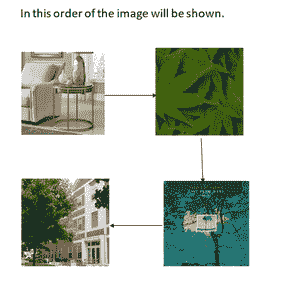

# 使用 Tkinter 的 Python 图像查看器应用程序

> 原文:[https://www . geesforgeks . org/image-viewer-app-in-python-using-tkinter/](https://www.geeksforgeeks.org/image-viewer-app-in-python-using-tkinter/)

**先决条件:**T2【蟒蛇图形界面–tkinter、[蟒蛇:枕头](https://www.geeksforgeeks.org/python-pillow-a-fork-of-pil/)

你有没有想过用 Python 做一个图像查看器？这里有一个借助 Python 制作图像查看器的解决方案。我们可以在 this 和枕头的帮助下做到这一点。我们将在下面讨论所需的模块和代码。

### 需要模块

*   [**Tkinter:**](https://www.geeksforgeeks.org/python-gui-tkinter/)**Tkinter 是一个库，我们可以借助它来制作 GUI(图形用户界面)。**

```py
 pip install tkinter
```

*   **[**枕头:**](https://www.geeksforgeeks.org/python-pillow-a-fork-of-pil/) 我们可以添加照片，因为它是一个 Python 的成像库。**

```py
 pip install pillow
```

**现在让我们为它编码**

### **入门指南**

*   **下面的代码演示了生成的图形用户界面的基本结构、按钮初始化和布局**

## **蟒蛇 3**

```py
# importing the tkinter module and PIL that
# is pillow module
from tkinter import *
from PIL import ImageTk, Image

# Calling the Tk (The initial constructor of tkinter)
root = Tk()

# We will make the title of our app as Image Viewer
root.title("Image Viewer")

# The geometry of the box which will be displayed
# on the screen
root.geometry("700x700")

# Adding the images using the pillow module which
# has a class ImageTk We can directly add the
# photos in the tkinter folder or we have to
# give a proper path for the images
image_no_1 = ImageTk.PhotoImage(Image.open("Sample.png"))
image_no_2 = ImageTk.PhotoImage(Image.open("sample.png"))
image_no_3 = ImageTk.PhotoImage(Image.open("Sample.png"))
image_no_4 = ImageTk.PhotoImage(Image.open("sample.png"))

# List of the images so that we traverse the list
List_images = [image_no_1, image_no_2, image_no_3, image_no_4]

label = Label(image=image_no_1)

# We have to show the the box so this below line is needed
label.grid(row=1, column=0, columnspan=3)

# We will have three button back ,forward and exit
button_back = Button(root, text="Back", command=back,
                     state=DISABLED)

# root.quit for closing the app
button_exit = Button(root, text="Exit",
                     command=root.quit)

button_forward = Button(root, text="Forward",
                        command=lambda: forward(1))

# grid function is for placing the buttons in the frame
button_back.grid(row=5, column=0)
button_exit.grid(row=5, column=1)
button_forward.grid(row=5, column=2)

root.mainloop()
```

*   ****前进功能:**该功能用于增加前进按钮的功能**

## **蟒蛇 3**

```py
def forward(img_no):

    # GLobal variable so that we can have
    # access and change the variable
    # whenever needed
    global label
    global button_forward
    global button_back
    global button_exit
    label.grid_forget()

    # This is for clearing the screen so that
    # our next image can pop up
    label = Label(image=List_images[img_no-1])

    # as the list starts from 0 so we are
    # subtracting one
    label.grid(row=1, column=0, columnspan=3)
    button_for = Button(root, text="forward",
                        command=lambda: forward(img_no+1))

    # img_no+1 as we want the next image to pop up
    if img_no == 4:
        button_forward = Button(root, text="Forward",
                                state=DISABLED)

    # img_no-1 as we want previous image when we click
    # back button
    button_back = Button(root, text="Back",
                         command=lambda: back(img_no-1))

    # Placing the button in new grid
    button_back.grid(row=5, column=0)
    button_exit.grid(row=5, column=1)
    button_for.grid(row=5, column=2)
```

*   ****后退功能:**该功能是给后退按钮增加功能**

## **蟒蛇 3**

```py
def back(img_no):

    # We will have global variable to access these
    # variable and change whenever needed
    global label
    global button_forward
    global button_back
    global button_exit
    label.grid_forget()

    # for clearing the image for new image to pop up
    label = Label(image=List_images[img_no - 1])
    label.grid(row=1, column=0, columnspan=3)
    button_forward = Button(root, text="forward",
                            command=lambda: forward(img_no + 1))
    button_back = Button(root, text="Back",
                         command=lambda: back(img_no - 1))
    print(img_no)

    # whenever the first image will be there we will
    # have the back button disabled
    if img_no == 1:
        button_back = Button(root, Text="Back", state=DISABLED)

    label.grid(row=1, column=0, columnspan=3)
    button_back.grid(row=5, column=0)
    button_exit.grid(row=5, column=1)
    button_for.grid(row=5, column=2)
```

****完整代码****

****使用的图像及其顺序–****

**

图像的显示顺序。** 

## **蟒蛇 3**

```py
# importing the tkinter module and PIL
# that is pillow module
from tkinter import *
from PIL import ImageTk, Image

def forward(img_no):

    # GLobal variable so that we can have
    # access and change the variable
    # whenever needed
    global label
    global button_forward
    global button_back
    global button_exit
    label.grid_forget()

    # This is for clearing the screen so that
    # our next image can pop up
    label = Label(image=List_images[img_no-1])

    # as the list starts from 0 so we are
    # subtracting one
    label.grid(row=1, column=0, columnspan=3)
    button_for = Button(root, text="forward",
                        command=lambda: forward(img_no+1))

    # img_no+1 as we want the next image to pop up
    if img_no == 4:
        button_forward = Button(root, text="Forward",
                                state=DISABLED)

    # img_no-1 as we want previous image when we click
    # back button
    button_back = Button(root, text="Back",
                         command=lambda: back(img_no-1))

    # Placing the button in new grid
    button_back.grid(row=5, column=0)
    button_exit.grid(row=5, column=1)
    button_for.grid(row=5, column=2)

def back(img_no):

    # We will have global variable to access these
    # variable and change whenever needed
    global label
    global button_forward
    global button_back
    global button_exit
    label.grid_forget()

    # for clearing the image for new image to pop up
    label = Label(image=List_images[img_no - 1])
    label.grid(row=1, column=0, columnspan=3)
    button_forward = Button(root, text="forward",
                            command=lambda: forward(img_no + 1))
    button_back = Button(root, text="Back",
                         command=lambda: back(img_no - 1))
    print(img_no)

    # whenever the first image will be there we will
    # have the back button disabled
    if img_no == 1:
        button_back = Button(root, Text="Back", state=DISABLED)

    label.grid(row=1, column=0, columnspan=3)
    button_back.grid(row=5, column=0)
    button_exit.grid(row=5, column=1)
    button_for.grid(row=5, column=2)

# Calling the Tk (The initial constructor of tkinter)
root = Tk()

# We will make the title of our app as Image Viewer
root.title("Image Viewer")

# The geometry of the box which will be displayed
# on the screen
root.geometry("700x700")

# Adding the images using the pillow module which
# has a class ImageTk We can directly add the
# photos in the tkinter folder or we have to
# give a proper path for the images
image_no_1 = ImageTk.PhotoImage(Image.open("Sample.png"))
image_no_2 = ImageTk.PhotoImage(Image.open("sample.png"))
image_no_3 = ImageTk.PhotoImage(Image.open("Sample.png"))
image_no_4 = ImageTk.PhotoImage(Image.open("sample.png"))

# List of the images so that we traverse the list
List_images = [image_no_1, image_no_2, image_no_3, image_no_4]

label = Label(image=image_no_1)

# We have to show the the box so this below line is needed
label.grid(row=1, column=0, columnspan=3)

# We will have three button back ,forward and exit
button_back = Button(root, text="Back", command=back,
                     state=DISABLED)

# root.quit for closing the app
button_exit = Button(root, text="Exit",
                     command=root.quit)

button_forward = Button(root, text="Forward",
                        command=lambda: forward(1))

# grid function is for placing the buttons in the frame
button_back.grid(row=5, column=0)
button_exit.grid(row=5, column=1)
button_forward.grid(row=5, column=2)

root.mainloop()
```

****输出:****

**<video class="wp-video-shortcode" id="video-471219-1" width="640" height="360" preload="metadata" controls=""><source type="video/mp4" src="https://media.geeksforgeeks.org/wp-content/uploads/20200818103619/geeksforgeeks-vedio.mp4?_=1">[https://media.geeksforgeeks.org/wp-content/uploads/20200818103619/geeksforgeeks-vedio.mp4](https://media.geeksforgeeks.org/wp-content/uploads/20200818103619/geeksforgeeks-vedio.mp4)</video>**