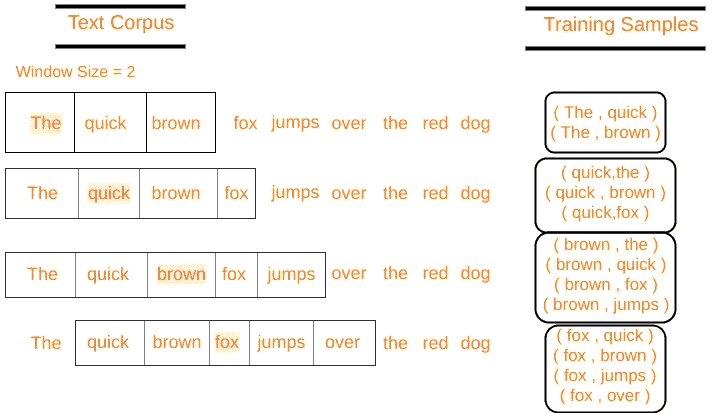

# 在 Python 中实现自己的 word2vec(skip-gram)模型

> 原文:[https://www . geesforgeks . org/implement-your-own-word 2 vescip-gram-model-in-python/](https://www.geeksforgeeks.org/implement-your-own-word2vecskip-gram-model-in-python/)

先决条件:[word 2 vec 简介](https://www.geeksforgeeks.org/python-word-embedding-using-word2vec/)
[自然语言处理](https://www.geeksforgeeks.org/introduction-to-natural-language-processing/) (NLP)是计算机科学和[人工智能](https://www.geeksforgeeks.org/artificial-intelligence-an-introduction/)的一个分支，涉及计算机和人类(自然)语言之间的交互。
在自然语言处理技术中，我们将单词和短语(从词汇或语料库)映射到数字向量，以使处理更容易。这些类型的**语言建模**技术被称为**单词嵌入**。
2013 年，谷歌发布了 **word2vec** ，这是一组用于产生文字嵌入的相关模型。
让我们通过推导神经网络的反向传播方程来实现我们自己的跳跃式模型(在 Python 中)。
在 word2vec 的**跳格**架构中，输入的是**中心词**，预测的是上下文词。考虑一组单词 W，如果 W(i)是输入(中心单词)，那么 W(i-2)、W(i-1)、W(i+1)和 W(i+2)是上下文单词，如果*滑动窗口大小*是 2。



```
Let's define some variables :

V    Number of unique words in our corpus of text ( Vocabulary )
x    Input layer (One hot encoding of our input word ). 
N    Number of neurons in the hidden layer of neural network
W    Weights between input layer and hidden layer
W'   Weights between hidden layer and output layer
y    A softmax output layer having probabilities of every word in our vocabulary
```


跳过 gram 架构

我们的神经网络架构已经定义，现在让我们做一些数学推导梯度下降所需的方程。

### 正向传播:

将一个中心字的热编码(用 **x** 表示)乘以第一个权重矩阵 **W** ，得到隐藏层矩阵 **h** (大小为 N×1)。

***(Vx1)(NxV)(Vx1)*** **现在我们将隐藏层向量 **h** 乘以第二权重矩阵**W’**得到一个新矩阵**u**

***(Vx1)(Nx1)*** **注
让**u<sub>j</sub>T40】成为 j <sup>层的第</sup>神经元**u**T45】让**W<sub>j</sub>T49】成为我们词汇中的 j <sup>第</sup>个单词，其中 j 是任何索引
让**V<sub>wj</sub>T56】成为矩阵的 j <sup>第</sup>列

***(1×1)(1xN)(Nx1)*** **y = soft max(u)
y<sub>j</sub>= soft max(u<sub>j</sub>)
y<sub>j</sub>表示 w <sub>j</sub> 是上下文词的概率
因此，我们的目标是最大化**P(w<sub>j*</sub>| w<sub>I</sub>)**，其中 j *代表上下文词的索引
显然我们想要最大化

，其中 **j* <sub>c</sub>** 是上下文词的词汇索引。上下文单词范围从 **c = 1，2，3..C**
我们取这个函数的**负对数似然**得到我们的**损失函数**，我们希望**最小化**

让 *t* 成为我们训练数据的实际输出向量，对于一个特定的中心词。它将在上下文单词的位置有 1，在所有其他位置有 0。t <sub>j*c</sub> 是上下文词的 1。
我们可以将乘以

解这个方程我们得到我们的损失函数为–
************ 

### 反向传播:

要调整的参数在矩阵 W 和 W’中，因此我们必须找到损失函数相对于 W 和 W’的偏导数，以应用梯度下降算法。
我们要找到


现在，找到


下面是实现:

## 蟒蛇 3

```
import numpy as np
import string
from nltk.corpus import stopwords

def softmax(x):
    """Compute softmax values for each sets of scores in x."""
    e_x = np.exp(x - np.max(x))
    return e_x / e_x.sum()

class word2vec(object):
    def __init__(self):
        self.N = 10
        self.X_train = []
        self.y_train = []
        self.window_size = 2
        self.alpha = 0.001
        self.words = []
        self.word_index = {}

    def initialize(self,V,data):
        self.V = V
        self.W = np.random.uniform(-0.8, 0.8, (self.V, self.N))
        self.W1 = np.random.uniform(-0.8, 0.8, (self.N, self.V))

        self.words = data
        for i in range(len(data)):
            self.word_index[data[i]] = i

    def feed_forward(self,X):
        self.h = np.dot(self.W.T,X).reshape(self.N,1)
        self.u = np.dot(self.W1.T,self.h)
        #print(self.u)
        self.y = softmax(self.u) 
        return self.y

    def backpropagate(self,x,t):
        e = self.y - np.asarray(t).reshape(self.V,1)
        # e.shape is V x 1
        dLdW1 = np.dot(self.h,e.T)
        X = np.array(x).reshape(self.V,1)
        dLdW = np.dot(X, np.dot(self.W1,e).T)
        self.W1 = self.W1 - self.alpha*dLdW1
        self.W = self.W - self.alpha*dLdW

    def train(self,epochs):
        for x in range(1,epochs):       
            self.loss = 0
            for j in range(len(self.X_train)):
                self.feed_forward(self.X_train[j])
                self.backpropagate(self.X_train[j],self.y_train[j])
                C = 0
                for m in range(self.V):
                    if(self.y_train[j][m]):
                        self.loss += -1*self.u[m][0]
                        C += 1
                self.loss += C*np.log(np.sum(np.exp(self.u)))
            print("epoch ",x, " loss = ",self.loss)
            self.alpha *= 1/( (1+self.alpha*x) )

    def predict(self,word,number_of_predictions):
        if word in self.words:
            index = self.word_index[word]
            X = [0 for i in range(self.V)]
            X[index] = 1
            prediction = self.feed_forward(X)
            output = {}
            for i in range(self.V):
                output[prediction[i][0]] = i

            top_context_words = []
            for k in sorted(output,reverse=True):
                top_context_words.append(self.words[output[k]])
                if(len(top_context_words)>=number_of_predictions):
                    break

            return top_context_words
        else:
            print("Word not found in dictionary")
```

## 蟒蛇 3

```
def preprocessing(corpus):
    stop_words = set(stopwords.words('english'))   
    training_data = []
    sentences = corpus.split(".")
    for i in range(len(sentences)):
        sentences[i] = sentences[i].strip()
        sentence = sentences[i].split()
        x = [word.strip(string.punctuation) for word in sentence
                                     if word not in stop_words]
        x = [word.lower() for word in x]
        training_data.append(x)
    return training_data

def prepare_data_for_training(sentences,w2v):
    data = {}
    for sentence in sentences:
        for word in sentence:
            if word not in data:
                data[word] = 1
            else:
                data[word] += 1
    V = len(data)
    data = sorted(list(data.keys()))
    vocab = {}
    for i in range(len(data)):
        vocab[data[i]] = i

    #for i in range(len(words)):
    for sentence in sentences:
        for i in range(len(sentence)):
            center_word = [0 for x in range(V)]
            center_word[vocab[sentence[i]]] = 1
            context = [0 for x in range(V)]

            for j in range(i-w2v.window_size,i+w2v.window_size):
                if i!=j and j>=0 and j<len(sentence):
                    context[vocab[sentence[j]]] += 1
            w2v.X_train.append(center_word)
            w2v.y_train.append(context)
    w2v.initialize(V,data)

    return w2v.X_train,w2v.y_train  
```

## 蟒蛇 3

```
corpus = ""
corpus += "The earth revolves around the sun. The moon revolves around the earth"
epochs = 1000

training_data = preprocessing(corpus)
w2v = word2vec()

prepare_data_for_training(training_data,w2v)
w2v.train(epochs)

print(w2v.predict("around",3))   
```

**输出:**

