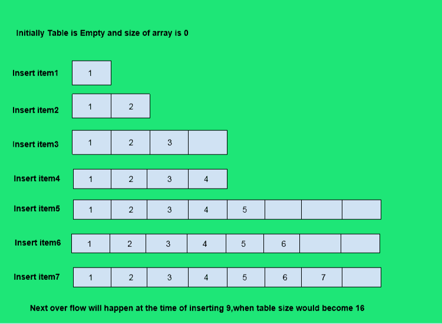
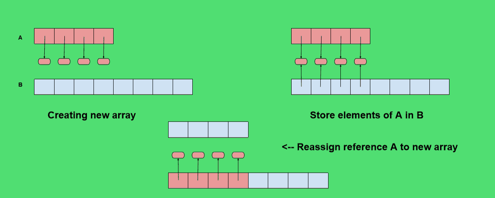

# Python 中动态数组的实现

> 原文:[https://www . geesforgeks . org/python 中动态数组的实现/](https://www.geeksforgeeks.org/implementation-of-dynamic-array-in-python/)

**什么是动态数组？**

动态数组类似于数组，但不同之处在于它的大小可以在运行时动态修改。不需要事先指定一个数组有多大。数组的元素占据一个连续的内存块，一旦创建，其大小就不能改变。一旦数组被填满，动态数组可以分配更大的内存块，将内容从原始数组复制到这个新空间，并继续填充可用的插槽。



我们将使用 python 的一个名为 [ctypes](https://docs.python.org/2/library/ctypes.html) 的内置库。查看文档了解更多信息，但它基本上是作为 ctypes 模块的原始数组使用的。

关于公共方法和私有方法的快速说明，我们可以在方法名前使用一个**下划线 _** 来保持它的非公共性。例如:

```py
class M(object):

    def public(self):
        print 'Use Tab to see me !'

    def _private(self):
        print "You won't be able to Tab to see me !"
```

```py
m = M()
m.public()
```

```py
Output:
Use Tab to see me!

```

```py
m._private()
```

```py
Output:
You won't be able to see me!
```

 **动态数组逻辑实现:**

关键是提供增长存储列表元素的数组的方法。我们实际上不能增长阵列，它的容量是固定的。如果一次将一个元素追加到列表中，当底层数组已满时，我们需要执行以下步骤。

1.  分配一个容量更大的新阵列 **B** (新阵列的一个常用规则是容量是现有阵列的两倍)
2.  将 **i=0** 的 **B[i]=A[i]** 设置为 **n-1** ，其中 n 表示当前项目数。
3.  设置 **A=B** 也就是说，我们因此使用 B 作为支持列表的数组。
4.  在新数组中插入新元素。



**动态数组代码实现:**

```py
import ctypes

class DynamicArray(object):
    '''
    DYNAMIC ARRAY CLASS (Similar to Python List)
    '''

    def __init__(self):
        self.n = 0 # Count actual elements (Default is 0)
        self.capacity = 1 # Default Capacity
        self.A = self.make_array(self.capacity)

    def __len__(self):
        """
        Return number of elements sorted in array
        """
        return self.n

    def __getitem__(self, k):
        """
        Return element at index k
        """
        if not 0 <= k <self.n:
            # Check it k index is in bounds of array
            return IndexError('K is out of bounds !') 

        return self.A[k] # Retrieve from the array at index k

    def append(self, ele):
        """
        Add element to end of the array
        """
        if self.n == self.capacity:
            # Double capacity if not enough room
            self._resize(2 * self.capacity) 

        self.A[self.n] = ele # Set self.n index to element
        self.n += 1

     def insertAt(self,item,index):
        """
         This function inserts the item at any specified index.
        """

        if index<0 or index>self.n:
            print("please enter appropriate index..")
            return

        if self.n==self.capacity:
            self._resize(2*self.capacity)

        for i in range(self.n-1,index-1,-1):
            self.A[i+1]=self.A[i]

        self.A[index]=item
        self.n+=1

    def delete(self):
        """
        This function deletes item from the end of array
        """

        if self.n==0:
            print("Array is empty deletion not Possible")
            return

        self.A[self.n-1]=0
        self.n-=1

    def removeAt(self,index):
        """
        This function deletes item from a specified index..
        """        

        if self.n==0:
            print("Array is empty deletion not Possible")
            return

        if index<0 or index>=self.n:
            return IndexError("Index out of bound....deletion not possible")        

        if index==self.n-1:
            self.A[index]=0
            self.n-=1
            return        

        for i in range(index,self.n-1):
            self.A[i]=self.A[i+1]            

        self.A[self.n-1]=0
        self.n-=1

    def _resize(self, new_cap):
        """
        Resize internal array to capacity new_cap
        """

        B = self.make_array(new_cap) # New bigger array

        for k in range(self.n): # Reference all existing values
            B[k] = self.A[k]

        self.A = B # Call A the new bigger array
        self.capacity = new_cap # Reset the capacity

    def make_array(self, new_cap):
        """
        Returns a new array with new_cap capacity
        """
        return (new_cap * ctypes.py_object)()
```

```py
# Instantiate
arr = DynamicArray()
# Append new element
arr.append(1)
len(arr)
```

```py
Output:
1
```

```py
# Append new element
arr.append(2)
# Check length
len(arr)
```

```py
Output:
2
```

```py
# Index
arr[0]
```

```py
Output:
1
```

```py
arr[1]
```

```py
Output:
2
```

太棒了，我们做了自己的动态数组！摆弄它，看看它如何自动调整大小。