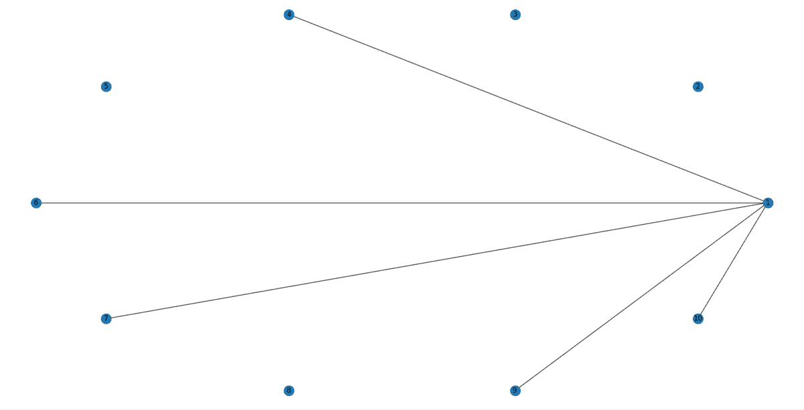

# 鄂尔多斯-仁义模型在社交网络上的实现

> 原文:[https://www . geesforgeks . org/implementation-of-Erdos-Renyi-model-on-social-networks/](https://www.geeksforgeeks.org/implementation-of-erdos-renyi-model-on-social-networks/)

**先决条件:** [社交网络入门](https://www.geeksforgeeks.org/introduction-to-social-networks-using-networkx-in-python/)[鄂尔多斯-仁义模式](https://www.geeksforgeeks.org/erdos-renyl-model-generating-random-graphs/)

鄂尔多斯仁义模型用于在社交网络上创建随机网络或图形。在鄂尔多斯雷尼模型中，每个边独立于网络中的边存在和不存在的概率是固定的。

### 使用鄂尔多斯-仁义模型实现社交网络:

**步骤 1)** 导入必要的模块，如[](https://www.geeksforgeeks.org/networkx-python-software-package-study-complex-networks/)*[*matplotlib . pyplot*](https://www.geeksforgeeks.org/pyplot-in-matplotlib/)，以及 [*随机*](https://www.geeksforgeeks.org/random-random-function-in-python/) 模块。*

## *蟒蛇 3*

```
*# Import Required modules
import networkx as nx
import matplotlib.pyplot as plt
import random*
```

***步骤 2)** 为模型创建分布图。*

## *蟒蛇 3*

```
*# Distribution graph for Erdos_Renyi model
def distribution_graph(g):
    print(nx.degree(g))
    all_node_degree = list(dict((nx.degree(g))).values())

    unique_degree = list(set(all_node_degree))
    unique_degree.sort()
    nodes_with_degree = []
    for i in unique_degree:
        nodes_with_degree.append(all_node_degree.count(i))

    plt.plot(unique_degree, nodes_with_degree)
    plt.xlabel("Degrees")
    plt.ylabel("No. of nodes")
    plt.title("Degree distribution")
    plt.show()*
```

***步骤 3)** 取 *N* 即用户的节点数。*

## *蟒蛇 3*

```
*# Take N number of nodes as input
print("Enter number of nodes")
N = int(input())*
```

***第 4 步)**现在取 *P* 即用户给出的边缘概率。*

## *蟒蛇 3*

```
*# Take P probability value for edges
print("Enter value of probability of every node")
P = float(input())*
```

***步骤 5)** 创建一个有 N 个没有任何边的节点的图。*

## *蟒蛇 3*

```
*# Create an empty graph object
g = nx.Graph()

# Adding nodes
g.add_nodes_from(range(1, N + 1))*
```

***步骤 6)** 随机给图加边，取一对节点，得到一个随机数 *R* 。如果 *R < P* (概率)，加边。对所有可能的节点对重复步骤 5 和 6，然后显示形成的整个社交网络(图)。*

## *蟒蛇 3*

```
*# Add edges to the graph randomly.
for i in g.nodes():
    for j in g.nodes():
        if (i < j):

            # Take random number R.
            R = random.random()

            # Check if R<P add the edge 
            # to the graph else ignore.
            if (R < P):
                g.add_edge(i, j)
    pos = nx.circular_layout(g)

    # Display the social network 
    nx.draw(g, pos, with_labels=1)
    plt.show()*
```

***步骤 7)** 显示连接节点。*

## *蟒蛇 3*

```
*# Display connection between nodes    
distribution_graph(g)*
```

### *以下是上述分步方法的完整程序:*

## *蟒蛇 3*

```
*# Implementation of Erdos-Renyi Model on a Social Network

# Import Required modules
import networkx as nx
import matplotlib.pyplot as plt
import random

# Distribution graph for Erdos_Renyi model
def distribution_graph(g):
    print(nx.degree(g))
    all_node_degree = list(dict((nx.degree(g))).values())

    unique_degree = list(set(all_node_degree))
    unique_degree.sort()
    nodes_with_degree = []
    for i in unique_degree:
        nodes_with_degree.append(all_node_degree.count(i))

    plt.plot(unique_degree, nodes_with_degree)
    plt.xlabel("Degrees")
    plt.ylabel("No. of nodes")
    plt.title("Degree distribution")
    plt.show()

# Take N number of nodes from user
print("Enter number of nodes")
N = int(input())

# Take P probability value for edges
print("Enter value of probability of every node")
P = float(input())

# Create an empty graph object
g = nx.Graph()

# Adding nodes
g.add_nodes_from(range(1, N + 1))

# Add edges to the graph randomly.
for i in g.nodes():
    for j in g.nodes():
        if (i < j):

            # Take random number R.
            R = random.random()

            # Check if R<P add the edge to the graph else ignore.
            if (R < P):
                g.add_edge(i, j)
    pos = nx.circular_layout(g)

    # Display the social network 
    nx.draw(g, pos, with_labels=1)
    plt.show()

# Display connection between nodes    
distribution_graph(g)*
```

***输出:***

> *输入节点数
> 10
> 输入每个节点的概率值
> 0.4
> [(1，5)，(2，3)，(3，4)，(4，2)，(5，3)，(6，5)，(7，4)，(8，2)，(9，2)，(10，2)]*

*

在图中随机添加边* 

***度**鄂尔多斯-仁义模型在上述方案上实施分布图 **:***

**