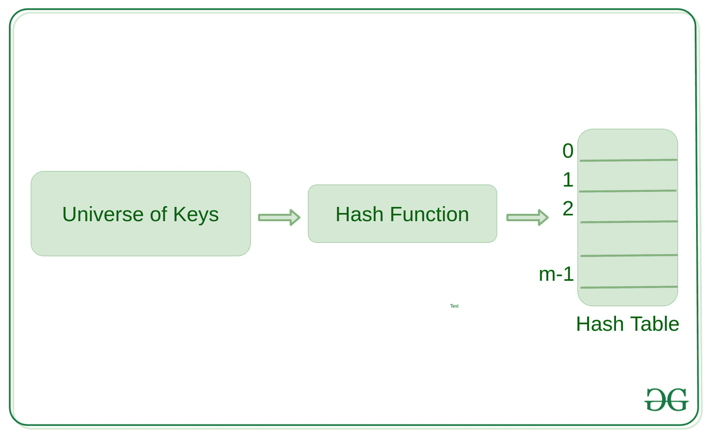

# Python 中带链接的哈希的实现

> 原文:[https://www . geeksforgeeks . org/python 中带链哈希的实现/](https://www.geeksforgeeks.org/implementation-of-hashing-with-chaining-in-python/)

哈希是一种用于存储大量数据的数据结构，可以通过搜索、插入、删除等操作在`O(1)`时间访问。哈希的各种应用有:

*   数据库索引
*   密码系统
*   编译器/解释器中的符号表
*   字典、缓存等。

### 哈希、哈希表和哈希函数的概念

哈希是一种重要的数据结构，它被设计为使用一种称为哈希函数的特殊函数，该函数用于将给定的值与特定的键进行映射，以便更快地访问元素。映射的效率取决于所用散列函数的效率。

**示例:**

```
h(large_value) = large_value % m
```

这里，`h()`是所需的哈希函数，【m】是哈希表的大小。对于大值，散列函数产生给定范围内的值。



**哈希函数是如何工作的？**

*   它应该总是将大键映射到小键。
*   它应该总是生成 0 到 m-1 之间的值，其中 m 是哈希表的大小。
*   It should uniformly distribute large keys into hash table slots.

    ### 碰撞处理

    如果我们事先知道密钥，那么我们就可以有完美的散列。在完美散列中，我们没有任何冲突。但是，如果我们不知道密钥，那么我们可以使用以下方法来避免冲突:

    *   链接
    *   开放寻址(线性探测、二次探测、双重散列)

    #### 链接

    哈希时，哈希函数可能会导致两个或多个密钥映射到同一值的冲突。链散列避免了冲突。其思想是使哈希表的每个单元格指向具有相同散列函数值的记录的链表。

    

    **注意:**在线性探测中，只要发生碰撞，我们就会探测到下一个空槽。而在二次探测中，每当发生冲突时，我们都会在第 I 次迭代中探测`i^2th`槽，并一直探测，直到在哈希表中找到一个空槽。

    ### 哈希的性能

    散列的性能是基于每个密钥对于散列表的任何槽都同样可能被散列来评估的。

    ```
    m = Length of Hash Table
    n = Total keys to be inserted in the hash table

    Load factor lf = n/m 
    Expected time to search = O(1 +lf )
    Expected time to insert/delete = O(1 + lf)

    The time complexity of search insert and delete is 
    O(1) if  lf is O(1)

    ```

    **哈希的 Python 实现**

    ```
    # Function to display hashtable
    def display_hash(hashTable):

        for i in range(len(hashTable)):
            print(i, end = " ")

            for j in hashTable[i]:
                print("-->", end = " ")
                print(j, end = " ")

            print()

    # Creating Hashtable as 
    # a nested list.
    HashTable = [[] for _ in range(10)]

    # Hashing Function to return 
    # key for every value.
    def Hashing(keyvalue):
        return keyvalue % len(HashTable)

    # Insert Function to add
    # values to the hash table
    def insert(Hashtable, keyvalue, value):

        hash_key = Hashing(keyvalue)
        Hashtable[hash_key].append(value)

    # Driver Code
    insert(HashTable, 10, 'Allahabad')
    insert(HashTable, 25, 'Mumbai')
    insert(HashTable, 20, 'Mathura')
    insert(HashTable, 9, 'Delhi')
    insert(HashTable, 21, 'Punjab')
    insert(HashTable, 21, 'Noida')

    display_hash (HashTable)
    ```

    **输出:**

    ```
    0 --> Allahabad --> Mathura 
    1 --> Punjab --> Noida 
    2 
    3 
    4 
    5 --> Mumbai 
    6 
    7 
    8 
    9 --> Delhi 
    ```