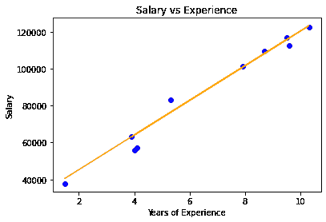

# 使用 Python 从头开始实现套索回归

> 原文:[https://www . geesforgeks . org/implementation-of-lasso-revolution-从头开始-使用-python/](https://www.geeksforgeeks.org/implementation-of-lasso-regression-from-scratch-using-python/)

#### 先决条件:

1.  线性回归
2.  梯度下降

#### 导言:

套索回归也是从线性回归导出的另一个线性模型，它共享相同的假设函数进行预测。线性回归的成本函数用 j 表示

<center></center>

```py
Here, *m* is the total number of training examples in the dataset.
*h(x<sup>(i)</sup>)* represents the hypothetical function for prediction.
*y<sup>(i)</sup>*represents the value of target variable for ith training example.

```

线性回归模型考虑所有与预测同等相关的特征。当数据集中有许多特征，甚至其中一些特征与预测模型无关时。这使得模型更加复杂，对测试集的预测过于不准确(或过度拟合)。这种高方差的模型不能推广到新的数据上。所以，拉索回归来拯救。它在线性回归的成本函数中引入了 L1 惩罚(或等于权重大小的绝对值)。拉索回归的修正成本函数如下。

<center>![\frac{1}{m}\left[\sum_{i=1}^{m}\left(y^{(i)}-h\left(x^{(i)}\right)\right)^{2}+\lambda \sum_{j=1}^{n} w_{j}\right]](img/72e411ec3da848a08350469feedc3650.png "Rendered by QuickLaTeX.com")</center>

```py
Here, *w<sub>(j)</sub>* represents the weight for jth feature.  
*n* is the number of features in the dataset.
*lambda* is the regularization strength.

```

套索回归同时执行变量选择和正则化。

#### 数学直觉:

在梯度下降优化期间，增加的 l1 惩罚将权重缩小到接近零或零。那些缩小到零的权重消除了假设函数中存在的特征。因此，无关的特征不参与预测模型。权重的这种惩罚使得假设更加简单，这促进了稀疏性(具有很少参数的模型)。

如果增加了截距，它将保持不变。

我们可以通过超参数λ来控制正则化的强度。所有权重都减少了相同的因子λ。

调谐λ值的不同情况。

1.  如果λ设置为 0，套索回归等于线性回归。
2.  如果λ设置为无穷大，则所有权重都将收缩为零。

如果我们增加λ，偏差增加，如果我们减少λ方差增加。随着 lambda 的增加，越来越多的权重被缩小到零，并从模型中删除特征。

#### 履行

本实现中使用的数据集可以从[链接](https://github.com/mohit-baliyan/References.)下载。

它有两栏—“T0”年经验“T2】工资”一个公司 30 个员工。因此，在本文中，我们将训练一个 Lasso 回归模型来学习每个员工的经验年限和他们各自的工资之间的相关性。一旦模型得到训练，我们将能够根据员工的多年经验来预测他的工资。

**代码:**

```py
# Importing libraries

import numpy as np

import pandas as pd

from sklearn.model_selection import train_test_split

import matplotlib.pyplot as plt

# Lasso Regression

class LassoRegression() :

    def __init__( self, learning_rate, iterations, l1_penality ) :

        self.learning_rate = learning_rate

        self.iterations = iterations

        self.l1_penality = l1_penality

    # Function for model training

    def fit( self, X, Y ) :

        # no_of_training_examples, no_of_features

        self.m, self.n = X.shape

        # weight initialization

        self.W = np.zeros( self.n )

        self.b = 0

        self.X = X

        self.Y = Y

        # gradient descent learning

        for i in range( self.iterations ) :

            self.update_weights()

        return self

    # Helper function to update weights in gradient descent

    def update_weights( self ) :

        Y_pred = self.predict( self.X )

        # calculate gradients  

        dW = np.zeros( self.n )

        for j in range( self.n ) :

            if self.W[j] > 0 :

                dW[j] = ( - ( 2 * ( self.X[:, j] ).dot( self.Y - Y_pred ) ) 

                         + self.l1_penality ) / self.m

            else :

                dW[j] = ( - ( 2 * ( self.X[:, j] ).dot( self.Y - Y_pred ) ) 

                         - self.l1_penality ) / self.m

        db = - 2 * np.sum( self.Y - Y_pred ) / self.m 

        # update weights

        self.W = self.W - self.learning_rate * dW

        self.b = self.b - self.learning_rate * db

        return self

    # Hypothetical function  h( x ) 

    def predict( self, X ) :

        return X.dot( self.W ) + self.b

def main() :

    # Importing dataset

    df = pd.read_csv( "salary_data.csv" )

    X = df.iloc[:, :-1].values

    Y = df.iloc[:, 1].values

    # Splitting dataset into train and test set

    X_train, X_test, Y_train, Y_test = train_test_split( X, Y, test_size = 1 / 3, random_state = 0 )

    # Model training

    model = LassoRegression( iterations = 1000, learning_rate = 0.01, l1_penality = 500 )

    model.fit( X_train, Y_train )

    # Prediction on test set

    Y_pred = model.predict( X_test )

    print( "Predicted values ", np.round( Y_pred[:3], 2 ) ) 

    print( "Real values      ", Y_test[:3] )

    print( "Trained W        ", round( model.W[0], 2 ) )

    print( "Trained b        ", round( model.b, 2 ) )

    # Visualization on test set 

    plt.scatter( X_test, Y_test, color = 'blue' )

    plt.plot( X_test, Y_pred, color = 'orange' )

    plt.title( 'Salary vs Experience' )

    plt.xlabel( 'Years of Experience' )

    plt.ylabel( 'Salary' )

    plt.show()

if __name__ == "__main__" : 

    main()
```

**输出:**

```py
Predicted values  [ 40600.91 123294.39  65033.07]
Real values       [ 37731 122391  57081]
Trained W         9396.99
Trained b         26505.43

```

<center>


形象化

</center>

**注意:**它自动执行模型选择的某些部分，有时被称为变量消除器。