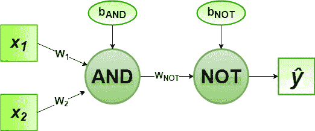

# 2 位二进制输入与非门感知器算法的实现

> 原文:[https://www . geeksforgeeks . org/2 位二进制输入与非门感知器算法的实现/](https://www.geeksforgeeks.org/implementation-of-perceptron-algorithm-for-nand-logic-gate-with-2-bit-binary-input/)

在机器学习领域，感知器是一种用于二进制分类器的监督学习算法。感知器模型实现以下功能:

![\[ \begin{array}{c} \hat{y}=\Theta\left(w_{1} x_{1}+w_{2} x_{2}+\ldots+w_{n} x_{n}+b\right) \\ =\Theta(\mathbf{w} \cdot \mathbf{x}+b) \\ \text { where } \Theta(v)=\left\{\begin{array}{cc} 1 & \text { if } v \geqslant 0 \\ 0 & \text { otherwise } \end{array}\right. \end{array} \]](img/7a525c5fa0f2cf3118ef7158b4d5b176.png "Rendered by QuickLaTeX.com")

对于权重向量和偏差参数的特定选择，模型预测相应输入向量的输出。

**与非**逻辑函数真值表，用于 ***2 位二进制变量*** ，即输入向量和相应的输出–

|  |  |  |
| --- | --- | --- |
| Zero | Zero | one |
| Zero | one | one |
| one | Zero | one |
| one | one | Zero |

我们可以观察到，
现在对于输入向量到 AND 节点的对应权重向量，关联的感知器函数可以定义为:

![\[$\boldsymbol{\hat{y}\prime} = \Theta\left(w_{1} x_{1}+w_{2} x_{2}+b_{AND}\right)$ \]](img/af7fc593787b5dac9749013093a6cc5a.png "Rendered by QuickLaTeX.com")

稍后，“与”节点的输出是权重为的“非”节点的输入。那么相应的输出就是与非门逻辑函数的最终输出，相关的感知器函数可以定义为:

![\[$\boldsymbol{\hat{y}} = \Theta\left(w_{NOT}  \boldsymbol{\hat{y}\prime}+b_{NOT}\right)$\]](img/e45e0c382856a6cc1b3c3f47d5337dfb.png "Rendered by QuickLaTeX.com")


实施时，考虑的权重参数为，偏差参数为。

**Python 实现:**

```
# importing Python library
import numpy as np

# define Unit Step Function
def unitStep(v):
    if v >= 0:
        return 1
    else:
        return 0

# design Perceptron Model
def perceptronModel(x, w, b):
    v = np.dot(w, x) + b
    y = unitStep(v)
    return y

# NOT Logic Function
# wNOT = -1, bNOT = 0.5
def NOT_logicFunction(x):
    wNOT = -1
    bNOT = 0.5
    return perceptronModel(x, wNOT, bNOT)

# AND Logic Function
# w1 = 1, w2 = 1, bAND = -1.5
def AND_logicFunction(x):
    w = np.array([1, 1])
    bAND = -1.5
    return perceptronModel(x, w, bAND)

# NAND Logic Function
# with AND and NOT  
# function calls in sequence
def NAND_logicFunction(x):
    output_AND = AND_logicFunction(x)
    output_NOT = NOT_logicFunction(output_AND)
    return output_NOT

# testing the Perceptron Model
test1 = np.array([0, 1])
test2 = np.array([1, 1])
test3 = np.array([0, 0])
test4 = np.array([1, 0])

print("NAND({}, {}) = {}".format(0, 1, NAND_logicFunction(test1)))
print("NAND({}, {}) = {}".format(1, 1, NAND_logicFunction(test2)))
print("NAND({}, {}) = {}".format(0, 0, NAND_logicFunction(test3)))
print("NAND({}, {}) = {}".format(1, 0, NAND_logicFunction(test4)))
```

**Output:**

```
NAND(0, 1) = 1
NAND(1, 1) = 0
NAND(0, 0) = 1
NAND(1, 0) = 1

```

这里，根据 2 位二进制输入的真值表，每个测试输入的模型预测输出()与与非门逻辑门常规输出()精确匹配。
因此，验证了与非门的感知器算法是正确实现的。