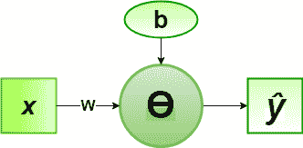

# 非逻辑门感知器算法的实现

> 原文:[https://www . geeksforgeeks . org/非逻辑门感知器算法的实现/](https://www.geeksforgeeks.org/implementation-of-perceptron-algorithm-for-not-logic-gate/)

在机器学习领域，感知器是一种用于二进制分类器的监督学习算法。感知器模型实现以下功能:

![\[ \begin{array}{c} \hat{y}=\Theta\left(w_{1} x_{1}+w_{2} x_{2}+\ldots+w_{n} x_{n}+b\right) \\ =\Theta(\mathbf{w} \cdot \mathbf{x}+b) \\ \text { where } \Theta(v)=\left\{\begin{array}{cc} 1 & \text { if } v \geqslant 0 \\ 0 & \text { otherwise } \end{array}\right. \end{array} \]](img/7a525c5fa0f2cf3118ef7158b4d5b176.png "Rendered by QuickLaTeX.com")

对于权重向量和偏差参数的特定选择，模型预测相应输入向量的输出。

**NOT** 逻辑函数真值表只有 1 位二进制输入(0 或 1)，即输入向量和相应的输出–

|  |  |
| --- | --- |
| Zero | one |
| one | Zero |

现在对于输入向量的相应权重向量，关联的感知器函数可以定义为:

![\[$\boldsymbol{\hat{y}} = \Theta\left(w x+b\right)$\]](img/3986c5a42999f8832393a49c462c1a40.png "Rendered by QuickLaTeX.com")


为实现，考虑的权重参数为，偏差参数为。

**Python 实现:**

```py
# importing Python library
import numpy as np

# define Unit Step Function
def unitStep(v):
    if v >= 0:
        return 1
    else:
        return 0

# design Perceptron Model
def perceptronModel(x, w, b):
    v = np.dot(w, x) + b
    y = unitStep(v)
    return y

# NOT Logic Function
# w = -1, b = 0.5
def NOT_logicFunction(x):
    w = -1
    b = 0.5
    return perceptronModel(x, w, b)

# testing the Perceptron Model
test1 = np.array(1)
test2 = np.array(0)

print("NOT({}) = {}".format(1, NOT_logicFunction(test1)))
print("NOT({}) = {}".format(0, NOT_logicFunction(test2)))
```

**Output:**

```py
NOT(1) = 0
NOT(0) = 1

```

这里，根据真值表，每个测试输入的模型预测输出()与非逻辑门常规输出()精确匹配。
由此验证了非逻辑门的感知器算法是正确实现的。