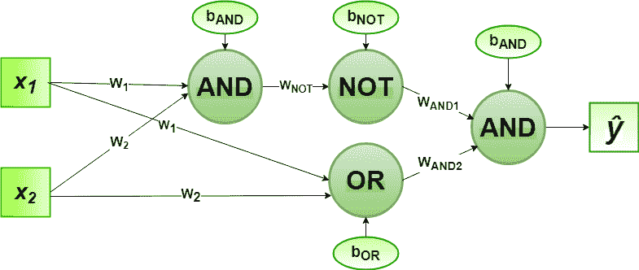

# 2 位二进制输入异或逻辑门感知器算法的实现

> 原文:[https://www . geeksforgeeks . org/2 位二进制输入异或逻辑门的感知器算法实现/](https://www.geeksforgeeks.org/implementation-of-perceptron-algorithm-for-xor-logic-gate-with-2-bit-binary-input/)

在机器学习领域，感知器是一种用于二进制分类器的监督学习算法。感知器模型实现以下功能:

![\[ \begin{array}{c} \hat{y}=\Theta\left(w_{1} x_{1}+w_{2} x_{2}+\ldots+w_{n} x_{n}+b\right) \\ =\Theta(\mathbf{w} \cdot \mathbf{x}+b) \\ \text { where } \Theta(v)=\left\{\begin{array}{cc} 1 & \text { if } v \geqslant 0 \\ 0 & \text { otherwise } \end{array}\right. \end{array} \]](img/7a525c5fa0f2cf3118ef7158b4d5b176.png "Rendered by QuickLaTeX.com")

对于权重向量和偏差参数的特定选择，模型预测相应输入向量的输出。

**异或**逻辑函数真值表为 ***2 位二进制变量*** ，即输入向量和对应的输出–

|  |  |  |
| --- | --- | --- |
| Zero | Zero | Zero |
| Zero | one | one |
| one | Zero | one |
| one | one | Zero |

我们可以观察到，
**设计感知器网络:**

1.  **Step1:** Now for the corresponding weight vector  of the input vector  to the AND and OR node, the associated Perceptron Function can be defined as:

    ![\[$\boldsymbol{\hat{y}_{1}} = \Theta\left(w_{1} x_{1}+w_{2} x_{2}+b_{AND}\right)$ \]](img/15b4635035365f29fdc0be0478ab60dc.png "Rendered by QuickLaTeX.com")

    ![\[$\boldsymbol{\hat{y}_{2}} = \Theta\left(w_{1} x_{1}+w_{2} x_{2}+b_{OR}\right)$ \]](img/8f3d59495bcc6f522caa6efd1caeed25.png "Rendered by QuickLaTeX.com")

2.  **Step2:** The output  from the AND node will be inputed to the NOT node with weight  and the associated Perceptron Function can be defined as:

    ![\[$\boldsymbol{\hat{y}_{3}} = \Theta\left(w_{NOT}  \boldsymbol{\hat{y}_{1}}+b_{NOT}\right)$\]](img/340a33dab7779e3ebd31eba0c5f68ffd.png "Rendered by QuickLaTeX.com")

3.  **Step3:** The output  from the OR node and the output  from NOT node as mentioned in Step2 will be inputed to the AND node with weight . Then the corresponding output  is the final output of the XOR logic function. The associated Perceptron Function can be defined as:

    ![\[$\boldsymbol{\hat{y}} = \Theta\left(w_{AND1}  \boldsymbol{\hat{y}_{3}}+w_{AND2}  \boldsymbol{\hat{y}_{2}}+b_{AND}\right)$\]](img/ff760502b052009570c7a709020a8b03.png "Rendered by QuickLaTeX.com")


实施时，权重参数考虑为，偏差参数为。

**Python 实现:**

```
# importing Python library
import numpy as np

# define Unit Step Function
def unitStep(v):
    if v >= 0:
        return 1
    else:
        return 0

# design Perceptron Model
def perceptronModel(x, w, b):
    v = np.dot(w, x) + b
    y = unitStep(v)
    return y

# NOT Logic Function
# wNOT = -1, bNOT = 0.5
def NOT_logicFunction(x):
    wNOT = -1
    bNOT = 0.5
    return perceptronModel(x, wNOT, bNOT)

# AND Logic Function
# here w1 = wAND1 = 1, 
# w2 = wAND2 = 1, bAND = -1.5
def AND_logicFunction(x):
    w = np.array([1, 1])
    bAND = -1.5
    return perceptronModel(x, w, bAND)

# OR Logic Function
# w1 = 1, w2 = 1, bOR = -0.5
def OR_logicFunction(x):
    w = np.array([1, 1])
    bOR = -0.5
    return perceptronModel(x, w, bOR)

# XOR Logic Function
# with AND, OR and NOT  
# function calls in sequence
def XOR_logicFunction(x):
    y1 = AND_logicFunction(x)
    y2 = OR_logicFunction(x)
    y3 = NOT_logicFunction(y1)
    final_x = np.array([y2, y3])
    finalOutput = AND_logicFunction(final_x)
    return finalOutput

# testing the Perceptron Model
test1 = np.array([0, 1])
test2 = np.array([1, 1])
test3 = np.array([0, 0])
test4 = np.array([1, 0])

print("XOR({}, {}) = {}".format(0, 1, XOR_logicFunction(test1)))
print("XOR({}, {}) = {}".format(1, 1, XOR_logicFunction(test2)))
print("XOR({}, {}) = {}".format(0, 0, XOR_logicFunction(test3)))
print("XOR({}, {}) = {}".format(1, 0, XOR_logicFunction(test4)))
```

**Output:**

```
XOR(0, 1) = 1
XOR(1, 1) = 0
XOR(0, 0) = 0
XOR(1, 0) = 1

```

这里，根据真值表，每个测试输入的模型预测输出()与异或逻辑门常规输出()精确匹配。
验证了异或门感知器算法的正确实现。