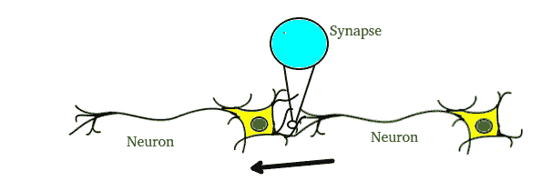
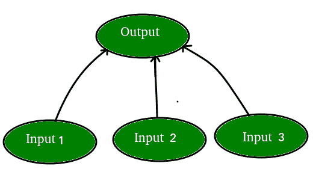

# 在 Python 中实现人工神经网络训练过程

> 原文:[https://www . geeksforgeeks . org/impering-ann-training-process in-python/](https://www.geeksforgeeks.org/implementing-ann-training-process-in-python/)

人工神经网络是一种受大脑启发的信息处理范式。人工神经网络和人一样，是通过榜样学习的。人工神经网络是通过学习过程为特定应用而配置的，例如模式识别或数据分类。学习很大程度上涉及对神经元之间存在的突触联系的调整。



大脑由数千亿个被称为神经元的细胞组成。这些神经元通过突触连接在一起，这些突触只不过是一个神经元向另一个神经元发送脉冲的连接。当一个神经元向另一个神经元发送兴奋信号时，这个信号将被加到该神经元的所有其他输入上。如果它超过一个给定的阈值，那么它将导致目标神经元向前发射一个动作信号——这就是思维过程内部的工作方式。
在计算机科学中，我们通过使用矩阵在计算机上创建“网络”来模拟这个过程。这些网络可以理解为神经元的抽象，而没有考虑到所有的生物学复杂性。为了简单起见，我们将只对一个简单的神经网络建模，它有两层，能够解决线性分类问题。



假设我们有一个问题，我们想要预测给定一组输入和输出的输出，作为训练示例，如下所示:


注意，输出与第三列直接相关，即输入 3 的值是图 2 中每个训练示例的输出。因此对于测试示例，输出值应为 1。

培训过程包括以下步骤:

1.  **前向传播:**
    取输入，乘以权重(只需用随机数作为权重)
    让 Y = W<sub>I</sub>I<sub>I</sub>= W<sub>1</sub>I<sub>1</sub>+W<sub>2</sub>I<sub>2</sub>+W<sub>3</sub>I<sub>3</sub>
    将结果通过一个 sigmoid 公式进行计算 Sigmoid 函数用于归一化 0 和 1 之间的结果:
    1/1 + e <sup>-y</sup>
2.  **反向传播**
    计算误差，即实际输出和预期输出之间的差异。根据误差，通过将误差与输入相乘并再次与乙状结肠曲线的梯度相乘来调整权重:
    权重+=误差输入输出(1-输出)，这里输出(1-输出)是乙状结肠曲线的导数。

**注意:**重复整个过程几千次迭代。
让我们用 Python 对整个过程进行编码。我们将使用 Numpy 库来帮助我们轻松地进行矩阵的所有计算。你需要在你的系统上安装一个 numpy 库来运行代码
**命令来安装 numpy:**

```py
 sudo apt -get install python-numpy
```

**实施:**

## 计算机编程语言

```py
from joblib.numpy_pickle_utils import xrange
from numpy import *

class NeuralNet(object):
    def __init__(self):
        # Generate random numbers
        random.seed(1)

        # Assign random weights to a 3 x 1 matrix,
        self.synaptic_weights = 2 * random.random((3, 1)) - 1

    # The Sigmoid function
    def __sigmoid(self, x):
        return 1 / (1 + exp(-x))

    # The derivative of the Sigmoid function.
    # This is the gradient of the Sigmoid curve.
    def __sigmoid_derivative(self, x):
        return x * (1 - x)

    # Train the neural network and adjust the weights each time.
    def train(self, inputs, outputs, training_iterations):
        for iteration in xrange(training_iterations):
            # Pass the training set through the network.
            output = self.learn(inputs)

            # Calculate the error
            error = outputs - output

            # Adjust the weights by a factor
            factor = dot(inputs.T, error * self.__sigmoid_derivative(output))
            self.synaptic_weights += factor

        # The neural network thinks.

    def learn(self, inputs):
        return self.__sigmoid(dot(inputs, self.synaptic_weights))

if __name__ == "__main__":
    # Initialize
    neural_network = NeuralNet()

    # The training set.
    inputs = array([[0, 1, 1], [1, 0, 0], [1, 0, 1]])
    outputs = array([[1, 0, 1]]).T

    # Train the neural network
    neural_network.train(inputs, outputs, 10000)

    # Test the neural network with a test example.
    print(neural_network.learn(array([1, 0, 1])))
```

**预期输出:**经过 10 次迭代，我们的神经网络预测值为 0.65980921。看起来不好，因为答案真的应该是 1。如果我们将迭代次数增加到 100，我们得到 0.87680541。我们的网络越来越智能！随后，对于 10000 次迭代，我们得到了 0.9897704，这是非常接近的，并且确实是令人满意的输出。
**参考文献:**

*   [克里斯特斯·斯特吉奥和迪米特里斯·西加诺斯的神经网络](https://www.doc.ic.ac.uk/~nd/surprise_96/journal/vol4/cs11/report.html)
*   [深度学习基础——从人工神经网络](https://www.analyticsvidhya.com/blog/2016/03/introduction-deep-learning-fundamentals-neural-networks/)开始
*   [就在你的浏览器里摆弄神经网络](http://playground.tensorflow.org/)
*   [神经网络去神秘化](http://lumiverse.io/series/neural-networks-demystified)

本文由 **Vivek Pal** 供稿。如果你喜欢 GeeksforGeeks 并想投稿，你也可以使用[write.geeksforgeeks.org](https://write.geeksforgeeks.org)写一篇文章或者把你的文章邮寄到 review-team@geeksforgeeks.org。看到你的文章出现在极客博客主页上，帮助其他极客。
如果你发现任何不正确的地方，或者你想分享更多关于上面讨论的话题的信息，请写评论。