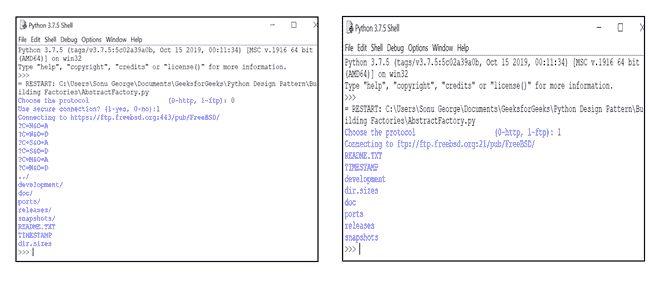

# 在 Python 中使用抽象工厂设计模式实现网络爬虫

> 原文:[https://www . geesforgeks . org/implementing-web-crawler-use-abstract-factory-design-in-pattern-python/](https://www.geeksforgeeks.org/implementing-web-crawler-using-abstract-factory-design-pattern-in-python/)

在[抽象工厂设计模式](https://www.geeksforgeeks.org/abstract-factory-method-python-design-patterns/)中，每个产品都有一个抽象的产品界面。这种方法有助于创建独立于工厂类的相关对象族。因此，您可以在运行时更改工厂以获得不同的对象，从而简化产品系列的替换。

在这种设计模式中，客户端使用抽象工厂接口来访问对象。抽象接口将对象的创建与客户端分开，这使得操作更加容易，并将具体的类与客户端隔离开来。但是，向现有工厂添加新产品很困难，因为您需要扩展工厂接口，这包括更改抽象工厂接口类及其所有子类。

为了更好地理解，让我们来看看 Python 中的网络爬虫实现。如下图所示，您有一个抽象工厂接口类–*抽象工厂*–和两个具体工厂类–*HTTPConcreteFactory*和 *FTPConcreteFactory* 。这两个具体类是从*抽象工厂类*派生的，并且有方法创建三个接口的实例–*协议抽象产品*、*门户抽象产品*和*爬虫抽象产品*。


由于*抽象工厂*类充当了 *HTTPConcreteFactory* 和 *FTPConcreteFactory* 等工厂的接口，因此它有三个抽象方法–*create _ protocol()、create_port()、create_crawler()* 。这些方法在工厂类中被重新定义。这意味着 *HTTPConcreteFactory* 类创建了它的相关对象族，如 HTTPPort、HTTPSecurePort 和 HTTPSecureProtocol，而 *FTPConcreteFactory* 类创建了 FTPPort、FTPProtocol 和 FTPCrawler。

## 蟒蛇 3

```py
import abc
import urllib
import urllib.error
import urllib.request
from bs4 import BeautifulSoup

class AbstractFactory(object, metaclass=abc.ABCMeta):
    """ Abstract Factory Interface """

    def __init__(self, is_secure):
        self.is_secure = is_secure

    @abc.abstractmethod
    def create_protocol(self):
        pass

    @abc.abstractmethod
    def create_port(self):
        pass

    @abc.abstractmethod
    def create_crawler(self):
        pass

class HTTPConcreteFactory(AbstractFactory):
    """ Concrete Factory for building HTTP connection. """

    def create_protocol(self):
        if self.is_secure:
            return HTTPSecureProtocol()
        return HTTPProtocol()

    def create_port(self):
        if self.is_secure:
            return HTTPSecurePort()
        return HTTPPort()

    def create_crawler(self):
        return HTTPCrawler()

class FTPConcreteFactory(AbstractFactory):
    """ Concrete Factory for building FTP connection """

    def create_protocol(self):
        return FTPProtocol()

    def create_port(self):
        return FTPPort()

    def create_crawler(self):
        return FTPCrawler()

class ProtocolAbstractProduct(object, metaclass=abc.ABCMeta):
    """ An abstract product, represents protocol to connect """

    @abc.abstractmethod
    def __str__(self):
        pass

class HTTPProtocol(ProtocolAbstractProduct):
    """ An concrete product, represents http protocol """

    def __str__(self):
        return 'http'

class HTTPSecureProtocol(ProtocolAbstractProduct):
    """ An concrete product, represents https protocol """

    def __str__(self):
        return 'https'

class FTPProtocol(ProtocolAbstractProduct):
    """ An concrete product, represents ftp protocol """

    def __str__(self):
        return 'ftp'

class PortAbstractProduct(object, metaclass=abc.ABCMeta):
    """ An abstract product, represents port to connect """

    @abc.abstractmethod
    def __str__(self):
        pass

class HTTPPort(PortAbstractProduct):
    """ A concrete product which represents http port. """

    def __str__(self):
        return '80'

class HTTPSecurePort(PortAbstractProduct):
    """ A concrete product which represents https port """
    def __str__(self):
        return '443'

class FTPPort(PortAbstractProduct):
    """ A concrete products which represents ftp port. """

    def __str__(self):
        return '21'

class CrawlerAbstractProduct(object, metaclass=abc.ABCMeta):
    """ An Abstract product, represents parser to parse web content """

    @abc.abstractmethod
    def __call__(self, content):
        pass

class HTTPCrawler(CrawlerAbstractProduct):
    def __call__(self, content):
        """ Parses web content """

        filenames = []
        soup = BeautifulSoup(content, "html.parser")
        links = soup.table.findAll('a')

        for link in links:
            filenames.append(link['href'])

        return '\n'.join(filenames)

class FTPCrawler(CrawlerAbstractProduct):
    def __call__(self, content):

        """ Parse Web Content """
        content = str(content, 'utf-8')
        lines = content.split('\n')
        filenames = []

        for line in lines:
            splitted_line = line.split(None, 8)
            if len(splitted_line) == 9:
                filenames.append(splitted_line[-1])

        return '\n'.join(filenames)

class Connector(object):
    """ A client """

    def __init__(self, abstractfactory):
        """ calling all attributes
of a connector according to abstractfactory class. """

        self.protocol = abstractfactory.create_protocol()
        self.port = abstractfactory.create_port()
        self.crawl = abstractfactory.create_crawler()

    def read(self, host, path):
        url = str(self.protocol) + '://' + host + ':' + str(self.port) + path
        print('Connecting to', url)
        return urllib.request.urlopen(url, timeout=10).read()

if __name__ == "__main__":
    con_domain = 'ftp.freebsd.org'
    con_path = '/pub/FreeBSD/'

    con_protocol = input('Choose the protocol \
                    (0-http, 1-ftp): ')

    if con_protocol == '0':
        is_secure = input('Use secure connection? (1-yes, 0-no):')
        if is_secure == '1':
            is_secure = True
        else:
            is_secure = False
        abstractfactory = HTTPConcreteFactory(is_secure)
    else:
        is_secure = False
        abstractfactory = FTPConcreteFactory(is_secure)

    connector = Connector(abstractfactory)

    try:
        data = connector.read(con_domain, con_path)
    except urllib.error.URLError as e:
        print('Cannot access resource with this method', e)
    else:
        print(connector.crawl(data))
```

**输出**



输出

该程序的目标是使用 HTTP 协议或 FTP 协议对网站进行爬网。这里，我们需要在实现代码时考虑三种情况。

1.  草案
2.  港口
3.  爬行者

这三种场景在 HTTP 和 FTP 网络访问模型中有所不同。因此，这里我们需要创建两个工厂，一个用于创建 HTTP 产品，另一个用于创建 FTP 产品–*HTTPConcreteFactory 和 FTPConcreteFactory* 。这两个混凝土工厂源自一个抽象工厂–*抽象工厂*。

使用抽象接口是因为两个工厂类的操作方法相同，只是实现不同，因此客户端代码可以确定在运行时使用哪个工厂。让我们分析一下每个工厂创造的产品。

在协议产品的情况下，http 具体工厂创建 HTTP 或 https 协议，而 ftp 具体工厂创建 FTP 协议。对于端口产品，HTTP 混凝土工厂生成 80 或 443 作为端口产品，FTP 工厂生成 21 作为端口产品。最后，由于 HTTP 和 FTP 的网站结构不同，爬虫实现也不同。

这里，创建的对象具有相同的接口，而创建的具体对象对于每个工厂都是不同的。比方说，HTTP 端口、HTTP Secure 端口、FTP 端口等端口产品都有相同的接口，但是两个工厂的具体对象不同。这同样适用于协议和爬虫。

最后，连接器类接受一个工厂，并使用这个工厂根据工厂类注入连接器的所有属性。